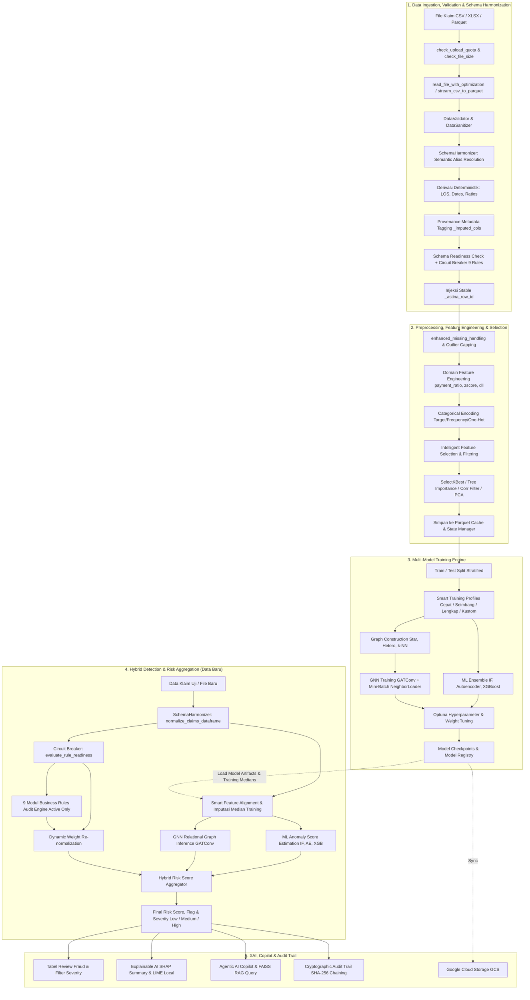

# ALUR KERJA ASTINA (Analisis Sistem Transaksi Identifikasi Nilai Anomali)

Dokumen ini mendokumentasikan secara menyeluruh arsitektur, alur kerja *end-to-end*, logika matematika agregasi risiko, spesifikasi modul kecerdasan buatan (*Machine Learning*, *Graph Neural Network*, *Agentic Copilot RAG*), seleksi fitur adaptif, tata kelola data, pengujian, serta pedoman operasional sistem ASTINA.

---

## 1. Ringkasan Sistem

**ASTINA** adalah platform analitik dan investigasi fraud klaim asuransi kesehatan berbasis **Hybrid AI Enterprise** yang menggabungkan:

- **Automated Preprocessing & Domain Feature Engineering**: Ekstraksi temporal, rasio moneter domain asuransi, deteksi outlier IQR, dan encoding variabel kategorik otomatis.
- **Intelligent Feature Selection & Redundancy Filtering**: Seleksi multivariat SelectKBest (ANOVA F-Score & Mutual Information), Tree-based Feature Importance (Random Forest, ExtraTrees, LightGBM), filter multikolinearitas terbobot skor, filter *low-variance* skala invarian, serta reduksi dimensi PCA interaktif.
- **Machine Learning Ensemble**: Kombinasi multi-model *Isolation Forest*, *PyTorch Deep Autoencoder*, *XGBoost / LightGBM*, dan *DBSCAN/HDBSCAN*.
- **Relational Graph Neural Network (GNN)**: Analisis relasional berbasis `GATConv` (Graph Attention Network) pada topologi *Star Graph*, *Heterogeneous Graph*, dan *k-NN Graph* untuk membongkar sindikat kolusi massal (*fraud rings*).
- **9 Modul Rule-Based Business Engine**: Audit kepatuhan deterministik terhadap 9 kategori fraud klaim medis asuransi kesehatan.
- **Agentic AI Copilot & Knowledge RAG**: Asisten investigasi berbasis *Retrieval-Augmented Generation* (FAISS vector store) yang memahami standar medis ICD-10, CPT, dan regulasi audit klaim asuransi.
- **Explainable AI (XAI)**: Atribusi fitur global dan lokal berbasis SHAP (*SHapley Additive exPlanations*) dan LIME (*Local Interpretable Model-agnostic Explanations*).
- **Cryptographic Audit Trail**: Pencatatan riwayat audit forensik berantai hash SHA-256 anti-tamper untuk integritas pembuktian hukum dan kepatuhan compliance.
- **Modern Glassmorphic UI & 5-Stage Visual Breadcrumbs**: Antarmuka responsif Streamlit dengan *live telemetry pills* status data, akselerasi GPU/CPU, dan pelacak alur investigasi.

---

## 2. Arsitektur Sistem Tingkat Tinggi



### Tabel Komponen Utama

| Komponen | Berkas Sumber | Tanggung Jawab Utama |
| :--- | :--- | :--- |
| **Entry Point & Router** | `main.py` | Konfigurasi Streamlit, top navbar, inisialisasi state, error boundary |
| **UI Components & Styles** | `ui_components.py` | Glassmorphic CSS, breadcrumb tracker, live telemetry pills |
| **UI Sidebar & Nav** | `ui/sidebar.py` | Navigasi menu, status kesiapan pipeline (0–100%), telemetri hardware |
| **UI Utilities & Charts** | `ui/utils.py` | Smart feature alignment, visual helper, chart Plotly, export data |
| **Schema Harmonizer** | `schema_harmonizer.py` | Penyelarasan semantik alias kolom (ID/EN/medis), derivasi deterministik, provenance tagging, & evaluasi kesiapan 9 aturan (Circuit Breaker) |
| **File Handler** | `file_handler.py` | Streaming IO multi-format (CSV, Excel `.xlsx`/`.xls`, Parquet), normalisasi format otomatis, optimasi memory dtype, buffer IO chunking 8MB |
| **Large File Processor** | `large_file_processor.py` | Chunking dataset, memory-bounded preprocessing per batch |
| **Data Validator & Sanitizer** | `data_validator.py` | Integritas kolom, sanitasi tipe data, evaluasi skema 14 kolom inti |
| **Data Preprocessing & Selection**| `preprocessing_optimized.py` | Imputasi, outlier capping, domain features, SelectKBest, Corr filter, PCA |
| **Model Engine & GNN** | `model.py` | CombinedAnomalyDetector, Autoencoder PyTorch, GNN GATConv, Optuna |
| **Model Explainer (XAI)** | `model_explainer.py` | Atribusi SHAP Tree/KernelExplainer, LIME tabular explanations |
| **Agentic AI Copilot** | `agentic_copilot.py` | AI assistant investigasi fraud, multi-provider LLM & reasoning |
| **RAG Knowledge Base** | `rag_engine.py` | Indexing FAISS, semantic search ICD-10, CPT, regulasi medis |
| **Business Rule Pipeline** | `fraud_risk_pipeline.py` | Orkestrasi 9 kelompok aturan kepatuhan klaim asuransi + Dynamic Weight Re-normalization |
| **Cryptographic Audit Trail** | `audit_trail.py` | Pencatatan rantai log hash SHA-256 anti-tamper |
| **Audit Verification** | `verify_audit_trail.py` | Skrip verifikasi integritas rantai blok hash audit trail |
| **State Manager** | `state_manager.py` | Manajemen transisi halaman, session state Streamlit, caching path |
| **Cache Manager** | `cache_manager.py` | Multi-tier Parquet & session cache, eviction policy |
| **Model Registry** | `model_registry.py` | Versi model, schema metadata, dynamic model loader |
| **Cloud Storage** | `cloud_storage.py` | Sinkronisasi model dan checkpoint ke Google Cloud Storage (GCS) |
| **System Telemetry** | `system_status.py` | Monitoring utilisasi CPU, RAM, GPU/VRAM, dan hardware specs |

---

## 3. Startup, Top Navbar, dan Alur Navigasi

### 3.1 Startup Flow

Aplikasi diaktifkan melalui terminal atau *production launcher*:

```powershell
# Jalankan menggunakan Streamlit
.\.venv\Scripts\Activate.ps1
streamlit run main.py

# Atau menggunakan production launcher
python run.py
```

`main.py` mengeksekusi tahapan inisialisasi:
1. Memanggil `st.set_page_config()` pada baris pertama (judul, favicon, layout wide).
2. Menginjeksikan *glassmorphic custom CSS* dari `ui_components.py`.
3. Menginisialisasi session state bawaan (`page="home"`, `is_processing=False`, dll).
4. Merender **Glassmorphic Top Navbar**:
   - Menampilkan *Live Telemetry Pills*: Baris & Fitur Data Terproses, Status Model Terlatih, Akselerasi Akses (CPU / CUDA GPU), dan Status Agentic Copilot.
   - Menampilkan **5-Stage Visual Breadcrumb Tracker**:
     `1. Unggah Data` ➔ `2. Praproses & Fitur` ➔ `3. Pelatihan` ➔ `4. Evaluasi` ➔ `5. Deteksi`.
5. Merender `ui/sidebar.py` (Progress Kesiapan 0%–100%, Spesifikasi Dataset, Switch Dataset).
6. Melakukan *safe routing* ke modul halaman aktif dengan *page-level try-except error boundary*.

### 3.2 Daftar Halaman Aplikasi

```text
[Home] ──> [Data Collection] ──> [Training] ──> [Evaluation] ──> [Detection] ──> [Status]
```

1. `home`: Dashboard ikhtisar sistem, status ringkas, dan shortcut alur kerja.
2. `collect`: Upload dataset, validasi skema 14 kolom, EDA, preprocessing, dan seleksi fitur interaktif.
3. `train`: Split data, Smart Training Profiles, estimasi beban komputasi, training ensemble ML & GNN.
4. `evaluate`: Evaluasi performa test set, Confusion Matrix, ROC/PR Curves, SHAP/LIME, dan analisis GNN.
5. `detect`: Deteksi batch klaim baru, eksekusi 9 aturan bisnis, tabel review fraud, XAI, dan AI Copilot.
6. `status`: Telemetri beban perangkat, pemantauan cache, log sistem, dan verifikasi Cryptographic Audit Trail.

---

## 4. Rincian Modul Halaman

### 4.1 Home (`ui/pages/home.py`)
- Menampilkan kartu metrik arsitektur *Hybrid AI*.
- Menampilkan ringkasan status kesiapan pipeline data dan model aktif.
- Menyediakan tombol aksi cepat menuju modul *Data Collection* atau *Detection*.

### 4.2 Data Collection & Preprocessing (`ui/pages/data_collection.py`)
- **File Uploader Multi-Format**: Menerima `.csv`, `.xlsx`, `.xls`, dan `.parquet` hingga batas 3 GiB.
- **Validasi Kuota & Ukuran**: Memeriksa kuota harian dan alokasi memori melalui `rate_limit.py`.
- **Schema Harmonizer & Semantic Alias Resolution (`SchemaHarmonizer`)**: Secara transparan menyelaraskan sinonim kolom bahasa Indonesia dan standar medis ke nama kanonikal, tanpa memerlukan preprocessing manual dari pengguna:
  - Resolusi alias: `no_klaim` → `claim_id`, `no_peserta` → `patient_id`, `kode_faskes` → `provider_id`, `biaya_tagihan` → `billed_amount`, `lama_rawat` → `length_of_stay`, `diagnosa` → `diagnosis_code`, dll.
  - Pembersihan nilai moneter otomatis (simbol `Rp`, `$`, koma ribuan, spasi).
  - Derivasi deterministik `admission_date` & `discharge_date` dari `service_date` + `length_of_stay` (dan sebaliknya).
  - Sinkronisasi timbal-balik `amount` ↔ `billed_amount`, `billing_date` ↔ `service_date`.
  - Kalkulasi rasio `payment_ratio` & `allowance_ratio` dengan proteksi bagi-nol.
  - Penandaan metadata provenance pada kolom hasil imputasi default (`df.attrs["_imputed_columns"]`), mencegah false positive pada aturan bisnis.
- **Matriks Kesiapan 9 Aturan Bisnis (Circuit Breaker UI)**: Kartu diagnostik interaktif yang menampilkan status eksekusi per aturan (`🟢 READY`, `🟡 DERIVED`, `⚪ SKIPPED`) dan rincian per kolom (`✅ Ada Langsung`, `🔄 Alias`, `⚡ Diturunkan`, `⚪ Default`, `❌ Tidak Ada`).
- **Exploratory Data Analysis (EDA)**: Distribusi nilai numerik, visualisasi *missing value*, dan analisis korelasi awal.
- **Opsi Preprocessing Terpadu**:
  - Deteksi dan capping outlier berbasis IQR.
  - Ekstraksi fitur tanggal (*day_of_week*, *month*, *quarter*).
  - Pembentukan rasio domain asuransi (*payment_ratio*, *allowance_ratio*, *zscore*, *high_amount_quick_submit*).
  - Pilihan strategi encoding kategori (*Target Encoding*, *Frequency Encoding*, *One-Hot Encoding*).
- **Modul Seleksi Fitur Cerdas (Interactive Feature Selection UI)**:
  - **Metode Seleksi**:
    - *SelectKBest (ANOVA F-Score)*: Memilih $K$ fitur dengan variansi antar-kelas tertinggi.
    - *SelectKBest (Mutual Information)*: Mengukur ketergantungan non-linear antara fitur dan target/pseudo-label.
    - *Tree-based Feature Importance*: Memanfaatkan *Random Forest*, *ExtraTrees*, atau *LightGBM* dengan *pseudo-labeling* otomatis untuk mengukur kontribusi fitur secara non-linear.
  - **Filter Redundansi Cerdas**:
    - *Filter Multikolinearitas Terbobot Skor*: Mendeteksi pasangan fitur dengan korelasi Pearson $r > 0.90$ dan secara otomatis mempertahankan fitur dengan skor kepentingan lebih tinggi.
    - *Filter Low-Variance Skala Invarian*: Menghapus fitur konstan atau mendekati konstan dengan menghitung variansi pada data ternormalisasi $[0, 1]$, melindungi fitur rasio berskala kecil agar tidak terhapus keliru.
  - **Reduksi Dimensi PCA**:
    - Mereduksi dimensi fitur numerik dengan slider persentase *explained variance ratio* ($80\% - 99\%$) disertai grafik akumulasi varians interaktif.
- **Simpan & Downstream State**: Menulis DataFrame hasil ke file Parquet terkompresi Zstandard dan memperbarui `state_manager.py`.

### 4.3 Training Model (`ui/pages/training.py`)
- **Data Splitting**: Pembagian data latih (*train*) dan data uji (*test*) dengan metode *Stratified Split* (mempertahankan proporsi label fraud) atau *Random Split*.
- **Visualisasi Anomaly-Focused Subgraph (Post-Training)**: Setelah training GNN selesai, sistem secara otomatis membangun subgraf terfokus anomali menggunakan fungsi `build_anomaly_subgraph()` (`model.py`) — **model di-score satu kali selagi masih warm**, hasilnya disimpan ke `st.session_state['gnn_anomaly_subgraph']`. UI tidak perlu memanggil ulang inferensi penuh saat render. Subgraf yang ditampilkan terdiri dari:
  - **Top-K node seed anomali** — klaim dengan skor GNN tertinggi (default 50, dapat diatur via slider 5–200).
  - **Tetangga 1-hop** dari node seed — memperlihatkan koneksi langsung (faskes / pasien / diagnosis yang sama), visualisasi sindikat kolusi.
  - Ukuran subgraf dibatasi ≤ 300 node, sehingga tetap cepat meskipun dataset training berukuran jutaan baris.
  - **Layout**: `kamada_kawai_layout` untuk ≤150 node (pemisahan klaster lebih baik), `spring_layout` untuk yang lebih besar.
  - **Dua layer node berbeda**: 🔴 node anomali seed (ukuran besar, border merah) dan ⚪ node tetangga (ukuran kecil, border abu-abu) — keduanya diwarnai berdasarkan skor GNN pada skala `RdYlBu_r`.
  - **Edge diwarnai per tipe relasi** pada Heterogeneous Graph: Provider (biru `#2563eb`), Patient (hijau `#10b981`), Diagnosis (kuning `#f59e0b`).
  - **3 kontrol interaktif pengguna**: slider top-K seed, checkbox tampilkan tetangga, slider skor minimum filter.
  - **4 metric cards** di atas grafik: total node dataset, total edge dataset, node anomali seed, node yang divisualisasikan.
  - Jika model dimuat dari disk (bukan dari sesi training aktif), banner informasi ditampilkan dengan instruksi latih ulang.
- **Peringatan PyTorch Tidak Tersedia**: Jika PyTorch gagal diimport (misalnya DLL error pada Windows atau versi tidak kompatibel), banner peringatan informatif otomatis ditampilkan di halaman Training. GNN dan Autoencoder akan di-skip secara *graceful*, sementara Isolation Forest dan XGBoost tetap berjalan normal.
- **Smart Training Profiles & Complexity Estimator**:
  - ⚡ **Mode Cepat (*Tabular Fast*)**: Isolation Forest (50 tree) + XGBoost, tanpa Autoencoder/GNN/Optuna (~10–30 dtk). Sangat efisien untuk CPU lokal dan serverless Cloud Run.
  - ⚖️ **Mode Seimbang (*Balanced*)**: Isolation Forest + PyTorch Autoencoder (20 epoch) + XGBoost (~1–2 mnt).
  - 🧠 **Mode Lengkap (*Deep Graph Ensemble*)**: Seluruh model ensemble, topologi graf GNN, serta optimasi bobot Optuna FPR Minimizer.
  - 🛠️ **Mode Kustom**: Kebebasan memilih algoritma, parameter epoch, learning rate, sampling neighbor, dan bobot ensemble.
- **Hardware-Aware Telemetry**: Monitor beban komputasi *real-time* yang mendeteksi ketersediaan GPU NVIDIA CUDA dan memberikan rekomendasi hardware (*Badge*: 🟢 Ringan, 🟡 Sedang, 🔴 Berat).
- **Asynchronous Training Worker**: Pelatihan berjalan di background thread dengan penulisan progres ke `cache/training_status.json`, mencegah UI Streamlit mengalami *freezing*.
- **Visualisasi Topologi Graf**: Menampilkan visualisasi interaktif anomaly-focused subgraph (NetworkX + Plotly) — top-K node paling mencurigai beserta ego-graph tetangga 1-hop-nya. Lihat detail di bagian **Visualisasi Anomaly-Focused Subgraph** di atas.

### 4.4 Evaluation & Explainability (`ui/pages/evaluation.py`)
- **Metrik Klasifikasi Supervised**: Evaluasi Accuracy, Precision, Recall, F1-Score, ROC-AUC, PR-AUC, dan Brier Score.
- **Visualisasi Diagnostik**: Interactive Confusion Matrix heatmap, ROC Curve, dan Precision-Recall Curve.
- **Explainable AI (XAI)**:
  - *Global Feature Importance*: SHAP Summary Beeswarm Plot dan Bar Plot atribut signifikansi global.
  - *Local Instance Explanation*: LIME Waterfall Plot dan Force Plot untuk membedah alasan individual suatu klaim ditandai anomali.
- **GNN Relational Contribution**: Analisis kontribusi koneksi graf terhadap probabilitas anomali klaim.

### 4.5 Detection, Rule Auditing & AI Copilot Workspace (`ui/pages/detection.py`)

Halaman deteksi dirancang sebagai stasiun kerja investigasi fraud komprehensif yang mampu mengevaluasi **data klaim baru secara langsung** berdasarkan model yang telah dilatih sebelumnya, tanpa memerlukan proses pelatihan ulang (*retraining*).

#### 4.5.1 Alur Inferensi Data Baru Berdasarkan Model Terlatih (Trained Model Inference)

Alur eksekusi inferensi data baru terdiri dari tahapan terstruktur berikut:

```text
1. Pemuatan Model Terlatih (load_persisted_detector)
   │  ├── Membaca model pkl/pt dari direktori models/
   │  └── Mengekstrak metadata skema (training_features) & kamus median (feature_medians)
   │
2. Ingestion & Sanitasi Data Baru
   │  ├── Parsing file CSV / Excel (xlsx/xls) / Parquet
   │  ├── Normalisasi nama kolom standar & injeksi _astina_row_id
   │  └── Evaluasi Schema Readiness (14 Kolom Inti)
   │
3. Smart Feature Alignment & Imputasi Median Training (build_aligned_inference_features)
   │  ├── Tier 1: Fitur Eksisting (Direct Match dari data baru)
   │  ├── Tier 2: Fitur Diturunkan (Auto-Derived missing flags, temporal, rasio domain)
   │  └── Tier 3: Fitur Imputasi Median (Menggunakan feature_medians dari training data)
   │
4. Eksekusi Inferensi Multi-Model Ensemble
   │  ├── Isolation Forest: Scoring kedalaman isolasi pohon partisi
   │  ├── PyTorch Deep Autoencoder: Rekonstruksi non-linear & kalkulasi loss
   │  ├── XGBoost / LightGBM: Prediksi probabilitas boosted trees
   │  └── Graph Neural Network (GNN GATConv): Scoring pola relasi sindikat kolusi
   │
5. Eksekusi Paralel 9 Modul Business Rules Engine
   │  └── Repeat Billing, Phantom Service, Provider Capacity, Duplicate, dsb.
   │
6. Agregasi Risiko Hybrid & Klasifikasi Tingkat Keparahan
   │  ├── Final Risk Score: 50% Aturan Bisnis + 30% ML Anomaly + 20% Duplicate Flag
   │  └── Severity Badge: High Risk (≥0.65), Medium Risk (0.40–0.64), Low Risk (<0.40)
   │
7. Penyajian Hasil pada 5 Tab Spesifik & Pembuatan Dokumen BAP AI Copilot
```

#### 4.5.2 Tri-Tier Feature Alignment & Imputasi Median Training

Dataset transaksi klaim baru yang masuk ke meja investigasi sering kali tidak memiliki kolom yang sama persis dengan dataset pelatihan (misalnya ketiadaan kolom fitur rekayasa atau kolom opsional). Untuk mencegah kegagalan inferensi atau bias distorsi yang timbul akibat pengisian angka nol (`0.0`), ASTINA mengimplementasikan fungsi `build_aligned_inference_features()` dengan pendekatan tiga tingkat (*tri-tier*):

1. **Fitur Eksisting (*Direct Feature Mapping*)**:
   Jika kolom fitur pelatihan telah tersedia langsung di dalam DataFrame klaim baru, nilai kolom tersebut digunakan secara langsung.
2. **Fitur Diturunkan (*Dynamic Feature Derivation*)**:
   - Kolom indikator ketiadaan (`*_missing`): Otomatis dibentuk dari deteksi nilai `NaN`/`None` pada kolom induk.
   - Kolom rasio moneter asuransi (`payment_ratio`, `allowance_ratio`): Dihitung secara dinamis dari `paid_amount / billed_amount` dan `allowed_amount / billed_amount`.
   - Kolom temporal (`day_of_week`, `month`): Diekstraksi otomatis dari `billing_date` atau `service_date`.
3. **Fitur Imputasi Median Training (*Training Median Imputation*)**:
   Fitur yang tidak dapat ditemukan maupun diturunkan akan diisi menggunakan nilai **median per-fitur dari data training asli** (`feature_medians` yang disimpan di `_params.json`). Dengan pendekatan ini, nilai masukan model tetap netral secara statistik dan tidak memicu *false positive* yang disebabkan oleh pergeseran distribusi buatan (*artificial drift*).

#### 4.5.3 Diagnostik & Audit Penyelarasan Fitur di UI

Setelah eksekusi deteksi dijalankan, halaman menyajikan diagnostik transparansi penuh:
- **Status Banner**:
  - 🟢 **Sukses Penuh**: Seluruh fitur ditemukan langsung atau berhasil diturunkan otomatis.
  - 🟡 **Peringatan Informatif**: Jika ada fitur yang diimputasi dengan median training, banner menampilkan jumlah fitur yang diimputasi dan menyarankan kelengkapan kolom untuk presisi maksimal.
- **Expander Detail Penyelarasan Fitur Inferensi (*Feature Alignment Audit*)**:
  Menampilkan rincian daftar kolom per kategori:
  - Kolom **Fitur Eksisting**
  - Kolom **Fitur Diturunkan**
  - Kolom **Fitur Imputasi Median Training**
- **Proteksi UI & Panduan Pemulihan (*Recovery Guide*)**:
  Jika model belum dilatih atau metadata fitur training tidak ditemukan, sistem menampilkan pesan informatif beserta tombol shortcut interaktif `🚀 Ke Halaman Pelatihan Model`.

#### 4.5.4 Spesifikasi 5 Tab Investigasi Deteksi

- **Tab 1: 📊 Ringkasan & Visualisasi**:
  - *Grafik Distribusi Prediksi Anomali*: Visualisasi seimbang jumlah klaim `Normal` vs `Anomali` yang stabil pada berbagai proporsi dataset.
  - *Histogram Skor Probabilitas Anomali*: Distribusi probabilitas ensemble multi-model dilengkapi garis ambang batas (*threshold marker*).
  - *Executive Risk Summary Panel*: 11 kartu ringkasan eksekutif (*Total Klaim, Anomali, High Risk, Repeat Billing, Phantom Service, Provider Capacity, Duplicate Payment, Upcoding & Unbundling, Inflated Bill Cloning, Length of Stay Risk, Medication/Device Fraud*).
  - *Proporsi Risiko per Kategori*: Diagram batang dan *donut chart* proporsi kategori risiko klaim.
- **Tab 2: 🚨 Business Risk & Rules**:
  - Deteksi dan rincian pelanggaran klaim berulang (*Repeat Billing*) dan layanan fiktif (*Phantom Service*).
  - Ringkasan komprehensif 9 modul aturan bisnis dengan statistik kasus dan rasio risiko.
- **Tab 3: 📋 Fraud Review Table & Export**:
  - Tabel audit interaktif klaim terfilter dengan badge keparahan (*🔴 High Risk*, *🟡 Medium Risk*, *🟢 Low Risk*).
  - Filter pencarian instan, filter kategori risiko, dan pengurutan berbasis *Final Risk Score*.
  - Ekspor hasil analisis lengkap ke berkas CSV atau Excel untuk pelaporan tim investigasi lapangan.
- **Tab 4: 🤖 AI Investigator Copilot & BAP**:
  - Pembuatan otomatis **Berita Acara Pemeriksaan (BAP)** dan resume medis formal.
  - Didukung multi-provider LLM (Google Gemini, OpenAI / Azure, Local Ollama, dan Heuristic Engine Offline).
  - Dilengkapi fitur pencarian dasar regulasi medis terkait (*Semantic RAG*) dan tombol unduh dokumen BAP dalam format Markdown (.md).
- **Tab 5: 📈 Concept Drift & Retraining**:
  - Uji pergeseran distribusi data (*Covariate & Concept Drift*) menggunakan uji statistik Kolmogorov-Smirnov.
  - Pemicu otomatis re-evaluasi model *Champion vs Challenger* ketika terdeteksi degradasi performa atau pergeseran pola data transaksi klaim.

### 4.6 System Status & Audit (`ui/pages/status.py`)
- Memonitor utilisasi CPU, RAM, Disk, dan GPU *real-time*.
- Menyediakan statistik ukuran cache Parquet dan tombol *clear cache*.
- Menampilkan ringkasan rantai log *Cryptographic Audit Trail* dan memvalidasi keutuhan hash SHA-256.

---

## 5. Spesifikasi 14 Kolom Inti & Evaluasi Kesiapan Skema

Dataset klaim memerlukan 14 kolom standar berikut untuk memastikan seluruh modul AI dan aturan bisnis berfungsi optimal:

| No | Nama Kolom | Tipe Data | Contoh Nilai | Modul yang Bergantung |
| :---: | :--- | :--- | :--- | :--- |
| 1 | `claim_id` | String/Int | `CLM-01001` | Audit Trail, Duplicate Payment, ID Pelacak |
| 2 | `patient_id` | String/Int | `PAT-00201` | Repeat Billing, Fuzzy Matching, Topologi Graf GNN |
| 3 | `provider_id` | String/Int | `PROV-00011` | Provider Capacity, Topologi Graf GNN |
| 4 | `service_code` | String | `99213` | Phantom Service, Upcoding & Unbundling |
| 5 | `diagnosis_code` | String | `J06.9`, `E11.9` | Phantom Service, Topologi Graf GNN |
| 6 | `billing_date` | Date | `2024-01-15` | Repeat Billing, High Amount Quick Submit |
| 7 | `service_date` | Date | `2024-01-10` | Provider Capacity, Length of Stay |
| 8 | `billed_amount` | Float | `15000000.0` | ML Ensemble, payment_ratio, allowance_ratio |
| 9 | `paid_amount` | Float | `12000000.0` | payment_ratio, Inflated Bill & Cloning |
| 10 | `allowed_amount` | Float | `13500000.0` | allowance_ratio |
| 11 | `claim_status` | String | `APPROVED` | Duplicate Payment & Claim Status Validator |
| 12 | `patient_age` | Integer | `45` | Feature Engineering: age_group, age_squared |
| 13 | `length_of_stay` | Integer | `3` (0 rawat jalan)| Length of Stay & Readmission Rules |
| 14 | `quantity` | Integer | `10` | Medication & Device Fraud Rules |

---

## 6. Preprocessing & Seleksi Fitur Cerdas

### 6.1 Alur Preprocessing Standar

```text
Input Raw DataFrame
  │
  ├── 1. Injeksi _astina_row_id stabil
  ├── 2. Sanitasi Tipe Data & Missing Handling (Imputasi Median / Mode)
  ├── 3. Validasi Range & Outlier Capping (IQR Method)
  ├── 4. Ekstraksi Fitur Temporal Tanggal
  ├── 5. Domain Feature Engineering (payment_ratio, allowance_ratio, zscore, dll)
  ├── 6. Categorical Encoding (Target / Frequency / One-Hot)
  ├── 7. Seleksi Fitur Multivariat & Filter Redundansi
  └── 8. Output Processed DataFrame + Schema Metadata
```

### 6.2 Logika Seleksi Fitur Terintegrasi

1. **SelectKBest ANOVA F-Score (`apply_select_k_best`)**:
   Menghitung rasio variansi antar-grup terhadap variansi dalam-grup:
   $$F = \frac{\text{MS}_{\text{between}}}{\text{MS}_{\text{within}}}$$
   Fitur dengan nilai $F$ tertinggi dipilih sebanyak $K$.

2. **SelectKBest Mutual Information (`apply_select_k_best`)**:
   Menghitung *information gain* non-linear antara fitur $X$ dan target $Y$:
   $$I(X; Y) = \sum_{x \in X} \sum_{y \in Y} p(x, y) \log \left( \frac{p(x, y)}{p(x)p(y)} \right)$$

3. **Tree-Based Feature Importance (`apply_tree_based_selection`)**:
   Melatih model pohon keputusan (*Random Forest* / *ExtraTrees* / *LightGBM*) menggunakan *pseudo-label* anomali jika dataset bersifat unsupervised, kemudian mengambil fitur teratas berdasarkan *Gini Importance* atau *Split Gain*.

4. **Filter Multikolinearitas Terbobot Skor (`filter_correlated_features`)**:
   Menghitung matriks korelasi absolut $|r_{ij}|$. Jika $|r_{ij}| > \text{threshold}$ (default $0.90$), sistem membandingkan skor kepentingan fitur $i$ dan $j$, lalu secara cerdas hanya mengeliminasi fitur dengan skor yang lebih rendah:
   $$\text{Drop } X_j \iff |r_{ij}| > 0.90 \land \text{Score}(X_i) \ge \text{Score}(X_j)$$

5. **Filter Low-Variance Skala Invarian (`filter_low_variance_features`)**:
   Menghitung variansi ternormalisasi pada rentang $[0, 1]$:
   $$\text{Var}_{\text{norm}}(X) = \frac{\text{Var}(X)}{(\max(X) - \min(X))^2}$$
   Mencegah terhapusnya fitur rasio bernilai kecil ($0.00 - 1.00$) yang memiliki informasi anomali penting.

6. **Reduksi Dimensi PCA (`apply_pca_reduction`)**:
   Melakukan dekomposisi nilai singular (*SVD*) pada matriks kovarians terstandarisasi untuk menghasilkan komponen ortogonal baru yang mencakup varians kumulatif yang ditargetkan (misalnya $95\%$).

### 6.3 Schema Harmonizer & Pengelolaan Skema Input

Sebelum preprocessing dimulai, `SchemaHarmonizer.harmonize_claims_schema()` dieksekusi sebagai lapisan **Input Schema Normalization** yang memastikan setiap DataFrame klaim — apa pun asal sumber datanya — memasuki pipeline dalam kondisi konsisten dan valid:

**Tahapan Harmonisasi:**

```text
Input Raw DataFrame (sembarang nama kolom)
  │
  ├── 1. Semantic Alias Resolution
  │     Mendeteksi kolom sinonim (no_klaim, biaya_tagihan, lama_rawat, dll.)
  │     dan memetakannya ke nama kanonikal (claim_id, billed_amount, length_of_stay)
  │
  ├── 2. Injeksi _astina_row_id (Stable Identifier)
  │     Menetapkan ID stabil per baris sebelum chunk/sorting
  │
  ├── 3. Sinkronisasi amount ↔ billed_amount
  │     Jika hanya salah satu tersedia, yang lainnya disalin secara deterministik
  │
  ├── 4. Sinkronisasi billing_date ↔ service_date
  │     Jika hanya salah satu tersedia, yang lainnya diturunkan secara aman
  │
  ├── 5. Derivasi LOS & Tanggal Rawat
  │     admission_date, discharge_date ↔ service_date + length_of_stay
  │     (dapat diturunkan ke dua arah)
  │
  ├── 6. Kalkulasi Rasio Finansial
  │     payment_ratio = paid_amount / billed_amount (proteksi bagi-nol)
  │     allowance_ratio = allowed_amount / billed_amount (proteksi bagi-nol)
  │
  ├── 7. Imputasi Default Aman (nilai netral, bukan fabricated fact)
  │     quantity=1, patient_age=45, claim_status="APPROVED", dll.
  │
  └── 8. Provenance Metadata Tagging
        df.attrs["_resolved_aliases"]  → alias yang diselaraskan
        df.attrs["_derived_columns"]   → kolom hasil derivasi
        df.attrs["_imputed_columns"]   → kolom yang diimputasi default
```

**Evaluasi Kesiapan 9 Aturan Bisnis (`evaluate_rule_readiness`):**

Setelah harmonisasi, setiap aturan bisnis dievaluasi secara individual:
- Kolom hasil imputasi default **tidak dihitung** sebagai "tersedia" untuk mencegah false positive.
- Aturan dengan prasyarat tidak terpenuhi diset `SKIPPED` dan bobotnya tidak dimasukkan ke agregasi.
- Metadata `rule_readiness` dikembalikan dalam `summary` pipeline untuk audit dan visualisasi UI.

---

## 7. Model AI Ensemble & Graph Neural Network

### 7.1 Combined Anomaly Detector

Model ensemble menggabungkan berbagai paradigma machine learning:

1. **Isolation Forest**: Memisahkan anomali melalui pemotongan acak pohon partisi (*isolation depth*).
2. **PyTorch Deep Autoencoder**: Arsitektur neural network *encoder-bottleneck-decoder* non-linear yang mengukur anomali dari *Reconstruction Loss*:
   $$\mathcal{L}_{\text{recon}} = \frac{1}{d} \sum_{k=1}^d (x_k - \hat{x}_k)^2$$
   Training menggunakan **Mixed Precision (AMP)** via `torch.amp.GradScaler('cuda')` dan `torch.amp.autocast('cuda')` (API PyTorch >= 2.0 — menggantikan `torch.cuda.amp` yang deprecated) untuk menghemat VRAM hingga ~40% pada GPU CUDA.
3. **XGBoost / LightGBM**: *Gradient Boosted Decision Trees* yang memprediksi probabilitas anomali berdasarkan fitur terstruktur non-linear.
4. **DBSCAN / HDBSCAN**: *Density-based spatial clustering* untuk mendeteksi *noise points* terisolasi.

### 7.2 Graph Neural Network (GATConv)

`InsuranceAnomalyGNNModel` memodelkan relasi transaksi klaim sebagai graf:
- **Node**: Representasi setiap klaim dengan fitur terstandarisasi.
- **Edges**: Hubungan klaim yang berbagi faskes, dokter, pasien, atau diagnosis sama.
- **Arsitektur**: Menggunakan `GATConv` (*Graph Attention Network*) dengan multi-head attention:
  $$\alpha_{ij} = \frac{\exp\left(\text{LeakyReLU}\left(\mathbf{a}^\top [\mathbf{W}\mathbf{h}_i \,\|\, \mathbf{W}\mathbf{h}_j]\right)\right)}{\sum_{k \in \mathcal{N}_i} \exp\left(\text{LeakyReLU}\left(\mathbf{a}^\top [\mathbf{W}\mathbf{h}_i \,\|\, \mathbf{W}\mathbf{h}_k]\right)\right)}$$
- **Mini-Batch NeighborLoader**: Mendukung *neighborhood sampling* bertingkat untuk menangani graf besar berskala ratusan ribu transaksi tanpa kehabisan memori GPU/RAM.
- **`get_node_embeddings()`**: Mengembalikan representasi vektor per-node (post-GAT, pre-classifier) yang dapat digunakan untuk analisis lanjutan.
- **Mixed Precision Training (AMP)**: Training Autoencoder menggunakan `torch.amp.GradScaler('cuda')` dan `torch.amp.autocast('cuda')` (API PyTorch ≥ 2.0) untuk menghemat VRAM hingga ~40%.

### 7.3 Anomaly-Focused Subgraph (`build_anomaly_subgraph`)

Setelah training selesai, fungsi `build_anomaly_subgraph()` di `model.py` dijalankan sekali selagi model masih *warm* (skor segar dari epoch terakhir) untuk membangun subgraf kompak yang difokuskan pada klaim paling mencurigai:

```
Input: node_features (N, F), edge_index (2, E), gnn_scores (N,), [edge_type (E,)]
  │
  ├── Step 1: Pilih top-K seed nodes (skor GNN tertinggi + node di atas threshold)
  ├── Step 2: Tambahkan tetangga 1-hop dari seed → ego-graph kolusi
  ├── Step 3: Potong ke max_viz_nodes=300 (prioritas: seed > tetangga berdasar skor)
  ├── Step 4: Remap node ID ke ruang kompak [0, N_sub)
  └── Output: sub_node_ids, sub_edge_index, sub_edge_type, sub_scores, is_seed
              n_total_nodes, n_total_edges, top_k_used
```

Hasil disimpan ke `self.gnn_anomaly_subgraph` pada detector, kemudian dipindahkan ke `st.session_state['gnn_anomaly_subgraph']` di `training.py` saat status training `"completed"`. Pendekatan ini memastikan visualisasi berjalan dalam milidetik di UI — tanpa perlu memanggil inferensi ulang pada seluruh dataset.

**Keunggulan vs pendekatan lama (full-graph scoring di render time):**

| Aspek | Pendekatan Lama | Anomaly Subgraph Baru |
|---|---|---|
| Scoring saat render | Ya — panggil `predict_anomaly_probability` ulang | Tidak — subgraf sudah dihitung saat training |
| Ukuran graf di UI | Semua N node (bisa ribuan) | ≤ 300 node selalu |
| Dataset besar | Lambat / crash | Cepat (O(K) bukan O(N)) |
| Fokus investigasi | Semua node merata | Top-K anomali + koneksi sindikat |
| Node anomali vs normal | Warna saja | Dua layer berbeda ukuran & border |

---

## 8. Agregasi Risiko Hybrid, 9 Modul Aturan Bisnis & Circuit Breaker

### 8.1 9 Modul Business Rules & Prasyarat Kolom

Sebelum setiap eksekusi, `SchemaHarmonizer.evaluate_rule_readiness()` memeriksa apakah kolom prasyarat tiap modul benar-benar tersedia (bukan hasil imputasi default netral). Aturan yang prasyaratnya tidak terpenuhi ditandai `SKIPPED` (Circuit Breaker aktif) dan dikecualikan dari agregasi bobot.

| # | Modul | Prasyarat Kolom Wajib | Bobot Default |
|:---:|:---|:---|:---:|
| 1 | **Repeat Billing** | `patient_id`, `provider_id`, `service_code`, `billing_date`, `amount` | 40% |
| 2 | **Phantom Service** | `service_code` | 20% |
| 3 | **Provider Capacity** | `provider_id`, `service_date`, `service_code` | 15% |
| 4 | **Fuzzy Claim Matching** | `patient_id`, `billing_date` | 15% |
| 5 | **Upcoding & Unbundling** | `claim_id`, `patient_id`, `provider_id`, `amount`, `diagnosis_code` | 2.5% |
| 6 | **Inflated Bill & Cloning** | `claim_id`, `patient_id`, `provider_id`, `amount` | 2.5% |
| 7 | **Length of Stay & Readmission** | `claim_id`, `patient_id`, `provider_id`, `length_of_stay` | 2.5% |
| 8 | **Medication & Device Fraud** | `claim_id`, `patient_id`, `provider_id`, `amount`, `quantity` | 2.5% |
| 9 | **Duplicate Payment** | `claim_id`, `claim_status` | 10% |

Penjelasan masing-masing modul:
1. **Repeat Billing**: Mendeteksi pengajuan ulang klaim pasien yang sama untuk tindakan serupa dalam rentang $\le 30$ hari.
2. **Phantom Service**: Mendeteksi layanan fiktif, tanggal tindakan tidak valid, atau tindakan medis yang tercatat di luar tanggal rawat inap.
3. **Provider Capacity**: Mengidentifikasi volume layanan dokter/faskes yang melebihi kapasitas fisiologis maksimal per hari kalender.
4. **Claim Status & Duplicate Payment**: Mendeteksi duplikasi pencairan klaim yang telah berstatus `PAID` atau disetujui sebelumnya.
5. **Upcoding & Unbundling**: Mendeteksi manipulasi penetapan kode tarif lebih tinggi dan pemecahan tindakan terpadu menjadi tagihan parsial terpisah.
6. **Inflated Bill & Cloning**: Mengidentifikasi tagihan ekstrem di atas ambang batas benchmark medis dan rekam medis hasil duplikasi (*cloned charts*).
7. **Length of Stay & Readmission**: Evaluasi lama hari rawat inap yang melampaui batas wajar klinis (*LOS outlier*) serta readmisi pasien dalam waktu singkat. Kolom `admission_date`/`discharge_date` dapat diturunkan otomatis dari `service_date` + `length_of_stay` melalui `SchemaHarmonizer`.
8. **Medication & Device Fraud**: Mengaudit kuantitas obat berlebih, dosis di luar batas rasional, dan markup harga alat kesehatan tak wajar.
9. **Fuzzy Claim Matching**: Pencocokan kemiripan leksikal klaim non-identik berbasis algoritma Levenshtein/Jaro-Winkler.

### 8.2 Formula Agregasi Skor Risiko dengan Dynamic Weight Re-normalization

**Formula Bobot Default (Dataset Lengkap — semua 9 modul aktif):**

$$\text{Business Risk Score} = 0.40(R_{\text{repeat}}) + 0.20(R_{\text{phantom}}) + 0.15(R_{\text{capacity}}) + 0.15(R_{\text{fuzzy}}) + 0.10(R_{\text{additional}})$$

**Formula Normalisasi Dinamis (Circuit Breaker Aktif — sebagian aturan SKIPPED):**

Bobot aturan yang aktif ($\text{READY}$ atau $\text{DERIVED}$) dinormalkan ulang sehingga total bobot tetap = 1.0:

$$w_i' = \frac{w_i}{\sum_{j \in \text{active}} w_j}, \quad \text{sehingga} \sum_{i \in \text{active}} w_i' = 1.0$$

Ini menjamin `business_risk_score` tetap berada dalam rentang $[0.0, 1.0]$ meskipun dataset hanya memiliki kolom minimal.

**Formula Skor Risiko Final:**

$$\text{Final Risk Score} = 0.50(\text{Business Risk Score}) + 0.30(\text{ML Anomaly Score}) + 0.20(\text{Duplicate Payment Flag})$$

### 8.3 Klasifikasi Tingkat Keparahan (Severity Classification)

- 🟢 **Low Risk**: $\text{Final Risk Score} < 0.40$
- 🟡 **Medium Risk**: $0.40 \le \text{Final Risk Score} < 0.65$
- 🔴 **High Risk**: $\text{Final Risk Score} \ge 0.65$

---

## 9. Agentic AI Copilot & Knowledge RAG

Modul `agentic_copilot.py` dan `rag_engine.py` bertindak sebagai asisten investigasi otonom bagi investigator asuransi:

1. **PII Sanitizer & Dynamic Context Builder (`ClaimContextBuilder`)**:
   - Mengekstrak atribut klaim terpilih, nilai deviasi fitur numerik (z-score / kontribusi fitur XAI), dan klaster kolusi topologi graf GNN secara dinamis.
   - Melakukan anonimisasi/masking data sensitif pasien (NIK, Nama, Rekam Medis) secara otomatis sebelum dikirim ke model bahasa (LLM) sesuai kepatuhan UU PDP & HIPAA.

2. **Knowledge Indexing & Regulatory Retrieval (`LocalRAGKnowledgeBase` & FAISS)**:
   - Mengindeks korpus regulasi resmi JKN, pedoman verifikasi klinis, dan batasan operasional medis:
     - `REG-001`: Permenkes No. 16 Tahun 2019 (Pencegahan & Penanganan Kecurangan JKN).
     - `REG-002`: Pedoman Repeat Billing & Readmisi 30 Hari.
     - `REG-003`: Verifikasi Phantom Service & Batas Kapasitas Dokter/Faskes.
     - `REG-004`: Kaidah Koding INA-CBGs & Upcoding Severity Level.
     - `REG-005`: Batasan FORNAS & Pemakaian Obat/Alkes Sekali Pakai.
     - `REG-006`: Evaluasi Lama Rawat Inap (ALOS) & Premature Discharge.
     - `REG-007` *(Baru)*: Pedoman Audit Klaim Deviasi Biaya & Rasio Ekstrem (Outlier Statistik ML) — mencakup klaim >2 SD dari median grup diagnosa, wajib verifikasi itemized bill audit.
     - `REG-008` *(Baru)*: Kaidah Kesesuaian Klinis Diagnosis (ICD-10) & Tindakan Medis — deteksi *Inappropriate Clinical Utilization* saat prosedur tidak sesuai diagnosa utama.
   - Menyajikan skor kesamaan semantik (*similarity score*) dari FAISS dan otomatis memetakan klaim anomali non-rule (murni outlier ML) ke standar kewajaran tarif menggunakan fallback query deviasi biaya multivariat.

3. **Multi-Provider LLM Integration & Graceful Resilience (`AgenticInvestigatorCopilot`)**:
   - **Google Gemini**: Integrasi REST API model `gemini-1.5-flash`, `gemini-1.5-pro`, dan `gemini-2.0-flash`.
   - **OpenAI / Compatible / Azure**: Integrasi endpoint standar maupun custom proxy (mendukung model `gpt-4o-mini`, `gpt-4o`, atau deployment khusus).
   - **Local Ollama**: Eksekusi lokal model open-weight (`llama3`, `mistral`, `qwen`) dengan konfigurasi endpoint URL fleksibel.
   - **Deterministic Heuristic Engine & Zero-Wipeout Fallback**: Jika koneksi cloud API gagal, habis kuota, atau timeout, sistem secara otomatis mengeksekusi *graceful fallback* dengan **tetap mempertahankan 100% data klaim asli** (nomor klaim, faskes, diagnosa, nilai tagihan, skor risiko).

4. **Automated BAP & Interactive Multi-turn Q&A**:
   - Menghasilkan dokumen **Berita Acara Pemeriksaan (BAP)** formal berstempel hash kriptografis SHA-256 anti-manipulasi yang siap diunduh dalam format Markdown (`.md`).
   - Menyediakan fitur tanya-jawab interaktif (*Interactive Multi-Turn Q&A*) dengan penyimpanan riwayat percakapan (*chat history*) berbasis session state sehingga tidak hilang saat berpindah klaim atau mengunduh dokumen.
   - Konfigurasi engine (pilihan provider, model, API key, dan nama auditor) tersimpan secara persisten di level sesi pengguna (*no-reset on claim switch*).

5. **AI Security Guardrail (`AIGuardrail`)**:
   - Lapisan pertahanan keamanan AI terintegrasi yang memvalidasi setiap input pertanyaan auditor sebelum dikirim ke LLM menggunakan deteksi pola regex multi-tier.
   - Mendeteksi dan memblokir 5 kategori serangan AI: *prompt injection*, *jailbreak*, *role override*, *token injection* (BOS/EOS), dan *SQL/command injection*.
   - Setiap upaya serangan yang diblokir otomatis dicatat ke dalam **Cryptographic Audit Trail** (`AI_PROMPT_INJECTION_BLOCKED`) untuk keperluan forensik dan kepatuhan.

6. **Dynamic XAI & GNN Context Injection (Tahap Pra-Copilot)**:
   - Sebelum memanggil Copilot, sistem mengekstrak deviasi fitur numerik klaim terpilih menggunakan z-score *real-time* terhadap distribusi dataset berjalan (kandidat fitur: `billed_amount`, `length_of_stay`, `procedure_count`, dll.).
   - Klaster topologi GNN diekstrak secara dinamis: jumlah klaim terhubung dari faskes yang sama, dan jumlah episode diagnosis yang sama dalam periode audit.
   - Kedua elemen ini diinjeksikan ke `ClaimContextBuilder.build_sanitized_context()` sebagai `shap_contributions` dan `gnn_neighbors` sehingga SHAP & GNN selalu tersedia dalam konteks LLM.

---

## 10. Cryptographic Audit Trail & Privasi Data (PII)

### 10.1 Chained Hash Audit Logging

Setiap aksi kritis dalam sistem (upload dataset, eksekusi preprocessing, training model, inferensi deteksi, ekspor laporan, dan deteksi ancaman keamanan AI) dicatat ke dalam `logs/audit_trail.jsonl`.

Event-event keamanan yang dicatat secara khusus:
- `DETECTION_BATCH_COMPLETED`: Eksekusi deteksi anomali selesai.
- `AI_PROMPT_INJECTION_BLOCKED`: Upaya *prompt injection* terdeteksi dan diblokir oleh `AIGuardrail`.
- `LOGIN_FAILED`: Percobaan autentikasi gagal dengan IP source.
- `DATA_EXPORT`: Ekspor laporan klaim oleh pengguna terautentikasi.

Struktur blok log audit:
```json
{
  "timestamp": "2026-08-27T10:30:00.123456Z",
  "event_type": "DETECTION_BATCH_COMPLETED",
  "actor": "investigator_user",
  "dataset_hash": "e3b0c44298fc1c149afbf4c8996fb92427ae41e4649b934ca495991b7852b855",
  "details": {
    "total_claims": 5000,
    "high_risk_count": 42
  },
  "previous_hash": "a1b2c3d4...",
  "entry_hash": "9f8e7d6c..."
}
```

Rumus rantai hash:
$$\text{Entry Hash}_k = \text{SHA256}\left(\text{Timestamp}_k \,\|\, \text{Event}_k \,\|\, \text{Details}_k \,\|\, \text{Entry Hash}_{k-1}\right)$$

Jika satu karakter log dimanipulasi secara ilegal, verifikasi menggunakan `python verify_audit_trail.py` akan segera mendeteksi kerusakan rantai hash.

### 10.2 Perlindungan Privasi Data Pribadi (PII Masking)

Modul `pii_masker.py` melindungi data sensitif sesuai regulasi UU Perlindungan Data Pribadi (UU PDP) dan HIPAA:
- **NIK / Nomor Pasien**: `317101******0001`
- **Nama Pasien**: `B**** S*******`
- **Nomor Rekam Medis**: `RM-***-89`

---

## 11. Pengujian Kualitas & Quality Gate (82 Test Cases)

Seluruh komponen ASTINA diuji secara otomatis menggunakan suite Pytest yang mencakup **82 skenario uji terdaftar** (82 Passed, 100% Green), termasuk modul uji keamanan siber, autentikasi, resiliensi schema harmonizer, dan subgraf anomali GNN:

```powershell
# Menjalankan seluruh test suite
.\.venv\Scripts\python.exe -m pytest tests/ -v

# Menjalankan hanya uji Schema Harmonizer & Circuit Breaker
.\.venv\Scripts\python.exe -m pytest tests/test_schema_synthesis_and_resilience.py -v

# Menjalankan uji GNN subgraf anomali
.\.venv\Scripts\python.exe -m pytest tests/test_graph_scaling.py -v
```

### Rincian Modul Uji

| Modul Test | Jumlah Uji | Cakupan Verifikasi |
| :--- | :---: | :--- |
| `test_agentic_copilot.py` | 9 | Uji pencarian semantik FAISS RAG (8 reg), retrieval outlier ML, inferensi Copilot, fallback zero-wipeout, Q&A heuristic, XAI/GNN context |
| `test_cybersecurity_and_auth.py` | 6 | Uji SHA-256 auth, RBAC 4-role (admin/auditor/analyst/viewer), AI Guardrail (5 pola injeksi), blokir prompt injection di Copilot, cache lifecycle purge, rate-limit role resolution |
| `test_app_startup.py` | 1 | Uji startup aplikasi dan validitas seluruh dependensi import utama |
| `test_detection_modules.py` | 14 | Uji menyeluruh 9 modul business rules, edge cases, dan integrasi pipeline |
| `test_feature_selection.py` | 6 | Uji SelectKBest (F-score & MI), Tree Importance, Filter Multikolinearitas, Low-Variance, PCA |
| `test_gnn_minibatch.py` | 4 | Uji PyTorch GNN mini-batch NeighborLoader, forward pass, dan early stopping |
| `test_gpu_and_pipeline_fixes.py` | 6 | Uji kebersihan memori GPU, parameter XGBoost hardware, fallback CUDA, fuzzy similarity parity, dan pseudo-label caching |
| `test_graph_scaling.py` | 9 | Uji batasan node/edge graph builder, pencegahan OOM pada graf besar, dan 7 skenario `build_anomaly_subgraph`: basic, seed inclusion, score shape, edge_type propagation, torch tensor input, single-node degenerate, all-low-scores fallback |
| `test_large_file_ingestion.py` | 2 | Uji konversi streaming CSV-to-Parquet per chunk dengan alokasi buffer aman |
| `test_optuna_ensemble_and_drift.py` | 5 | Uji optimasi hyperparameter Optuna dan deteksi Kolmogorov-Smirnov drift |
| `test_pipeline_edge_cases.py` | 12 | Uji toleransi data null, data bertipe campuran, sanitasi string, dan extreme amounts |
| `test_schema_synthesis_and_resilience.py` | 6 | Uji resiliensi SchemaHarmonizer: zero-crash dataset minimal, aliasing bahasa Indonesia, derivasi LOS deterministik, circuit breaker weight re-normalization, provenance tagging, dan empty DataFrame |
| `test_streaming_preprocessing_memory.py` | 2 | Uji batasan pemakaian RAM (<100MB peak) pada pemrosesan streaming skala besar |
| **Total Test Suite** | **82 (82 Passed)** | **100% Passed (Green)** |

---

## 12. Panduan Deployment Multi-Environment

### 12.0 Catatan Kompatibilitas & Konfigurasi Penting

#### Streamlit API — Migrasi `width=`
Sejak `streamlit >= 1.45`, parameter `use_container_width` pada `st.plotly_chart`, `st.dataframe`, dan komponen terkait **sudah dihapus** dan digantikan API baru:
- `use_container_width=True` → `width='stretch'`
- `use_container_width=False` → `width='content'`
- Pada `st.button`: hapus parameter `use_container_width` sepenuhnya (button mengikuti lebar kolom secara default).

Seluruh kode UI ASTINA (`detection.py`, `home.py`, `model_explainer.py`, `system_status.py`, `ui/utils.py`, `auth_manager.py`) telah dimigrasikan ke API baru ini.

#### Konfigurasi `.streamlit/config.toml`
File konfigurasi telah diperbarui dengan pengaturan berikut untuk performa optimal:
```toml
[server]
maxCachedMessageAge = 2      # Batasi cache in-process untuk hemat RAM

[runner]
fastReruns = true            # Kurangi overhead re-render
postScriptGC = true          # Paksa GC setelah setiap script run (bebaskan tensor/DataFrame)

[client]
toolbarMode = "minimal"      # Kurangi render overhead pada sistem RAM rendah
```
Konfigurasi ini terutama penting pada mesin dengan RAM ≤ 8 GB (seperti mesin dengan RAM terpakai ≥ 75% sebelum aplikasi dijalankan).

#### `ConnectionResetError: [WinError 10054]`
Error ini muncul di log Windows ketika browser menutup tab/koneksi WebSocket saat server Streamlit masih aktif. Ini adalah perilaku normal asyncio ProactorEventLoop di Windows — **tidak menyebabkan crash aplikasi**, hanya log warning. Tidak perlu tindakan dari sisi kode aplikasi.

#### Dependensi Baru: `lime` & catatan `alibi-detect`
Library `lime>=0.2.0.0` telah ditambahkan ke `requirements.txt` (sebelumnya hanya ada di venv tapi tidak terdokumentasi di requirements). Library `alibi-detect` **tidak dimasukkan** ke `requirements.txt` utama karena instalasinya menarik TensorFlow (~2GB) yang akan memperlamban Docker build secara signifikan. Sistem berjalan penuh tanpa `alibi-detect` — fitur drift detection menggunakan Kolmogorov-Smirnov via `scipy` yang sudah tersedia. Untuk mengaktifkan fitur drift lanjutan: `pip install "alibi-detect[torch]>=0.12.0"`.

#### Fix `large_file_processor.py` — Temp Directory
Direktori temp (`TEMP_DATA_DIR`) kini dibuat ulang (`os.makedirs(..., exist_ok=True)`) tepat sebelum `sink_parquet()` dipanggil. Ini mencegah `FileNotFoundError` yang terjadi ketika Windows membersihkan direktori temp antara dua sesi jalannya aplikasi.

#### Fix `training.py` — `UnboundLocalError: node_features`
Variabel `node_features` kini dideklarasikan di baris pertama `show_training_page()` (bersama `X_train = None` dan `edge_index = None`). Tanpa deklarasi ini, Python memperlakukan `node_features` sebagai *local variable* untuk seluruh fungsi sejak pertama kali terlihat di-assign, sehingga exception di blok mana pun sebelum assignment tersebut memicu `UnboundLocalError: cannot access local variable 'node_features' where it is not associated with a value`.

#### Anomaly-Focused Subgraph — Session State Keys Baru
Dua session state key baru ditambahkan untuk mendukung visualisasi subgraf anomali GNN:
- `st.session_state['gnn_anomaly_subgraph']` — dict berisi subgraf kompak (≤300 node) hasil `build_anomaly_subgraph()`, di-set saat training selesai, di-clear saat training baru dimulai.
- Key lama `graph_node_features` tetap dipertahankan untuk backward compatibility dengan kode lain yang mungkin merujuknya.

### 12.1 Localhost Environment
```powershell
# 1. Setup Virtual Environment
py -3.13 -m venv .venv
.\.venv\Scripts\Activate.ps1

# 2. Install Dependensi
pip install -r requirements.txt

# 3. Jalankan Aplikasi
streamlit run main.py
```

### 12.2 Docker Desktop
```bash
# Build dan jalankan container dengan Docker Compose
docker-compose up --build -d

# Pantau status dan log
docker-compose ps
docker-compose logs -f
```

### 12.3 Google Cloud Run Serverless
```powershell
# Deploy otomatis via PowerShell
.\.cloudrun\deploy.ps1
```

---

<p align="center">
  <b>copyright@2026 TIM ASTINA INDONESIA</b><br>
  <i>Analisis Sistem Transaksi Identifikasi Nilai Anomali</i>
</p>
