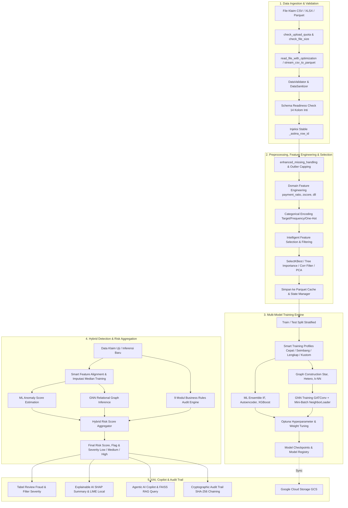

# ALUR KERJA ASTINA (Analisis Sistem Transaksi Identifikasi Nilai Anomali)

Dokumen ini mendokumentasikan secara menyeluruh arsitektur, alur kerja *end-to-end*, logika matematika agregasi risiko, spesifikasi modul kecerdasan buatan (*Machine Learning*, *Graph Neural Network*, *Agentic Copilot RAG*), seleksi fitur adaptif, tata kelola data, pengujian, serta pedoman operasional sistem ASTINA.

---

## 1. Ringkasan Sistem

**ASTINA** adalah platform analitik dan investigasi fraud klaim asuransi kesehatan berbasis **Hybrid AI Enterprise** yang menggabungkan:

- **Automated Preprocessing & Domain Feature Engineering**: Ekstraksi temporal, rasio moneter domain asuransi, deteksi outlier IQR, dan encoding variabel kategorik otomatis.
- **Intelligent Feature Selection & Redundancy Filtering**: Seleksi multivariat SelectKBest (ANOVA F-Score & Mutual Information), Tree-based Feature Importance (Random Forest, ExtraTrees, LightGBM), filter multikolinearitas terbobot skor, filter *low-variance* skala invarian, serta reduksi dimensi PCA interaktif.
- **Machine Learning Ensemble**: Kombinasi multi-model *Isolation Forest*, *PyTorch Deep Autoencoder*, *XGBoost / LightGBM*, dan *DBSCAN/HDBSCAN*.
- **Relational Graph Neural Network (GNN)**: Analisis relasional berbasis `GATConv` (Graph Attention Network) pada topologi *Star Graph*, *Heterogeneous Graph*, dan *k-NN Graph* untuk membongkar sindikat kolusi massal (*fraud rings*).
- **9 Modul Rule-Based Business Engine**: Audit kepatuhan deterministik terhadap 9 kategori fraud klaim medis asuransi kesehatan.
- **Agentic AI Copilot & Knowledge RAG**: Asisten investigasi berbasis *Retrieval-Augmented Generation* (FAISS vector store) yang memahami standar medis ICD-10, CPT, dan regulasi audit klaim asuransi.
- **Explainable AI (XAI)**: Atribusi fitur global dan lokal berbasis SHAP (*SHapley Additive exPlanations*) dan LIME (*Local Interpretable Model-agnostic Explanations*).
- **Cryptographic Audit Trail**: Pencatatan riwayat audit forensik berantai hash SHA-256 anti-tamper untuk integritas pembuktian hukum dan kepatuhan compliance.
- **Modern Glassmorphic UI & 5-Stage Visual Breadcrumbs**: Antarmuka responsif Streamlit dengan *live telemetry pills* status data, akselerasi GPU/CPU, dan pelacak alur investigasi.

---

## 2. Arsitektur Sistem Tingkat Tinggi



### Tabel Komponen Utama

| Komponen | Berkas Sumber | Tanggung Jawab Utama |
| :--- | :--- | :--- |
| **Entry Point & Router** | `main.py` | Konfigurasi Streamlit, top navbar, inisialisasi state, error boundary |
| **UI Components & Styles** | `ui_components.py` | Glassmorphic CSS, breadcrumb tracker, live telemetry pills |
| **UI Sidebar & Nav** | `ui/sidebar.py` | Navigasi menu, status kesiapan pipeline (0–100%), telemetri hardware |
| **UI Utilities & Charts** | `ui/utils.py` | Smart feature alignment, visual helper, chart Plotly, export data |
| **File Handler** | `file_handler.py` | Streaming CSV-to-Parquet, optimasi memory dtype, buffer IO |
| **Large File Processor** | `large_file_processor.py` | Chunking dataset, memory-bounded preprocessing per batch |
| **Data Validator & Sanitizer** | `data_validator.py` | Integritas kolom, sanitasi tipe data, evaluasi skema 14 kolom inti |
| **Data Preprocessing & Selection**| `preprocessing_optimized.py` | Imputasi, outlier capping, domain features, SelectKBest, Corr filter, PCA |
| **Model Engine & GNN** | `model.py` | CombinedAnomalyDetector, Autoencoder PyTorch, GNN GATConv, Optuna |
| **Model Explainer (XAI)** | `model_explainer.py` | Atribusi SHAP Tree/KernelExplainer, LIME tabular explanations |
| **Agentic AI Copilot** | `agentic_copilot.py` | AI assistant investigasi fraud, multi-provider LLM & reasoning |
| **RAG Knowledge Base** | `rag_engine.py` | Indexing FAISS, semantic search ICD-10, CPT, regulasi medis |
| **Business Rule Pipeline** | `fraud_risk_pipeline.py` | Orkestrasi 9 kelompok aturan kepatuhan klaim asuransi |
| **Cryptographic Audit Trail** | `audit_trail.py` | Pencatatan rantai log hash SHA-256 anti-tamper |
| **Audit Verification** | `verify_audit_trail.py` | Skrip verifikasi integritas rantai blok hash audit trail |
| **State Manager** | `state_manager.py` | Manajemen transisi halaman, session state Streamlit, caching path |
| **Cache Manager** | `cache_manager.py` | Multi-tier Parquet & session cache, eviction policy |
| **Model Registry** | `model_registry.py` | Versi model, schema metadata, dynamic model loader |
| **Cloud Storage** | `cloud_storage.py` | Sinkronisasi model dan checkpoint ke Google Cloud Storage (GCS) |
| **System Telemetry** | `system_status.py` | Monitoring utilisasi CPU, RAM, GPU/VRAM, dan hardware specs |

---

## 3. Startup, Top Navbar, dan Alur Navigasi

### 3.1 Startup Flow

Aplikasi diaktifkan melalui terminal atau *production launcher*:

```powershell
# Jalankan menggunakan Streamlit
.\.venv\Scripts\Activate.ps1
streamlit run main.py

# Atau menggunakan production launcher
python run.py
```

`main.py` mengeksekusi tahapan inisialisasi:
1. Memanggil `st.set_page_config()` pada baris pertama (judul, favicon, layout wide).
2. Menginjeksikan *glassmorphic custom CSS* dari `ui_components.py`.
3. Menginisialisasi session state bawaan (`page="home"`, `is_processing=False`, dll).
4. Merender **Glassmorphic Top Navbar**:
   - Menampilkan *Live Telemetry Pills*: Baris & Fitur Data Terproses, Status Model Terlatih, Akselerasi Akses (CPU / CUDA GPU), dan Status Agentic Copilot.
   - Menampilkan **5-Stage Visual Breadcrumb Tracker**:
     `1. Unggah Data` ➔ `2. Praproses & Fitur` ➔ `3. Pelatihan` ➔ `4. Evaluasi` ➔ `5. Deteksi`.
5. Merender `ui/sidebar.py` (Progress Kesiapan 0%–100%, Spesifikasi Dataset, Switch Dataset).
6. Melakukan *safe routing* ke modul halaman aktif dengan *page-level try-except error boundary*.

### 3.2 Daftar Halaman Aplikasi

```text
[Home] ──> [Data Collection] ──> [Training] ──> [Evaluation] ──> [Detection] ──> [Status]
```

1. `home`: Dashboard ikhtisar sistem, status ringkas, dan shortcut alur kerja.
2. `collect`: Upload dataset, validasi skema 14 kolom, EDA, preprocessing, dan seleksi fitur interaktif.
3. `train`: Split data, Smart Training Profiles, estimasi beban komputasi, training ensemble ML & GNN.
4. `evaluate`: Evaluasi performa test set, Confusion Matrix, ROC/PR Curves, SHAP/LIME, dan analisis GNN.
5. `detect`: Deteksi batch klaim baru, eksekusi 9 aturan bisnis, tabel review fraud, XAI, dan AI Copilot.
6. `status`: Telemetri beban perangkat, pemantauan cache, log sistem, dan verifikasi Cryptographic Audit Trail.

---

## 4. Rincian Modul Halaman

### 4.1 Home (`ui/pages/home.py`)
- Menampilkan kartu metrik arsitektur *Hybrid AI*.
- Menampilkan ringkasan status kesiapan pipeline data dan model aktif.
- Menyediakan tombol aksi cepat menuju modul *Data Collection* atau *Detection*.

### 4.2 Data Collection & Preprocessing (`ui/pages/data_collection.py`)
- **File Uploader Multi-Format**: Menerima `.csv`, `.xlsx`, `.xls`, dan `.parquet` hingga batas 3 GiB.
- **Validasi Kuota & Ukuran**: Memeriksa kuota harian dan alokasi memori melalui `rate_limit.py`.
- **Schema Readiness Card**: Evaluasi otomatis ketersediaan 14 kolom inti (100% Lengkap, 70–99% Parsial, <70% Ditolak).
- **Exploratory Data Analysis (EDA)**: Distribusi nilai numerik, visualisasi *missing value*, dan analisis korelasi awal.
- **Opsi Preprocessing Terpadu**:
  - Deteksi dan capping outlier berbasis IQR.
  - Ekstraksi fitur tanggal (*day_of_week*, *month*, *quarter*).
  - Pembentukan rasio domain asuransi (*payment_ratio*, *allowance_ratio*, *zscore*, *high_amount_quick_submit*).
  - Pilihan strategi encoding kategori (*Target Encoding*, *Frequency Encoding*, *One-Hot Encoding*).
- **Modul Seleksi Fitur Cerdas (Interactive Feature Selection UI)**:
  - **Metode Seleksi**:
    - *SelectKBest (ANOVA F-Score)*: Memilih $K$ fitur dengan variansi antar-kelas tertinggi.
    - *SelectKBest (Mutual Information)*: Mengukur ketergantungan non-linear antara fitur dan target/pseudo-label.
    - *Tree-based Feature Importance*: Memanfaatkan *Random Forest*, *ExtraTrees*, atau *LightGBM* dengan *pseudo-labeling* otomatis untuk mengukur kontribusi fitur secara non-linear.
  - **Filter Redundansi Cerdas**:
    - *Filter Multikolinearitas Terbobot Skor*: Mendeteksi pasangan fitur dengan korelasi Pearson $r > 0.90$ dan secara otomatis mempertahankan fitur dengan skor kepentingan lebih tinggi.
    - *Filter Low-Variance Skala Invarian*: Menghapus fitur konstan atau mendekati konstan dengan menghitung variansi pada data ternormalisasi $[0, 1]$, melindungi fitur rasio berskala kecil agar tidak terhapus keliru.
  - **Reduksi Dimensi PCA**:
    - Mereduksi dimensi fitur numerik dengan slider persentase *explained variance ratio* ($80\% - 99\%$) disertai grafik akumulasi varians interaktif.
- **Simpan & Downstream State**: Menulis DataFrame hasil ke file Parquet terkompresi Zstandard dan memperbarui `state_manager.py`.

### 4.3 Training Model (`ui/pages/training.py`)
- **Data Splitting**: Pembagian data latih (*train*) dan data uji (*test*) dengan metode *Stratified Split* (mempertahankan proporsi label fraud) atau *Random Split*.
- **Smart Training Profiles & Complexity Estimator**:
  - ⚡ **Mode Cepat (*Tabular Fast*)**: Isolation Forest (50 tree) + XGBoost, tanpa Autoencoder/GNN/Optuna (~10–30 dtk). Sangat efisien untuk CPU lokal dan serverless Cloud Run.
  - ⚖️ **Mode Seimbang (*Balanced*)**: Isolation Forest + PyTorch Autoencoder (20 epoch) + XGBoost (~1–2 mnt).
  - 🧠 **Mode Lengkap (*Deep Graph Ensemble*)**: Seluruh model ensemble, topologi graf GNN, serta optimasi bobot Optuna FPR Minimizer.
  - 🛠️ **Mode Kustom**: Kebebasan memilih algoritma, parameter epoch, learning rate, sampling neighbor, dan bobot ensemble.
- **Hardware-Aware Telemetry**: Monitor beban komputasi *real-time* yang mendeteksi ketersediaan GPU NVIDIA CUDA dan memberikan rekomendasi hardware (*Badge*: 🟢 Ringan, 🟡 Sedang, 🔴 Berat).
- **Asynchronous Training Worker**: Pelatihan berjalan di background thread dengan penulisan progres ke `cache/training_status.json`, mencegah UI Streamlit mengalami *freezing*.
- **Visualisasi Topologi Graf**: Menampilkan visualisasi interaktif NetworkX + Plotly untuk relasi rujukan antar faskes, dokter, dan pasien.

### 4.4 Evaluation & Explainability (`ui/pages/evaluation.py`)
- **Metrik Klasifikasi Supervised**: Evaluasi Accuracy, Precision, Recall, F1-Score, ROC-AUC, PR-AUC, dan Brier Score.
- **Visualisasi Diagnostik**: Interactive Confusion Matrix heatmap, ROC Curve, dan Precision-Recall Curve.
- **Explainable AI (XAI)**:
  - *Global Feature Importance*: SHAP Summary Beeswarm Plot dan Bar Plot atribut signifikansi global.
  - *Local Instance Explanation*: LIME Waterfall Plot dan Force Plot untuk membedah alasan individual suatu klaim ditandai anomali.
- **GNN Relational Contribution**: Analisis kontribusi koneksi graf terhadap probabilitas anomali klaim.

### 4.5 Detection, Rule Auditing & AI Copilot Workspace (`ui/pages/detection.py`)
Halaman deteksi menyediakan alur kerja investigasi terpadu berbasis **5 Tab Spesifik**:
- **Smart Data Ingestion & Feature Alignment**:
  - Mendukung input dataset multi-sumber: unggah file baru (CSV, Excel xlsx/xls, Parquet), reuse dataset session aktif, atau sampel demo bawaan.
  - *Smart Feature Alignment*: Menyelaraskan nama dan tipe kolom klaim uji dengan skema fitur model terlatih (`training_features`), serta melakukan imputasi statistik nilai hilang berbasis median training (`feature_medians`).
  - *Hardware-Aware Multi-Model Inference*: Inferensi ensemble (Isolation Forest, Autoencoder, XGBoost, GNN) dengan alokasi otomatis komputasi CUDA GPU / CPU yang aman.
- **Tab 1: 📊 Ringkasan & Visualisasi**:
  - *Grafik Distribusi Prediksi Anomali*: Visualisasi seimbang jumlah klaim `Normal` vs `Anomali` yang stabil pada berbagai proporsi dataset.
  - *Histogram Skor Probabilitas Anomali*: Distribusi probabilitas ensemble multi-model dilengkapi garis ambang batas (*threshold marker*).
  - *Executive Risk Summary Panel*: 11 kartu ringkasan eksekutif (*Total Klaim, Anomali, High Risk, Repeat Billing, Phantom Service, Provider Capacity, Duplicate Payment, Upcoding & Unbundling, Inflated Bill Cloning, Length of Stay Risk, Medication/Device Fraud*).
  - *Proporsi Risiko per Kategori*: Diagram batang dan *donut chart* proporsi kategori risiko klaim.
- **Tab 2: 🚨 Business Risk & Rules**:
  - Deteksi dan rincian pelanggaran klaim berulang (*Repeat Billing*) dan layanan fiktif (*Phantom Service*).
  - Ringkasan komprehensif 9 modul aturan bisnis dengan statistik kasus dan rasio risiko.
- **Tab 3: 📋 Fraud Review Table & Export**:
  - Tabel audit interaktif klaim terfilter dengan badge keparahan (*🔴 High Risk*, *🟡 Medium Risk*, *🟢 Low Risk*).
  - Filter pencarian instan, filter kategori risiko, dan pengurutan berbasis *Final Risk Score*.
  - Ekspor hasil analisis lengkap ke berkas CSV atau Excel untuk pelaporan tim investigasi lapangan.
- **Tab 4: 🤖 AI Investigator Copilot & BAP**:
  - Pembuatan otomatis **Berita Acara Pemeriksaan (BAP)** dan resume medis formal.
  - Didukung multi-provider LLM (Google Gemini, OpenAI / Azure, Local Ollama, dan Heuristic Engine Offline).
  - Dilengkapi fitur pencarian dasar regulasi medis terkait (*Semantic RAG*) dan tombol unduh dokumen BAP dalam format Markdown (.md).
- **Tab 5: 📈 Concept Drift & Retraining**:
  - Uji pergeseran distribusi data (*Covariate & Concept Drift*) menggunakan uji statistik Kolmogorov-Smirnov.
  - Pemicu otomatis re-evaluasi model *Champion vs Challenger* ketika terdeteksi degradasi performa atau pergeseran pola data transaksi klaim.

### 4.6 System Status & Audit (`ui/pages/status.py`)
- Memonitor utilisasi CPU, RAM, Disk, dan GPU *real-time*.
- Menyediakan statistik ukuran cache Parquet dan tombol *clear cache*.
- Menampilkan ringkasan rantai log *Cryptographic Audit Trail* dan memvalidasi keutuhan hash SHA-256.

---

## 5. Spesifikasi 14 Kolom Inti & Evaluasi Kesiapan Skema

Dataset klaim memerlukan 14 kolom standar berikut untuk memastikan seluruh modul AI dan aturan bisnis berfungsi optimal:

| No | Nama Kolom | Tipe Data | Contoh Nilai | Modul yang Bergantung |
| :---: | :--- | :--- | :--- | :--- |
| 1 | `claim_id` | String/Int | `CLM-01001` | Audit Trail, Duplicate Payment, ID Pelacak |
| 2 | `patient_id` | String/Int | `PAT-00201` | Repeat Billing, Fuzzy Matching, Topologi Graf GNN |
| 3 | `provider_id` | String/Int | `PROV-00011` | Provider Capacity, Topologi Graf GNN |
| 4 | `service_code` | String | `99213` | Phantom Service, Upcoding & Unbundling |
| 5 | `diagnosis_code` | String | `J06.9`, `E11.9` | Phantom Service, Topologi Graf GNN |
| 6 | `billing_date` | Date | `2024-01-15` | Repeat Billing, High Amount Quick Submit |
| 7 | `service_date` | Date | `2024-01-10` | Provider Capacity, Length of Stay |
| 8 | `billed_amount` | Float | `15000000.0` | ML Ensemble, payment_ratio, allowance_ratio |
| 9 | `paid_amount` | Float | `12000000.0` | payment_ratio, Inflated Bill & Cloning |
| 10 | `allowed_amount` | Float | `13500000.0` | allowance_ratio |
| 11 | `claim_status` | String | `APPROVED` | Duplicate Payment & Claim Status Validator |
| 12 | `patient_age` | Integer | `45` | Feature Engineering: age_group, age_squared |
| 13 | `length_of_stay` | Integer | `3` (0 rawat jalan)| Length of Stay & Readmission Rules |
| 14 | `quantity` | Integer | `10` | Medication & Device Fraud Rules |

---

## 6. Preprocessing & Seleksi Fitur Cerdas

### 6.1 Alur Preprocessing Standar

```text
Input Raw DataFrame
  │
  ├── 1. Injeksi _astina_row_id stabil
  ├── 2. Sanitasi Tipe Data & Missing Handling (Imputasi Median / Mode)
  ├── 3. Validasi Range & Outlier Capping (IQR Method)
  ├── 4. Ekstraksi Fitur Temporal Tanggal
  ├── 5. Domain Feature Engineering (payment_ratio, allowance_ratio, zscore, dll)
  ├── 6. Categorical Encoding (Target / Frequency / One-Hot)
  ├── 7. Seleksi Fitur Multivariat & Filter Redundansi
  └── 8. Output Processed DataFrame + Schema Metadata
```

### 6.2 Logika Seleksi Fitur Terintegrasi

1. **SelectKBest ANOVA F-Score (`apply_select_k_best`)**:
   Menghitung rasio variansi antar-grup terhadap variansi dalam-grup:
   $$F = \frac{\text{MS}_{\text{between}}}{\text{MS}_{\text{within}}}$$
   Fitur dengan nilai $F$ tertinggi dipilih sebanyak $K$.

2. **SelectKBest Mutual Information (`apply_select_k_best`)**:
   Menghitung *information gain* non-linear antara fitur $X$ dan target $Y$:
   $$I(X; Y) = \sum_{x \in X} \sum_{y \in Y} p(x, y) \log \left( \frac{p(x, y)}{p(x)p(y)} \right)$$

3. **Tree-Based Feature Importance (`apply_tree_based_selection`)**:
   Melatih model pohon keputusan (*Random Forest* / *ExtraTrees* / *LightGBM*) menggunakan *pseudo-label* anomali jika dataset bersifat unsupervised, kemudian mengambil fitur teratas berdasarkan *Gini Importance* atau *Split Gain*.

4. **Filter Multikolinearitas Terbobot Skor (`filter_correlated_features`)**:
   Menghitung matriks korelasi absolut $|r_{ij}|$. Jika $|r_{ij}| > \text{threshold}$ (default $0.90$), sistem membandingkan skor kepentingan fitur $i$ dan $j$, lalu secara cerdas hanya mengeliminasi fitur dengan skor yang lebih rendah:
   $$\text{Drop } X_j \iff |r_{ij}| > 0.90 \land \text{Score}(X_i) \ge \text{Score}(X_j)$$

5. **Filter Low-Variance Skala Invarian (`filter_low_variance_features`)**:
   Menghitung variansi ternormalisasi pada rentang $[0, 1]$:
   $$\text{Var}_{\text{norm}}(X) = \frac{\text{Var}(X)}{(\max(X) - \min(X))^2}$$
   Mencegah terhapusnya fitur rasio bernilai kecil ($0.00 - 1.00$) yang memiliki informasi anomali penting.

6. **Reduksi Dimensi PCA (`apply_pca_reduction`)**:
   Melakukan dekomposisi nilai singular (*SVD*) pada matriks kovarians terstandarisasi untuk menghasilkan komponen ortogonal baru yang mencakup varians kumulatif yang ditargetkan (misalnya $95\%$).

---

## 7. Model AI Ensemble & Graph Neural Network

### 7.1 Combined Anomaly Detector

Model ensemble menggabungkan berbagai paradigma machine learning:

1. **Isolation Forest**: Memisahkan anomali melalui pemotongan acak pohon partisi (*isolation depth*).
2. **PyTorch Deep Autoencoder**: Arsitektur neural network *encoder-bottleneck-decoder* non-linear yang mengukur anomali dari *Reconstruction Loss*:
   $$\mathcal{L}_{\text{recon}} = \frac{1}{d} \sum_{k=1}^d (x_k - \hat{x}_k)^2$$
3. **XGBoost / LightGBM**: *Gradient Boosted Decision Trees* yang memprediksi probabilitas anomali berdasarkan fitur terstruktur non-linear.
4. **DBSCAN / HDBSCAN**: *Density-based spatial clustering* untuk mendeteksi *noise points* terisolasi.

### 7.2 Graph Neural Network (GATConv)

`InsuranceAnomalyGNNModel` memodelkan relasi transaksi klaim sebagai graf:
- **Node**: Representasi setiap klaim dengan fitur terstandarisasi.
- **Edges**: Hubungan klaim yang berbagi faskes, dokter, pasien, atau diagnosis sama.
- **Arsitektur**: Menggunakan `GATConv` (*Graph Attention Network*) dengan multi-head attention:
  $$\alpha_{ij} = \frac{\exp\left(\text{LeakyReLU}\left(\mathbf{a}^\top [\mathbf{W}\mathbf{h}_i \,\|\, \mathbf{W}\mathbf{h}_j]\right)\right)}{\sum_{k \in \mathcal{N}_i} \exp\left(\text{LeakyReLU}\left(\mathbf{a}^\top [\mathbf{W}\mathbf{h}_i \,\|\, \mathbf{W}\mathbf{h}_k]\right)\right)}$$
- **Mini-Batch NeighborLoader**: Mendukung *neighborhood sampling* bertingkat untuk menangani graf besar berskala ratusan ribu transaksi tanpa kehabisan memori GPU/RAM.

---

## 8. Agregasi Risiko Hybrid & 9 Modul Aturan Bisnis

### 8.1 9 Modul Business Rules

1. **Repeat Billing**: Mendeteksi pengajuan ulang klaim pasien yang sama untuk tindakan serupa dalam rentang $\le 30$ hari.
2. **Phantom Service**: Mendeteksi layanan fiktif, tanggal tindakan tidak valid, atau tindakan medis yang tercatat di luar tanggal rawat inap.
3. **Provider Capacity**: Mengidentifikasi volume layanan dokter/faskes yang melebihi kapasitas fisiologis maksimal per hari kalender.
4. **Claim Status & Duplicate Payment**: Mendeteksi duplikasi pencairan klaim yang telah berstatus `PAID` atau disetujui sebelumnya.
5. **Upcoding & Unbundling**: Mendeteksi manipulasi penetapan kode tarif lebih tinggi dan pemecahan tindakan terpadu menjadi tagihan parsial terpisah.
6. **Inflated Bill & Cloning**: Mengidentifikasi tagihan ekstrem di atas ambang batas benchmark medis dan rekam medis hasil duplikasi (*cloned charts*).
7. **Length of Stay & Readmission**: Evaluasi lama hari rawat inap yang melampaui batas wajar klinis (*LOS outlier*) serta readmisi pasien dalam waktu singkat.
8. **Medication & Device Fraud**: Mengaudit kuantitas obat berlebih, dosis di luar batas rasional, dan markup harga alat kesehatan tak wajar.
9. **Fuzzy Claim Matching**: Pencocokan kemiripan leksikal klaim non-identik berbasis algoritma Levenshtein/Jaro-Winkler.

### 8.2 Formula Agregasi Skor Risiko

$$\text{Business Risk Score} = 0.40(R_{\text{repeat}}) + 0.20(R_{\text{phantom}}) + 0.15(R_{\text{capacity}}) + 0.15(R_{\text{fuzzy}}) + 0.10(R_{\text{additional}})$$

$$\text{Final Risk Score} = 0.50(\text{Business Risk Score}) + 0.30(\text{ML Anomaly Score}) + 0.20(\text{Duplicate Payment Flag})$$

### 8.3 Klasifikasi Tingkat Keparahan (Severity Classification)

- 🟢 **Low Risk**: $\text{Final Risk Score} < 0.40$
- 🟡 **Medium Risk**: $0.40 \le \text{Final Risk Score} < 0.65$
- 🔴 **High Risk**: $\text{Final Risk Score} \ge 0.65$

---

## 9. Agentic AI Copilot & Knowledge RAG

Modul `agentic_copilot.py` dan `rag_engine.py` bertindak sebagai asisten investigasi otonom bagi investigator asuransi:

1. **PII Sanitizer & Context Builder (`ClaimContextBuilder`)**:
   - Mengekstrak atribut klaim terpilih, nilai SHAP kontribusi fitur teratas, dan klaster kolusi graf GNN.
   - Melakukan anonimisasi/masking data sensitif pasien (NIK, Nama, Rekam Medis) secara otomatis sebelum dikirim ke model bahasa (LLM) sesuai kepatuhan UU PDP & HIPAA.

2. **Knowledge Indexing & Regulatory Retrieval (`RAGEngine` & FAISS)**:
   - Menyimpan vektor *embedding* dari standar ICD-10, pedoman kode CPT, regulasi asuransi kesehatan nasional/komersial, dan katalog indikator fraud medis.
   - Menggunakan pencarian semantik hibrida (vektor FAISS + BM25 keyword match) untuk mencocokkan pasal aturan medis yang relevan dengan jenis pelanggaran yang terdeteksi.

3. **Multi-Provider LLM Integration (`AgenticInvestigatorCopilot`)**:
   - **Google Gemini**: Integrasi API berbasis `gemini-1.5-flash` / `gemini-1.5-pro`.
   - **OpenAI / Azure**: Integrasi API model `gpt-4o` / `gpt-4-turbo`.
   - **Local Ollama**: Eksekusi lokal model open-weight (`llama3`, `mistral`, `qwen`) tanpa dependensi cloud.
   - **Deterministic Heuristic Engine**: Fallback otomatis berbasis aturan pakar medis terstruktur jika tidak tersedia koneksi internet atau kunci API.

4. **Automated BAP & Medical Summary Generation**:
   - Menghasilkan dokumen **Berita Acara Pemeriksaan (BAP)** terstruktur lengkap dengan identitas kasus, ringkasan profil risiko, temuan pelanggaran aturan bisnis, analisis klinis fitur anomali, dasar hukum/regulasi terkait, dan rekomendasi audit forensik.
   - Dokumen BAP dapat langsung diunduh dalam format Markdown (`.md`) atau disalin untuk keperluan berkas perkara investigasi resmi.

---

## 10. Cryptographic Audit Trail & Privasi Data (PII)

### 10.1 Chained Hash Audit Logging

Setiap aksi kritis dalam sistem (upload dataset, eksekusi preprocessing, training model, inferensi deteksi, ekspor laporan) dicatat ke dalam `logs/audit_trail.jsonl`.

Struktur blok log audit:
```json
{
  "timestamp": "2026-08-27T10:30:00.123456Z",
  "event_type": "DETECTION_BATCH_COMPLETED",
  "actor": "investigator_user",
  "dataset_hash": "e3b0c44298fc1c149afbf4c8996fb92427ae41e4649b934ca495991b7852b855",
  "details": {
    "total_claims": 5000,
    "high_risk_count": 42
  },
  "previous_hash": "a1b2c3d4...",
  "entry_hash": "9f8e7d6c..."
}
```

Rumus rantai hash:
$$\text{Entry Hash}_k = \text{SHA256}\left(\text{Timestamp}_k \,\|\, \text{Event}_k \,\|\, \text{Details}_k \,\|\, \text{Entry Hash}_{k-1}\right)$$

Jika satu karakter log dimanipulasi secara ilegal, verifikasi menggunakan `python verify_audit_trail.py` akan segera mendeteksi kerusakan rantai hash.

### 10.2 Perlindungan Privasi Data Pribadi (PII Masking)

Modul `pii_masker.py` melindungi data sensitif sesuai regulasi UU Perlindungan Data Pribadi (UU PDP) dan HIPAA:
- **NIK / Nomor Pasien**: `317101******0001`
- **Nama Pasien**: `B**** S*******`
- **Nomor Rekam Medis**: `RM-***-89`

---

## 11. Pengujian Kualitas & Quality Gate (53 Test Cases)

Seluruh komponen ASTINA diuji secara otomatis menggunakan suite Pytest yang mencakup **53 skenario uji komprehensif** (100% Passed):

```powershell
# Menjalankan seluruh test suite
.\.venv\Scripts\python.exe -m pytest tests/ -v
```

### Rincian Modul Uji

| Modul Test | Jumlah Uji | Cakupan Verifikasi |
| :--- | :---: | :--- |
| `test_agentic_copilot.py` | 5 | Uji pencarian semantik FAISS RAG, inferensi reasoning Copilot, fallback provider |
| `test_app_startup.py` | 1 | Uji startup aplikasi dan validitas seluruh dependensi import utama |
| `test_detection_modules.py` | 14 | Uji menyeluruh 9 modul business rules, edge cases, dan integrasi pipeline |
| `test_feature_selection.py` | 6 | Uji SelectKBest (F-score & MI), Tree Importance, Filter Multikolinearitas, Low-Variance, PCA |
| `test_gnn_minibatch.py` | 4 | Uji PyTorch GNN mini-batch NeighborLoader, forward pass, dan early stopping |
| `test_graph_scaling.py` | 2 | Uji batasan node/edge graph builder dan pencegahan OOM pada graf besar |
| `test_large_file_ingestion.py` | 2 | Uji konversi streaming CSV-to-Parquet per chunk dengan alokasi buffer aman |
| `test_optuna_ensemble_and_drift.py`| 5 | Uji optimasi hyperparameter Optuna dan deteksi Kolmogorov-Smirnov drift |
| `test_pipeline_edge_cases.py` | 12 | Uji toleransi data null, data bertipe campuran, sanitasi string, dan extreme amounts |
| `test_streaming_preprocessing_memory.py` | 2 | Uji batasan pemakaian RAM (<100MB peak) pada pemrosesan streaming skala besar |
| **Total Test Suite** | **53** | **100% Passed (Green)** |

---

## 12. Panduan Deployment Multi-Environment

### 12.1 Localhost Environment
```powershell
# 1. Setup Virtual Environment
py -3.13 -m venv .venv
.\.venv\Scripts\Activate.ps1

# 2. Install Dependensi
pip install -r requirements.txt

# 3. Jalankan Aplikasi
streamlit run main.py
```

### 12.2 Docker Desktop
```bash
# Build dan jalankan container dengan Docker Compose
docker-compose up --build -d

# Pantau status dan log
docker-compose ps
docker-compose logs -f
```

### 12.3 Google Cloud Run Serverless
```powershell
# Deploy otomatis via PowerShell
.\.cloudrun\deploy.ps1
```

---

<p align="center">
  <b>copyright@2026 TIM ASTINA INDONESIA</b><br>
  <i>Analisis Sistem Transaksi Identifikasi Nilai Anomali</i>
</p>
