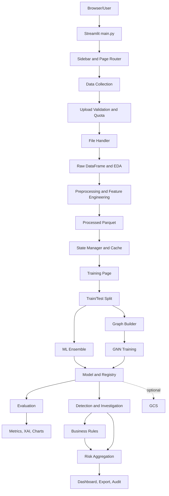

# ALUR KERJA ASTINA

## 1. Ringkasan Sistem

ASTINA adalah aplikasi Streamlit untuk deteksi fraud dan anomali klaim asuransi kesehatan. Sistem menggabungkan:

- preprocessing dan feature engineering otomatis;
- model machine learning ensemble;
- Graph Neural Network (GNN) untuk hubungan antar klaim;
- sembilan kelompok business rules;
- explainable AI menggunakan SHAP dan LIME;
- evaluasi model dan monitoring;
- registry model, cache, audit trail, serta sinkronisasi artefak ke Google Cloud Storage.

Tujuan alur kerja adalah mengubah data klaim mentah menjadi skor risiko yang dapat ditindaklanjuti oleh investigator.

## 2. Arsitektur Tingkat Tinggi



### Komponen utama

| Komponen | Lokasi | Tanggung jawab |
|---|---|---|
| Entry point | `main.py` | Konfigurasi Streamlit, inisialisasi state, routing halaman, error boundary |
| UI utilities | `ui/utils.py` | Helper data, chart, alignment fitur, konfigurasi tampilan |
| Sidebar | `ui/sidebar.py` | Navigasi, status dataset, status model, status perangkat |
| File handler | `file_handler.py` | Temporary upload, pembacaan file, optimasi dtype, Parquet |
| Validator | `data_validator.py` | Integritas, tipe kolom, range, validasi ML |
| Preprocessor | `preprocessing_optimized.py` | Missing value, tanggal, encoding, outlier, feature engineering |
| Large-file processor | `large_file_processor.py` | Pemrosesan per chunk dan paralel |
| State manager | `state_manager.py` | State Streamlit, path processed data, split dataset |
| Cache | `cache_manager.py` | Hash file, cache Parquet, metadata, eviction |
| Model engine | `model.py` | Ensemble ML, autoencoder, XGBoost, DBSCAN, GNN, save/load |
| Rule pipeline | `fraud_risk_pipeline.py` | Agregasi sembilan kelompok rules |
| Model registry | `model_registry.py` | Versi model dan metadata |
| Cloud storage | `cloud_storage.py` | Mirror dan restore artefak ke GCS |
| Monitoring | `metrics.py`, `enhanced_metrics.py` | Counter, gauge, durasi, metrik operasi |
| Audit | `audit_trail.py` | Audit upload, preprocessing, training, deteksi |

## 3. Startup dan Routing

### 3.1 Entry point

Aplikasi dijalankan dengan:

```powershell
.\.venv\Scripts\Activate.ps1
streamlit run main.py
```

Atau melalui launcher:

```powershell
python run.py
```

`main.py` melakukan langkah berikut:

1. Mengimpor Streamlit dan konfigurasi dasar.
2. Menetapkan `st.set_page_config()` satu kali sebelum command UI lain.
3. Mengaktifkan custom CSS dari `ui_components.py`.
4. Mengimpor sidebar dan semua page module.
5. Menginisialisasi state default.
6. Menjalankan `render_sidebar()`.
7. Memilih page berdasarkan `st.session_state["page"]`.
8. Menangkap exception pada page-level dan menyediakan navigasi kembali ke home.

### 3.2 State awal

State yang dibuat oleh `main()`:

- `page = "home"`
- `is_processing = False`
- `processing_message = ""`
- `page_before_processing = None`

Nilai page yang valid didefinisikan oleh `state_manager.VALID_PAGES`:

- `home`
- `collect`
- `train`
- `evaluate`
- `detect`
- `status`

Perubahan halaman menggunakan `state_manager.navigate_to_page()`. Fungsi ini memvalidasi nama page dan memanggil `st.rerun()` hanya bila page berubah.

## 4. Halaman dan Fungsi Fitur

### 4.1 Home

File: `ui/pages/home.py`

Fungsi utama:

- menampilkan ringkasan ASTINA;
- menampilkan shortcut menuju pengumpulan data, training, evaluasi, dan deteksi;
- memberikan konteks status sistem kepada pengguna.

### 4.2 Data Collection

File: `ui/pages/data_collection.py`

Fungsi utama: `show_data_collection_page()`.

Fungsi yang dijalankan:

1. Menampilkan `st.file_uploader()`.
2. Menerima CSV, XLSX, XLS, dan Parquet.
3. Memeriksa quota dengan `check_upload_quota()`.
4. Membaca informasi file melalui `get_file_info()`.
5. Menampilkan ukuran file, kategori, dan rekomendasi chunk.
6. Memanggil `load_and_validate_raw_data()`.
7. Menampilkan hasil validasi.
8. Menampilkan EDA dan sample data.
9. Menyediakan pilihan preprocessing.
10. Menjalankan preprocessing saat tombol `Proses Data` ditekan.
11. Menyimpan output ke Parquet.
12. Mengisi state downstream untuk training.
13. Menulis audit trail dan metrics.

Fungsi cached:

```python
load_and_validate_raw_data(uploaded_file)
```

Fungsi ini mengembalikan:

```text
DataFrame, memory_info, is_valid, validation_results
```

Opsi preprocessing yang tersedia:

- optimasi file besar;
- deteksi outlier;
- validasi data;
- penghapusan duplikasi;
- subset kolom untuk pengecekan duplikasi.

### 4.3 Training

File: `ui/pages/training.py`

Fungsi utama:

- memuat processed dataset;
- menentukan mode supervised atau unsupervised;
- memilih fitur;
- membagi train/test;
- memilih algoritma;
- membangun graph untuk GNN;
- menjalankan training asynchronous;
- menyimpan checkpoint dan model registry;
- menampilkan visualisasi graph dan kurva training.

### 4.4 Evaluation

File: `ui/pages/evaluation.py`

Fungsi utama:

- memuat detector tersimpan;
- memuat `test_df`;
- menyelaraskan fitur evaluasi dengan schema training;
- menjalankan `predict_anomaly_probability()`;
- menghitung metrik supervised;
- menampilkan confusion matrix dan ROC/PR metrics;
- menampilkan feature importance melalui SHAP/LIME;
- menampilkan analisis kontribusi GNN dan monitoring.

### 4.5 Detection

File: `ui/pages/detection.py`

Fungsi utama:

- mengimpor model ZIP;
- menerima data deteksi baru dari CSV atau form manual;
- menjalankan preprocessing yang konsisten dengan training;
- melakukan feature alignment;
- menghitung anomaly probability;
- menjalankan business rules;
- menggabungkan skor model dan business risk;
- menampilkan daftar klaim berisiko;
- menyediakan export dan detail investigasi.

### 4.6 Status

File: `ui/pages/status.py`.

Page ini meneruskan tampilan ke `system_status.show_system_status_page()`, yang menampilkan kesehatan aplikasi, perangkat, model, cache, dan operasi terakhir.

## 5. Alur Upload dan Validasi

### 5.1 Urutan upload

```text
File browser
  -> Streamlit uploader
  -> check_upload_quota
  -> check_file_size
  -> copy ke temporary file
  -> baca berdasarkan tipe file
  -> optimasi dtype
  -> sanitasi string/kolom
  -> comprehensive_validation
  -> EDA
  -> simpan metadata upload
```

Konfigurasi utama di `config.py`:

- `MAX_FILE_SIZE = 3 GiB`;
- `CHUNK_SIZE = 50 MiB` untuk konfigurasi umum;
- `LARGE_DATASET_CONFIG["chunk_size"] = 50_000` baris;
- caching data upload maksimum satu entry pada page collection.

### 5.2 Quota

Modul `rate_limit.py` menangani:

- quota upload harian;
- quota training harian;
- quota inference per menit;
- concurrent operations;
- histori request.

Quota disimpan in-process. Karena itu, quota belum bersifat global bila terdapat beberapa worker atau beberapa instance Cloud Run.

### 5.3 Validasi

Komponen validasi:

- `DataSanitizer.sanitize_dataframe()`;
- `DataValidator.check_basic_integrity()`;
- `DataValidator.check_column_types()`;
- `DataValidator.check_data_ranges()`;
- `DataValidator.validate_for_ml()`;
- `comprehensive_validation()`.

Sanitasi meliputi:

- normalisasi nama kolom ke lowercase dan underscore;
- penghapusan null byte;
- pembersihan control character;
- pemeriksaan dataset kosong;
- deteksi kolom konstan;
- pengukuran missing value;
- validasi tipe numerik, kategori, dan tanggal.

Hasil validasi membedakan error fatal dan warning. Data yang tidak valid dihentikan sebelum preprocessing.

## 6. File Ingestion dan Storage

Sebelum rule dan model dijalankan, pipeline mempertahankan stable `_astina_row_id` untuk setiap klaim. ID ini menjadi kunci internal untuk mapping score, flag, node GNN, hasil evaluasi, dan export. Mapping tidak bergantung pada posisi baris setelah sorting, sampling, reset index, atau penggabungan data.

### 6.1 Temporary upload

`read_file_with_optimization()` menyalin object upload ke temporary file menggunakan buffer 8 MiB. Ini mencegah proses penyalinan upload membuat salinan bytes besar secara eksplisit di memory aplikasi.

### 6.2 CSV

`read_large_csv()` menentukan ukuran chunk berdasarkan ukuran file. Untuk CSV besar, fungsi:

1. memanggil `stream_csv_to_parquet()`;
2. membaca CSV dengan `pd.read_csv(..., chunksize=...)`;
3. mengoptimalkan dtype setiap batch;
4. menulis batch melalui `pyarrow.parquet.ParquetWriter`;
5. menutup writer secara aman;
6. memuat hasil Parquet menjadi satu DataFrame untuk kompatibilitas workflow lama;
7. menghapus temporary Parquet.

Perbaikan ini menghilangkan pola lama berupa menyimpan semua chunk dalam list kemudian menjalankan `pd.concat()` untuk ingestion CSV besar.

### 6.3 Parquet

Parquet dibaca melalui Polars pada `read_with_polars()`, lalu dikonversi ke pandas. Bila Polars gagal, digunakan `pd.read_parquet()`.

### 6.4 Excel dan JSON

- Excel menggunakan `pd.read_excel()` dan cocok untuk file kecil/menengah.
- JSON menggunakan `pd.read_json()`.
- Excel tidak direkomendasikan untuk file mendekati 3 GiB karena format tersebut tidak efisien untuk streaming tabular.

### 6.5 Processed storage

`save_processed_data()`:

- memperbaiki kompatibilitas Arrow;
- membuat salinan DataFrame untuk serialisasi;
- menyimpan Parquet ke `TEMP_DATA_DIR`;
- mengembalikan path file hasil.

`load_processed_data()` dapat mengembalikan metadata lazy untuk file besar, tetapi beberapa caller lama masih memuat full DataFrame saat data dibutuhkan.

## 7. Preprocessing dan Feature Engineering

Fungsi utama: `preprocess_insurance_claims_optimized()` di `preprocessing_optimized.py`.

### 7.1 Urutan standard

1. `enhanced_missing_handling()`.
2. Validasi range.
3. Deteksi dan penanganan outlier.
4. Deteksi kolom tanggal.
5. Encoding kategori.
6. Seleksi fitur awal.
7. Feature engineering numerik.
8. Filtering fitur final.
9. Imputasi nilai akhir.
10. Penyusunan metadata preprocessing.

### 7.2 Missing value

`enhanced_missing_handling()`:

- membuat flag `<feature>_missing`;
- menghapus kolom dengan missing rate di atas 50 persen;
- mengisi numerik dengan median;
- mengisi kategori dengan mode atau `Unknown`.

### 7.3 Range dan outlier

Validasi range memproses pola nama kolom:

- umur dibatasi 0 sampai 120;
- amount, cost, price, dan fee negatif diubah menjadi absolut;
- percentage, rate, dan ratio dinormalisasi atau di-clip;
- count dan quantity negatif diubah menjadi absolut.

Deteksi outlier menggunakan IQR. Aksi default adalah `cap`, bukan menghapus baris.

### 7.4 Tanggal

Kolom yang memiliki nama `date`, `time`, `created`, atau `submitted` dapat menghasilkan:

- day of week;
- month;
- year;
- day;
- quarter.

### 7.5 Encoding kategori

Strategi dipilih berdasarkan cardinality:

- cardinality sampai 5: one-hot encoding;
- cardinality sampai 20: factor/label dan frequency encoding;
- cardinality tinggi: frequency-binned atau frequency encoding;
- kolom yang menyerupai ID dapat dilewati agar tidak menjadi leakage/noise.

### 7.6 Feature engineering

Fitur yang dapat dibuat mencakup:

- rasio amount antar kolom;
- `payment_ratio`;
- `allowance_ratio`;
- age group;
- age squared;
- count log dan count high;
- time late dan time quick;
- `high_amount_quick_submit`;
- z-score;
- percentile rank;
- interaksi sampai lima fitur numerik utama.

### 7.7 Dataset besar

Jika `enable_large_file_handling=True` dan jumlah baris melewati threshold, preprocessing didelegasikan ke `preprocess_large_dataset()`:

- chunk default 50.000 baris;
- pemrosesan maksimal dua worker;
- backend Joblib saat ini `threading`;
- penyamaan schema hasil chunk;
- merge hasil processed chunk;
- pembersihan fitur ID, missing tinggi, dan variance rendah.

Batas aktual: UI masih menyediakan DataFrame penuh kepada pipeline sebelum pemrosesan chunk. Karena itu, dukungan 3 GiB belum sepenuhnya bounded-memory end-to-end.

Untuk fraud rules, evaluasi dilakukan terhadap dataset global sebelum hasil akhir dikembalikan. Parameter `chunk_size` tidak boleh mengubah pasangan atau group lintas batas chunk. Stable `_astina_row_id` dipertahankan agar hasil rule tetap terkait dengan klaim asal.

## 8. State Management dan Cache

### 8.1 Dataset state

Kunci state yang digunakan:

- `df_processed_path`;
- `feature_columns`;
- `preprocessing_metadata`;
- `processed_data_hash`;
- `train_df`;
- `test_df`;
- `selected_features`;
- `feature_selection_method`;
- `original_feature_count`;
- `final_feature_count`.

### 8.2 Training state

- `current_training_detector`;
- `current_training_features`;
- `current_training_mode`;
- `current_training_label_column`;
- `training_in_progress`;
- `detector`;
- `model_trained`;
- `training_features`;
- `training_mode`;
- `training_label_column`.

### 8.3 Evaluation dan detection state

- `X_eval_test`;
- `eval_result_df`;
- `eval_predictions`;
- `eval_probabilities`;
- `eval_y_true`;
- `individual_probs`;
- `detection_results`;
- `detection_threshold`;
- `risk_summary`;
- `uploaded_data`;
- `last_drift_detected`;
- `drift_detector`.

### 8.4 Cache

`cache_manager.py` menyediakan:

- `get_file_hash()`;
- `save_to_cache()`;
- `load_from_cache()`;
- `get_cache_path()`;
- `clear_old_cache()`;
- `smart_cache_eviction()`.

Cache menyimpan Parquet dan metadata JSON. Untuk production multi-instance, cache local filesystem tidak cukup sebagai sumber kebenaran tunggal.

## 9. Training Model

### 9.1 Persiapan data

`split_processed_dataset()`:

1. memvalidasi dataset tidak kosong;
2. mensyaratkan minimal 10 baris;
3. mencari kandidat kolom `fraud`, `label`, `target`, atau `class`;
4. memakai stratified split bila label biner tersedia;
5. fallback ke random split bila stratifikasi gagal;
6. memastikan train dan test tidak kosong.

### 9.2 Mode training

Mode unsupervised dapat menggunakan:

- Isolation Forest;
- Autoencoder;
- DBSCAN/HDBSCAN;
- GNN.

Mode supervised dapat menggunakan:

- XGBoost;
- LightGBM;
- Random Forest;
- SVM.

Fitur tambahan training:

- Optuna hyperparameter tuning;
- Stratified K-Fold cross-validation;
- konfigurasi imbalance/SMOTE;
- dynamic model weights;
- early stopping;
- cancellation event;
- checkpoint periodik.

### 9.3 CombinedAnomalyDetector

Class utama: `CombinedAnomalyDetector` di `model.py`.

`fit()` melakukan:

1. imputasi melalui `SimpleImputer`;
2. standardisasi melalui `StandardScaler`;
3. pelatihan model yang dipilih;
4. pembuatan pseudo-label bila diperlukan;
5. pelatihan GNN bila graph tersedia;
6. penyimpanan metadata feature schema;
7. pembaruan bobot ensemble.

Model yang didukung:

- `IsolationForest`;
- `ClaimAnomalyAutoencoder`;
- `ClaimAnomalyXGBoostModel`;
- DBSCAN/HDBSCAN;
- `InsuranceAnomalyGNNModel`.

Default bobot awal:

- Isolation Forest: 0.30;
- Autoencoder: 0.20;
- XGBoost: 0.40;
- GNN: 0.10;
- DBSCAN: 0.00.

Probabilitas individual dinormalisasi, lalu digabung menjadi overall anomaly probability pada rentang 0 sampai 1.

### 9.4 Training asynchronous

UI training menjalankan background thread dan menulis status ke `cache/training_status.json`.

Status mencakup:

- `status`;
- `progress`;
- `message`.

Setelah selesai:

1. detector disimpan ke session state;
2. model dan scaler disimpan ke disk;
3. metadata ditulis ke model registry;
4. artefak opsional dimirror ke GCS;
5. UI melakukan rerun untuk menampilkan hasil.

Catatan production: file status tunggal dan state in-process belum aman untuk banyak user atau banyak instance sekaligus. Gunakan job ID dan database/queue untuk deployment multi-user.

## 10. Graph Construction dan GNN

### 10.1 Graph builder

Dispatcher: `create_claim_graph()`.

Metode:

- `star`: hubungan shared provider, patient, diagnosis;
- `knn`: nearest neighbors pada feature matrix;
- `heterogeneous`: edge relation provider/patient/diagnosis;
- similarity: cosine similarity atau fallback chain graph.

Fungsi terkait:

- `create_knn_graph()` memakai FAISS bila tersedia dan fallback ke `NearestNeighbors`;
- `create_heterogeneous_graph()` menambahkan edge type;
- `create_similarity_graph()` memberi threshold dan edge budget;
- graph star menghubungkan anggota group ke center node.

Batas default:

- `max_nodes = 20_000`;
- `max_edges = 200_000`.

Batas ini mencegah ledakan graph, tetapi berarti graph training bukan representasi seluruh dataset bila jumlah node melewati batas.

### 10.2 GNN model

`InsuranceAnomalyGNNModel` memakai GATConv dan menghasilkan prediksi node-level.

`_train_gnn()` menyediakan:

- class-weighted CrossEntropyLoss;
- AdamW;
- CosineAnnealingLR;
- train/validation split;
- validation F1, precision, recall;
- early stopping;
- checkpoint;
- optional DevNet-style soft labels.

`_train_gnn_sampled()` menyediakan:

- `NeighborLoader`;
- mini-batch subgraph;
- loss hanya pada seed nodes;
- batch validation;
- configurable neighbors dan batch size;
- fallback ke full-batch bila backend sampler tidak tersedia.

Konfigurasi yang dapat diberikan melalui `gnn_params`:

- `use_neighbor_sampling`;
- `sampling_threshold_nodes`;
- `batch_size`;
- `num_neighbors`;
- `num_layers`;
- `hidden_channels`;
- `num_heads`;
- `dropout`.

Default sampling:

- threshold 20.000 node;
- CPU batch size 512;
- GPU batch size 2.048;
- neighbors `[15, 10]`.

### 10.3 Inference GNN

`predict_anomaly_probability()`:

- melakukan full forward untuk graph kecil;
- memakai adaptive threshold berdasarkan device untuk graph besar;
- memakai NeighborLoader saat tersedia;
- mengambil output hanya untuk seed nodes;
- menggabungkan probabilitas GNN dengan model ensemble lain.

Graph harus tersedia saat evaluasi/detection agar kontribusi GNN tidak menjadi nol. Data baru juga membutuhkan pemetaan node dan edge yang konsisten dengan graph training.

Halaman evaluation dan detection membangun graph dari data yang sudah disejajarkan dengan feature schema, lalu meneruskan `edge_index` ke `predict_anomaly_probability()` ketika detector memiliki model GNN aktif. Untuk graph besar, node tetap mengikuti batas graph yang dikonfigurasi dan node yang tidak masuk graph tidak boleh diberi interpretasi GNN palsu.

## 11. Visualisasi GNN

Visualisasi berada pada `ui/pages/training.py`.

Alurnya:

1. mengambil `edge_index` dari session state;
2. menentukan jumlah node yang ingin ditampilkan;
3. membangun NetworkX graph untuk subset node;
4. menghitung layout;
5. membangun edge trace Plotly;
6. membangun node trace Plotly;
7. mengambil anomaly probability dari `eval_result_df`;
8. memetakan warna berdasarkan `node_id`;
9. menampilkan hover text dan anomaly probability.

Perbaikan yang sudah ada:

- jumlah node visualisasi tidak lagi hard-coded sebagai 500;
- pengguna dapat memilih jumlah node tampilan;
- edge hanya ditampilkan bila kedua endpoint masuk subset;
- probability dipetakan berdasarkan `node_id` bila kolom tersebut tersedia.
- state graph lama dibersihkan sebelum training baru agar visualisasi tidak menampilkan graph dari model sebelumnya;
- metode graph disimpan dan digunakan kembali pada evaluation/detection;
- visualisasi menghitung score pada node graph yang sama, memilih node paling anomali, mempertahankan isolated node, dan menggunakan color scale tetap 0 sampai 1;
- score GNN dibedakan dari score ensemble agar warna graph tidak disalahartikan sebagai probabilitas ensemble.
- pada graph heterogeneous, edge type dipertahankan sampai renderer dan relasi Provider, Patient, serta Diagnosis ditampilkan dengan warna/legend berbeda.
- pada training graph heterogeneous, `edge_type` dikonversi menjadi one-hot `edge_attr` untuk `GATConv`, dan `edge_dim` disimpan bersama metadata checkpoint.

Batas operasional:

- NetworkX spring layout mahal untuk graph besar;
- Plotly SVG tidak cocok untuk jutaan edge;
- full graph sebaiknya ditampilkan melalui viewport, filter, cluster, atau WebGL;
- subset visualisasi harus selalu diberi label jumlah node/edge yang ditampilkan dan jumlah graph asli.

## 12. Evaluasi dan Metrik Risiko

### 12.1 Evaluasi model

Evaluasi membuat kolom:

- `anomaly_probability`;
- `anomaly_prediction`.

Threshold UI default adalah 0.5. Untuk supervised dataset, metrik yang tersedia meliputi:

- accuracy;
- precision;
- recall;
- F1;
- ROC-AUC;
- PR-AUC;
- Brier score;
- confusion matrix;
- classification report.

### 12.2 Business risk

Risk pipeline menggunakan `run_integrated_claim_risk_pipeline()` dari `fraud_risk_pipeline.py`.

Kelompok rules:

1. Repeat Billing: `RepeatBillingDetector.detect_repeat_claims()`.
2. Phantom Service: `PhantomServiceRuleEngine.validate_claims_dataframe()`.
3. Provider Capacity: `ProviderCapacityValidator.validate_all_providers_batch()`.
4. Claim Status dan Duplicate Payment: `ClaimStatusValidator.check_duplicate_payment()`.
5. Upcoding dan Unbundling.
6. Inflated Bill dan Cloning.
7. Length of Stay dan Readmission.
8. Medication dan Device Fraud.
9. Fuzzy Claim Matching.

Business risk dikombinasikan dengan anomaly score model untuk menghasilkan overall risk dan severity.

Aturan mapping dan agregasi penting:

- provider capacity dipetakan berdasarkan `provider_id` dan tanggal kalender layanan;
- fuzzy similarity memakai `_astina_row_id`, bukan posisi hasil sorting;
- duplicate payment mengecualikan `claim_id` saat ini dan hanya status `PAID` yang menjadi duplicate terkonfirmasi;
- koneksi database yang tidak tersedia dilaporkan sebagai validasi unavailable, bukan diam-diam dianggap tidak ada duplicate;
- quantity billed lebih besar dari nol dengan quantity delivered nol tetap menjadi kandidat medication/device fraud;
- provider capacity dan duplicate payment tersedia pada kategori/filter risiko.

### 12.3 Hubungan Rule-Based Detection dengan Hasil Training Model

ASTINA memiliki dua sumber sinyal deteksi yang berbeda tetapi saling melengkapi:

```text
Data klaim baru
     │
     ├── Preprocessing dan feature alignment
     │       │
     │       ├── Model hasil training
     │       │     Isolation Forest / Autoencoder / XGBoost / GNN
     │       │     -> anomaly_probability dan anomaly_prediction
     │       │
     │       └── Rule-based engine
     │             Repeat Billing / Phantom / Capacity / dan rules lain
     │             -> *_flag, *_score, reason, status
     │
     └── Risk aggregation
       -> business_risk_score
       -> final_risk_score
       -> final_risk_flag dan risk_category
```

#### A. Peran model hasil training

Model ML belajar pola dari data training yang sudah melalui preprocessing. Hasilnya bersifat probabilistik atau statistik:

- Isolation Forest mencari observasi yang terisolasi dari pola umum;
- Autoencoder menggunakan reconstruction error untuk mengukur kejanggalan;
- XGBoost atau model supervised lain mempelajari hubungan fitur dengan label;
- GNN mempelajari pola node dan hubungan antar klaim melalui `edge_index`.

Pada tahap deteksi, data baru harus menggunakan preprocessing dan feature schema yang sama. `CombinedAnomalyDetector.predict_anomaly_probability()` menghasilkan skor setiap model, kemudian menggabungkannya menjadi `anomaly_probability`. Nilai ini merepresentasikan seberapa tidak lazim pola data menurut model yang telah dilatih; nilai tersebut bukan bukti pelanggaran aturan bisnis tertentu.

#### B. Peran rule-based detection

Rule engine tidak dilatih oleh proses ML. Rule ditentukan oleh konfigurasi bisnis, batas operasional, database historis, dan relasi antar klaim. Rule memeriksa kondisi yang dapat dijelaskan secara deterministik, misalnya:

- dua klaim pasien/provider/layanan yang terlalu mirip dalam window waktu tertentu;
- kode layanan tidak valid atau layanan tidak sesuai usia;
- kapasitas provider pada tanggal layanan terlampaui;
- klaim serupa sudah memiliki pembayaran `PAID`;
- jumlah obat yang ditagihkan melebihi jumlah yang dikirim, termasuk delivered nol;
- pola tagihan, readmission, upcoding, cloning, atau layanan fiktif.

Setiap rule menghasilkan flag, score, dan bila tersedia alasan/evidence. Rule dapat menemukan pelanggaran meskipun anomaly probability model rendah, karena model dan rule menjawab pertanyaan yang berbeda.

#### C. Urutan saat deteksi

1. Data deteksi baru divalidasi dan dinormalisasi.
2. Fitur disejajarkan dengan fitur training; fitur yang hilang diturunkan atau diisi sesuai kebijakan alignment.
3. Graph dibangun untuk evaluation/detection bila detector memiliki GNN aktif.
4. Model hasil training menghasilkan `anomaly_probability`, `anomaly_prediction`, dan skor individual.
5. `run_integrated_claim_risk_pipeline()` menjalankan business rules pada dataset deteksi secara global.
6. Hasil rule dipetakan ke klaim menggunakan `_astina_row_id` dan key bisnis seperti provider serta tanggal layanan.
7. Skor rule digabungkan menjadi `business_risk_score`.
8. `business_risk_score`, anomaly score ML, dan duplicate payment digabungkan menjadi `final_risk_score`.
9. Threshold menghasilkan `final_risk_flag`; `risk_category` memilih kategori dominan untuk investigasi.
10. UI menampilkan score, flag, alasan rule, detail model, dan hasil export.

#### D. Hubungan hasil training dan rule

Hasil training berfungsi sebagai sinyal pola umum dan menjadi salah satu komponen skor akhir. Rule-based detection berfungsi sebagai kontrol bisnis yang dapat menjelaskan dan mengoreksi blind spot model. Hubungannya adalah ensemble dua lapisan, bukan rule yang mengubah bobot internal model secara langsung:

| Kondisi | Interpretasi |
|---|---|
| Anomaly ML tinggi, rule rendah | Pola statistik tidak lazim, tetapi belum ada pelanggaran rule yang teridentifikasi. Perlu review berbasis XAI dan konteks klaim. |
| Anomaly ML rendah, rule tinggi | Klaim mengikuti pola data umum, tetapi melanggar aturan bisnis. Tetap harus masuk antrean investigasi. |
| Anomaly ML tinggi, rule tinggi | Sinyal statistik dan bukti rule mendukung; prioritas investigasi tinggi. |
| Keduanya rendah | Tidak ada sinyal kuat dari model atau rule berdasarkan data dan konfigurasi saat ini. Bukan jaminan klaim pasti valid. |

Secara konseptual, pipeline menghitung:

```text
business_risk_score = weighted rule scores
final_risk_score = kombinasi business risk + anomaly score ML + duplicate payment
```

Bobot, threshold, dan status validasi harus disimpan dalam metadata agar keputusan dapat diaudit. Status `validation unavailable`, khususnya ketika database duplicate payment tidak tersedia, tidak boleh ditafsirkan sebagai bukti bahwa klaim aman.

#### E. Contoh alur keputusan

Contoh klaim memiliki `anomaly_probability = 0.32`, tetapi:

- `repeat_billing_flag = 1`;
- `provider_capacity_flag = 1`;
- `medication_device_fraud_flag = 1`.

Klaim tetap dapat memperoleh `final_risk_flag = 1` karena business risk mendeteksi kondisi yang tidak bergantung pada skor model. Sebaliknya, klaim dengan anomaly probability tinggi tanpa rule flag perlu diperiksa melalui feature explanation, data pembanding, dan validasi manual.

### 12.4 Investigator output

Output detection dapat berisi:

- claim identifier;
- individual model probabilities;
- combined anomaly probability;
- business rule flags;
- severity;
- alasan rule terpicu;
- feature explanation;
- rekomendasi investigasi;
- hasil export.

## 13. Model Save, Registry, dan GCS

### 13.1 Save model

`CombinedAnomalyDetector.save_models()` menyimpan artefak seperti:

- params JSON;
- Isolation Forest;
- Autoencoder;
- XGBoost;
- GNN;
- DBSCAN;
- imputer;
- scaler.

Metadata mencakup:

- algorithms;
- training metadata;
- feature columns;
- feature dtypes;
- GNN architecture.

### 13.2 Load model

`load_models()`:

1. meminta artefak yang hilang dari GCS bila enabled;
2. membaca params JSON;
3. mengembalikan feature schema;
4. membangun arsitektur model;
5. memuat weights dan scaler;
6. mengembalikan detector yang siap inference.

Nama artefak restore harus memakai basename yang sama dengan prefix model yang disimpan.

### 13.3 Cloud Run persistence

Filesystem Cloud Run bersifat ephemeral. Untuk persistence lintas restart:

- simpan model ke GCS;
- gunakan bucket production, bukan placeholder;
- gunakan service account khusus dengan IAM minimum;
- pertimbangkan database untuk registry, job status, dan audit;
- jangan menjadikan file local sebagai sumber kebenaran multi-instance.

## 14. Deployment

### 14.1 Localhost

- Python yang direkomendasikan: 3.13;
- environment: `.venv`;
- port default: 8501;
- health endpoint: `/_stcore/health`;
- pemeriksaan: `HTTP 200` dan body `ok`.

### 14.2 Docker

`Dockerfile` menggunakan multi-stage build:

1. builder memasang dependency;
2. runtime memakai Python slim;
3. proses berjalan sebagai `appuser` non-root;
4. `/app/cache` dan `/app/models` dibuat writable;
5. healthcheck memakai endpoint Streamlit;
6. port default 8501;
7. upload limit 3072 MiB.

Docker Compose:

- mem-publish port 8501;
- me-mount `./cache` ke `/app/cache`;
- me-mount `./models` ke `/app/models`;
- menjalankan healthcheck;
- mempertahankan artefak model/cache saat restart container.

Command:

```bash
docker compose up --build -d
docker compose ps
docker compose logs -f
```

### 14.3 Cloud Run

Konfigurasi deployment menargetkan:

- memory 16 GiB;
- CPU 4;
- port 8501;
- request body 3 GiB pada konfigurasi deployment;
- concurrency 1;
- min instances 1;
- max instances 5;
- timeout 3600 detik;
- akses private secara default;
- upload limit Streamlit 3072 MiB.

Script yang tersedia:

- `.cloudrun/deploy.sh` untuk Bash/Linux/macOS/WSL;
- `.cloudrun/deploy.ps1` untuk PowerShell;
- `cloudbuild.yaml` untuk build dan deploy otomatis;
- `.cloudrun/app.yaml` untuk konfigurasi deklaratif.

Sebelum deploy:

1. pasang dan login `gcloud`;
2. pastikan Docker aktif;
3. buat atau pilih project Google Cloud;
4. buat bucket GCS;
5. siapkan Artifact Registry;
6. siapkan service account IAM;
7. atur `GOOGLE_CLOUD_BUCKET`;
8. verifikasi region dan repository;
9. deploy image;
10. panggil endpoint health;
11. uji restore model dari instance baru.

Untuk file 3 GiB, arsitektur production yang direkomendasikan adalah:

```text
Browser
  -> resumable/direct upload ke GCS
  -> job ingestion
  -> worker preprocessing
  -> Parquet partition
  -> worker training
  -> model/checkpoint ke GCS
  -> UI membaca status dan hasil
```

Mengirim file 3 GiB langsung melalui request Streamlit/Cloud Run bukan jalur paling aman atau hemat resource.

## 15. Error Handling dan Recovery

Lapisan error handling:

- `main.py` menangkap error page-level;
- `data_collection.py` menyimpan detail processing error;
- file handler menghapus temporary file pada `finally`;
- large-file processor membersihkan progress UI dan objek intermediate;
- training menyimpan status dan mendukung cancellation;
- model inference melakukan fallback bila GNN gagal;
- audit dan logger mencatat exception dengan context.

Informasi error yang dipertahankan pada processing failure:

- exception type;
- message;
- jumlah baris;
- jumlah kolom;
- ukuran file;
- nama file;
- timestamp.

Recovery yang direkomendasikan:

1. jangan menghapus input asli;
2. pertahankan metadata job;
3. hapus temporary artifact yang tidak lengkap;
4. tandai job failed secara atomik;
5. izinkan retry dengan job ID baru;
6. jangan menimpa checkpoint valid terakhir.

## 16. Keamanan

Kontrol yang sudah tersedia:

- proses container sebagai non-root;
- XSRF protection dikonfigurasi pada environment;
- akses Cloud Run default private;
- quota upload/inference;
- audit trail;
- validasi model ZIP terhadap path traversal;
- extraction ZIP secara streaming ke disk;
- password database tidak memiliki default production.

Kontrol yang wajib dilengkapi production:

- IAM service account khusus;
- signed/resumable GCS upload;
- validasi MIME dan ukuran ZIP;
- rate limiter terpusat Redis/database;
- secret manager untuk credential;
- audit storage terpusat;
- antivirus atau artifact scanning bila model berasal dari user eksternal;
- TLS dan identity-aware access di depan aplikasi.

## 17. Pengujian dan Quality Gate

Perintah validasi lokal:

```powershell
.\.venv\Scripts\Activate.ps1
python -m pip check
python -m pytest -q
python -c "import main; print('startup imports ok')"
```

Validasi container dan deployment:

```powershell
docker compose config
docker compose up --build -d
Invoke-WebRequest http://localhost:8501/_stcore/health
```

Coverage yang sudah tersedia:

- import aplikasi;
- business rules;
- edge case pipeline;
- feature importance;
- format edge index GNN;
- graph node/edge limit;
- CSV batch-to-Parquet ingestion.

Quality gate terakhir yang tervalidasi pada workspace:

```text
33 tests passed
pip check: No broken requirements found
startup imports: ok
local health endpoint: HTTP 200, body ok
deployment YAML: valid
Docker Compose config: valid
```

Coverage yang masih harus ditambahkan untuk production:

- upload dan ingestion file 3 GiB nyata atau synthetic equivalent;
- peak RSS memory dan disk pressure;
- resumable upload;
- restart worker;
- concurrent users;
- GCS restore dari instance baru;
- model architecture compatibility untuk semua versi;
- GNN sampling dengan backend PyG production;
- visualisasi node ID non-kontigu;
- ZIP bomb dan malformed archive;
- rate limit lintas instance;
- end-to-end upload sampai export detection.

## 18. Status Readiness Saat Ini

### Sudah berjalan

- localhost Streamlit startup;
- Docker Compose configuration parsing;
- dependency installation pada Python 3.13;
- upload limit configuration sampai 3 GiB;
- CSV ingestion batch-to-Parquet;
- graph node dan edge cap;
- GNN sampled training path;
- visualization node ID mapping;
- model GCS basename restore;
- GNN architecture restore;
- ZIP extraction path validation;
- regression test suite.

### Belum bebas bottleneck

- UI masih memmaterialisasi DataFrame penuh sebelum preprocessing;
- preprocessing dan train/test split masih dapat membuat salinan besar;
- graph training memiliki cap 20.000 node dan 200.000 edge;
- NeighborLoader bergantung pada backend PyG;
- fallback tanpa backend sampler masih full-batch;
- NetworkX/Plotly bukan renderer ideal untuk jutaan edge;
- status training, cache, registry, dan quota masih sebagian local/in-process;
- Cloud Run live deployment dan IAM belum dapat dianggap tervalidasi hanya dari static configuration;
- direct 3 GiB upload sebaiknya diganti dengan GCS resumable upload.

Kesimpulan: ASTINA sudah memiliki fondasi yang sehat untuk localhost dan Docker pada workload kecil/menengah. Untuk production Cloud Run dan dataset 3 GiB, aplikasi memerlukan object-storage upload, worker asynchronous, partitioned preprocessing end-to-end, persistent job store, serta backend GNN sampling yang benar-benar terpasang.
