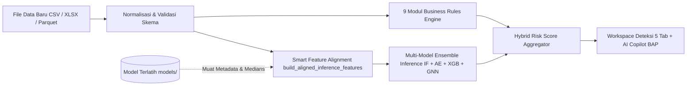
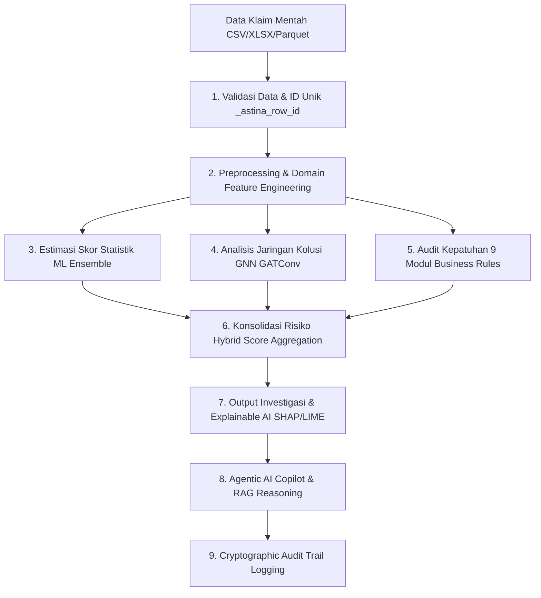

# ASTINA — AI-Powered Insurance Fraud & Anomaly Detection

**ASTINA** adalah platform analitik dan investigasi fraud klaim asuransi kesehatan berbasis **Hybrid AI Enterprise** yang menggabungkan kekuatan **Machine Learning Ensemble** (Isolation Forest, Autoencoder, XGBoost, GNN) dengan **Rule-Based Business Engine** (9 modul aturan audit klaim), **Agentic AI Copilot bertenaga RAG**, serta **Audit Trail Kriptografis**.

Aplikasi ini dilengkapi antarmuka interaktif berbasis **Streamlit**, mendukung pemrosesan dataset besar secara efisien (streaming chunk & Parquet caching), serta menyediakan Explainable AI (XAI) untuk transparansi keputusan investigasi klinis dan finansial.

---

## 🚀 Fitur Utama

- **🧠 Hybrid Detection Engine**: Menggabungkan probabilitas anomali statistik ML/GNN dengan validasi deterministik kepatuhan 9 aturan bisnis asuransi.
- **🔄 Semantic Schema Harmonizer & Alias Resolver**: Penyelarasan cerdas sinonim kolom bahasa Indonesia dan standar medis (`no_klaim`, `no_peserta`, `kode_faskes`, `biaya_tagihan`, `lama_rawat`, `diagnosa`, `tgl_pelayanan`, dll.) ke kolom kanonikal, pembersihan simbol moneter (`Rp`, `$`, koma), derivasi deterministik tanggal/LOS/rasio, dan penandaan metadata asal usul (*provenance tagging*) untuk mencegah alarm palsu (*zero crash guarantee*).
- **⚡ Circuit Breaker & Dynamic Weight Re-normalization**: Evaluasi kesiapan prasyarat 9 modul aturan bisnis secara otomatis. Jika kolom tertentu absen pada dataset, aturan terkait dilewati secara aman (`SKIPPED`) tanpa memicu error, dan bobot risiko dinormalkan ulang secara dinamis agar total bobot tetap 1.0 (100%), mencegah deflasi skor risiko.
- **⚡ Resilient Multi-Format Data Ingestion**: Dukungan menyeluruh untuk file CSV, Excel (`.xlsx`, `.xls`), dan Parquet dengan normalisasi format otomatis, streaming disk buffering 8MB untuk efisiensi RAM, engine Polars untuk Parquet cepat, dan integrasi parser Excel tahan error.
- **🎯 Intelligent Feature Selection & Redundancy Filtering**: Modul seleksi fitur multivariat adaptif di UI Praproses yang mencakup SelectKBest (ANOVA F-Score & Mutual Information), Tree-based Feature Importance (ExtraTrees/RandomForest/LightGBM), Filter Multikolinearitas Terbobot Skor, Filter Low-Variance Skala Invarian, serta Reduksi Dimensi PCA interaktif dengan *live explained variance preview*.
- **⚡ Smart Training Profiles & Complexity Estimator**: Antarmuka pelatihan interaktif dengan preset adaptif (⚡ *Mode Cepat* ~10-30 dtk, ⚖️ *Mode Seimbang* ~1-2 mnt, 🧠 *Mode Lengkap* Deep Graph, 🛠️ *Kustom*) serta monitor estimasi beban komputasi & rekomendasi hardware (CPU vs GPU) *real-time*.
- **🕸️ Graph Neural Network (GNN)**: Analisis relasional berbasis `GATConv` (Star Graph, Heterogeneous Graph, & k-NN Graph) untuk membongkar sindikat kolusi faskes, dokter, dan pasien (*fraud rings*) dengan evaluasi metrik periodik teroptimasi. Setelah training selesai, visualisasi **Anomaly-Focused Subgraph** ditampilkan secara otomatis — hanya menampilkan top-K node paling mencurigai beserta tetangga 1-hop-nya (ego-graph kolusi) dalam subgraf kompak ≤300 node, sehingga tetap cepat meskipun dataset training berukuran jutaan baris. Node 🔴 anomali seed (skor tertinggi) dan ⚪ tetangga dibedakan secara visual. Jika PyTorch tidak tersedia, banner peringatan otomatis muncul di UI dan GNN/Autoencoder di-skip secara graceful.
- **📑 5-Tab Detection & Investigation Workspace**:
  1. 📊 *Ringkasan & Visualisasi*: Distribusi prediksi anomali seimbang, histogram probabilitas multi-model ensemble, panel metrik eksekutif 11 kartu risiko, dan proporsi risiko per kategori.
  2. 🚨 *Business Risk & Rules*: Audit temuan Repeat Billing & Phantom Service beserta rincian 9 modul aturan fraud medis dan status eksekusi Circuit Breaker.
  3. 📋 *Fraud Review Table & Export*: Tabel audit interaktif klaim terfilter, pengurutan tingkat keparahan (*High/Medium/Low Risk*), dan ekspor multiformat.
  4. 🤖 *AI Investigator Copilot & BAP*: Pembuatan Berita Acara Pemeriksaan (BAP) formal & resume medis dalam format Markdown dengan sitasi regulasi medis RAG FAISS.
  5. 📈 *Concept Drift & Retraining*: Pemantauan pergeseran distribusi data (uji Kolmogorov-Smirnov) dan orkestrasi retrain model Champion-Challenger.
- **🤖 Agentic AI Copilot & RAG**: Asisten investigasi cerdas multi-provider (Google Gemini, OpenAI, Local Ollama, Offline Heuristic Engine) bertenaga FAISS Knowledge Base (ICD-10, CPT, regulasi medis) yang dilengkapi sanitasi PII (HIPAA/UU PDP).
- **🧭 Interactive Top Navbar & Pipeline Tracker**: Status bar modern *glassmorphic* di setiap halaman yang memuat *live telemetry pills* (status baris & fitur data, model aktif, akselerasi GPU/CPU, status Copilot) dan *5-stage visual breadcrumb tracker* (`Unggah Data` ➔ `Praproses & Fitur` ➔ `Pelatihan` ➔ `Evaluasi` ➔ `Deteksi`).
- **⚙️ Comprehensive Settings Page**: Halaman konfigurasi terpusat untuk LLM provider, API key management, model registry, system configuration, dan security settings dengan UI yang intuitif dan mudah digunakan.
- **📊 Real-Time Sidebar Status Dashboard**: Panel metrik samping dengan *progress bar* kesiapan pipeline (0%–100%), kartu spesifikasi dataset streaming, metrik model AI/ML, dan monitor kesehatan hardware.
- **🛡️ Cryptographic Audit Trail**: Pencatatan riwayat audit forensik berantai hash SHA-256 anti-tamper untuk setiap aksi ingestion, preprocessing, training, deteksi, dan ekspor data.
- **🔐 Enterprise Auth Gateway & RBAC (Role-Based Access Control)**: Gerbang autentikasi aman dengan pemisahan 4 peran pengguna (*Admin*, *Auditor*, *Analyst*, *Viewer*) yang mematuhi standar UU No. 27 Tahun 2022 (UU PDP) dan HIPAA Security Rule, dilengkapi pencatatan audit log login/logout otomatis.
- **🔒 PII Masking & Data Privacy**: Perlindungan data sensitif pasien (NIK, Nama, Rekam Medis) secara dinamis sesuai regulasi perlindungan data pribadi (UU PDP / HIPAA).
- **⚡ Batch-Only Optimized Streaming Pipeline**: Ingestion data berkecepatan tinggi dengan Polars/PyArrow LazyFrame, penulisan Parquet per chunk terkompresi Zstandard, dan evaluasi kesiapan skema otomatis (0–100%).
- **🔄 Concept Drift & Automated Retraining**: Deteksi pergeseran distribusi data (*covariate & concept drift*) otomatis menggunakan uji Kolmogorov-Smirnov dengan *Champion-Challenger Quality Gate*.
- **⚖️ 9 Modul Aturan Bisnis Fraud Medis**:
  1. *Repeat Billing*: Deteksi klaim berulang untuk pasien/tindakan identik dalam jendela waktu 30 hari.
  2. *Phantom Service*: Deteksi layanan fiktif, inkonsistensi tanggal tindakan, dan tindakan di luar masa rawat.
  3. *Provider Capacity*: Validasi kapasitas harian dokter/faskes yang melampaui batas wajar operasional.
  4. *Claim Status & Duplicate Payment*: Validasi duplikasi pembayaran klaim yang telah lunas/disetujui.
  5. *Upcoding & Unbundling*: Deteksi penggelembungan tarif medis dan pemecahan paket tindakan terpadu.
  6. *Inflated Bill & Cloning*: Deteksi lonjakan tagihan ekstrem di atas benchmark serta duplikasi rekam medis (*cloned charts*).
  7. *Length of Stay & Readmission*: Evaluasi lama rawat inap tidak wajar (*LOS outlier*) dan readmisi kilat.
  8. *Medication & Device Fraud*: Audit kuantitas obat berlebih, rasionalitas dosis, dan markup alkes tak wajar.
  9. *Fuzzy Claim Matching*: Pencocokan kemiripan klaim non-identik berbasis kemiripan teks leksikal & atribut.
- **🔍 Explainable AI (SHAP & LIME)**: Visualisasi atribusi fitur (*feature importance*) dan kontribusi lokal untuk transparansi akuntabilitas model.
- **📊 Real-Time System Telemetry**: Monitoring utilisasi hardware (CPU, RAM, GPU/VRAM), throughput ingestion, dan latensi inferensi.
- **💻 Headless CLI Training Engine**: Dukungan pelatihan model otomatis melalui baris perintah (`training_cli.py`) untuk integrasi MLOps / CI/CD pipeline.
- **☁️ Multi-Environment Ready**: Kompatibilitas penuh untuk Localhost (Windows/Linux/macOS), Docker Desktop, dan Google Cloud Run dengan persistensi volume dan sinkronisasi Google Cloud Storage (GCS).

---

## 📁 Struktur Repositori

```text
project-Graphnet/
├── main.py                          # Entry point aplikasi web Streamlit & routing navigasi
├── run.py                           # Production & local runtime launcher
├── auth_manager.py                  # Autentikasi pengguna, RBAC 4-role, & session gateway
├── config.py                        # Konfigurasi global, limit memori, & parameter aturan
├── schema_harmonizer.py             # Harmonizer skema, semantic aliasing, derivasi deterministik & evaluasi Circuit Breaker
├── fraud_risk_pipeline.py           # Pipeline orkestrasi skoring risiko hybrid
├── preprocessing_optimized.py       # Pipeline data preprocessing, feature engineering & feature selection
├── large_file_processor.py          # Streaming chunk processor untuk dataset skala besar
├── file_handler.py                  # IO file handler (CSV/Excel/Parquet streaming)
├── model.py                         # Arsitektur ML Ensemble (Autoencoder, XGBoost, GNN, Optuna)
├── model_registry.py                # Manajemen versi model & metadata training
├── model_explainer.py               # Modul interpretasi model (SHAP & LIME)
├── agentic_copilot.py               # AI Copilot investigasi berbasis LLM & Agentic reasoning (Zero-Wipeout Fallback)
├── rag_engine.py                    # Knowledge base RAG berbasis FAISS, regulasi JKN & kaidah outlier ML
├── audit_trail.py                   # Engine pencatatan audit log berantai SHA-256
├── verify_audit_trail.py            # Skrip verifikasi integritas rantai log audit
├── pii_masker.py                    # Modul anonimisasi & masking data sensitif (PII)
├── cache_manager.py                 # Multi-tier Parquet & session cache manager
├── training_cli.py                  # Command-Line Interface untuk batch training model
├── system_status.py                 # Telemetri & monitoring resource hardware
├── enhanced_metrics.py              # Metrik operasional & performa sistem
├── encoding_recommendations.py      # Rekomendasi otomatis teknik encoding fitur kategorik
├── rate_limit.py                    # Rate limiter & proteksi konkurensi request
├── error_handler.py                 # Error boundary & resilience handler
├── retry_utils.py                   # Utilitas exponential backoff retry
├── cloud_storage.py                 # Sinkronisasi artefak model ke Google Cloud Storage
│
├── ui/                              # Antarmuka Pengguna Streamlit
│   ├── sidebar.py                   # Navigasi, telemetry status, & switch dataset
│   ├── utils.py                     # Visual helper, grafik Plotly, & smart alignment
│   ├── ui_components.py             # Custom glassmorphic CSS, navbar, pills & breadcrumbs
│   └── pages/                       # Modul Halaman Aplikasi
│       ├── home.py                  # Dashboard ikhtisar & status sistem
│       ├── data_collection.py       # Upload dataset, validasi skema, preprocessing & feature selection
│       ├── training.py              # Pelatihan model ML Ensemble & GNN
│       ├── evaluation.py            # Evaluasi performa, metrik confusion matrix, & XAI
│       ├── detection.py             # Deteksi fraud batch, rule audit, review table & AI Copilot
│       ├── status.py                # Telemetri performa sistem & audit logging
│       └── settings.py              # Konfigurasi LLM, Copilot, model registry & sistem
│
├── tests/                           # Unit test & integrasi otomatis (Pytest) - 82 Test Cases
│   ├── conftest.py                  # Pytest fixtures & setup lingkungan uji
│   ├── test_agentic_copilot.py      # Uji Copilot, FAISS RAG, zero-wipeout fallback, & XAI/GNN context
│   ├── test_app_startup.py          # Uji startup & integritas import modul utama
│   ├── test_cybersecurity_and_auth.py # Uji autentikasi SHA-256, RBAC 4-role, AI Guardrail, & lifecycle cache
│   ├── test_detection_modules.py    # Test suite komprehensif 9 modul aturan & ML
│   ├── test_feature_selection.py    # Uji metode seleksi fitur, multikolinearitas & varians
│   ├── test_gnn_minibatch.py        # Uji mini-batch sampling & forward pass GNN
│   ├── test_gpu_and_pipeline_fixes.py # Uji kebersihan VRAM, fallback CUDA/CPU, & fuzzy parity
│   ├── test_graph_scaling.py        # Uji penskalaan graf, edge budget limit & build_anomaly_subgraph (7 skenario)
│   ├── test_large_file_ingestion.py # Uji streaming CSV-to-Parquet chunk ingestion
│   ├── test_optuna_ensemble_and_drift.py # Uji optimasi Optuna & deteksi pergeseran data
│   ├── test_pipeline_edge_cases.py  # Uji edge cases & robustness data tak standar
│   ├── test_schema_synthesis_and_resilience.py # Uji resilient schema harmonizer, aliasing Indonesia & circuit breaker
│   └── test_streaming_preprocessing_memory.py # Uji batasan memori streaming preprocessing
│
├── .cloudrun/                       # Konfigurasi & skrip deploy Google Cloud Run
│   ├── deploy.ps1                   # Skrip deploy otomatis PowerShell
│   └── deploy.sh                    # Skrip deploy otomatis Bash
├── Dockerfile                       # Multi-stage Dockerfile aman (non-root appuser)
├── docker-compose.yml               # Orkestrasi Docker Compose dengan persistensi volume
├── requirements.txt                 # Daftar dependensi Python terverifikasi
└── README.md                        # Dokumentasi teknis & operasional
```

---

## ⚙️ Persyaratan Sistem & Dependensi

- **Python**: Versi `3.11` s/d `3.13` (Direkomendasikan Python 3.13 — diuji penuh di environment ini).
- **Hardware Minimum**: 4 Core CPU, 8 GB RAM (16 GB RAM disarankan untuk dataset besar > 1 GB dan training GNN).
- **Akselerasi Opsional**: GPU NVIDIA (CUDA 12.x) untuk akselerasi PyTorch/GNN. AMD ROCm didukung secara teoritis via PyTorch ROCm build.
- **Docker**: Docker Desktop versi terbaru dengan Docker Compose v2.

Semua dependensi inti dikunci pada [requirements.txt](file:///c:/project-Graphnet/requirements.txt):
`streamlit==1.61.1`, `pandas`, `numpy`, `scikit-learn`, `scipy`, `joblib`, `torch>=2.4.0`, `torch-geometric>=2.6.0`, `imbalanced-learn`, `plotly>=6.0.0`, `xgboost`, `lightgbm`, `catboost`, `polars`, `pyarrow`, `optuna`, `hdbscan`, `faiss-cpu`, `psutil`, `shap`, `lime`, `google-cloud-storage`.

> **Catatan Streamlit API:** Sejak `streamlit>=1.45`, parameter `use_container_width` pada `st.plotly_chart`, `st.dataframe`, dan `st.button` telah dihapus dan digantikan oleh `width='stretch'` / `width='content'`. Seluruh komponen UI ASTINA sudah menggunakan API baru ini.

> **`alibi-detect` (Opsional):** Library ini menyediakan deteksi drift lanjutan tetapi secara default menarik TensorFlow (~2GB). **Tidak disertakan** di `requirements.txt` utama agar Docker image tetap ringan. Untuk mengaktifkan, install terpisah: `pip install "alibi-detect[torch]>=0.12.0"`. Sistem berjalan normal tanpa library ini (fitur drift detection tetap tersedia via Kolmogorov-Smirnov dari `scipy`).

---

## 🛠️ Panduan Menjalankan Aplikasi

### Opsi 1: Local Environment (PowerShell / Bash)

1. **Masuk ke direktori proyek**:
   ```bash
   cd c:\project-Graphnet
   ```

2. **Buat dan aktifkan Virtual Environment**:
   - **Windows (PowerShell)**:
     ```powershell
     py -3.13 -m venv .venv
     .\.venv\Scripts\Activate.ps1
     ```
   - **Linux / macOS**:
     ```bash
     python3.13 -m venv .venv
     source .venv/bin/activate
     ```

3. **Install semua dependensi**:
   - **Mode CPU (Standar)**:
     ```bash
     pip install --upgrade pip
     pip install -r requirements.txt
     ```
   - **Mode GPU CUDA (Direkomendasikan untuk Akselerasi GNN & XGBoost)**:
     Bagi pengguna dengan kartu grafis NVIDIA (misalnya GeForce RTX Series):
     ```powershell
     pip install --upgrade pip
     # 1. Install PyTorch dengan CUDA 12.4
     pip install torch torchvision torchaudio --index-url https://download.pytorch.org/whl/cu124
     # 2. Install PyG dan seluruh dependensi proyek
     pip install torch-geometric
     pip install -r requirements.txt
     ```

4. **Verifikasi Deteksi GPU (Khusus Mode CUDA)**:
   ```powershell
   python -c "import torch; print('CUDA Available:', torch.cuda.is_available()); print('Device:', torch.cuda.get_device_name(0) if torch.cuda.is_available() else 'None')"
   ```
   *Output yang diharapkan jika berhasil: `CUDA Available: True` beserta nama GPU Anda.*

5. **Jalankan aplikasi**:
   - Menggunakan Streamlit langsung:
     ```bash
     streamlit run main.py
     ```
   - Atau menggunakan launcher otomatis:
     ```bash
     python run.py
     ```

6. **Akses Dashboard**:
   Buka browser pada [http://localhost:8501](http://localhost:8501). Pada menu **Status Sistem** atau sidebar, indikator akan otomatis menampilkan ikon 🚀 **GPU CUDA Aktif**.

---

### 🚀 Panduan Khusus: Setup & Optimasi Akselerasi GPU (NVIDIA CUDA)

Jika sistem Anda memiliki GPU diskrit NVIDIA (seperti **NVIDIA GeForce RTX 3050 Laptop GPU** atau seri GTX/RTX lainnya), ASTINA dirancang untuk mempercepat proses komputasi berat secara otomatis:

#### Komponen yang Diakselerasi GPU:
- **Graph Neural Network (GNN / GAT & GCN)**: Mempercepat komputasi pesan topologi graf klaim medis dan pembaruan bobot layer PyTorch Geometric.
- **Deep Learning Autoencoder**: Pelatihan representasi laten dan kalkulasi *anomaly reconstruction error*.
- **XGBoost & Ensemble ML**: Memanfaatkan akselerasi CUDA pada algoritma pohon (`tree_method='hist'`, `device='cuda'`).
- **Real-time Telemetry**: Dashboard otomatis mendeteksi nama perangkat, memori VRAM, dan compute capability.

#### Langkah Setup Step-by-Step (Windows PowerShell):
1. **Periksa Kesiapan Driver NVIDIA**:
   ```powershell
   nvidia-smi
   ```
   Pastikan driver terdeteksi dan versi CUDA Driver Version minimal mendukung CUDA 12.x.

2. **Aktifkan Virtual Environment**:
   ```powershell
   cd c:\project-Graphnet
   .\.venv\Scripts\Activate.ps1
   ```

3. **Install PyTorch dengan CUDA 12.4**:
   ```powershell
   pip install --upgrade pip
   pip install torch torchvision torchaudio --index-url https://download.pytorch.org/whl/cu124
   ```

4. **Install PyTorch Geometric & Dependensi ASTINA**:
   ```powershell
   pip install torch-geometric
   pip install -r requirements.txt
   ```

5. **Uji Validasi Koneksi CUDA**:
   ```powershell
   python -c "import torch; print('CUDA Available:', torch.cuda.is_available()); print('Device:', torch.cuda.get_device_name(0) if torch.cuda.is_available() else 'None')"
   ```

#### Fitur Keamanan Memori GPU (VRAM 4 GB Resilience):
- **Otomatis Pembersihan Cache (`clean_gpu_memory`)**: Cache VRAM dibersihkan secara periodik (`torch.cuda.empty_cache()`) setelah tiap epoch untuk mencegah kebocoran memori.
- **Mini-Batch NeighborLoader**: Pengambilan sampel subgraf bertahap untuk graf berukuran masif (>50.000 klaim) agar tidak terjadi *CUDA Out of Memory (OOM)*.
- **Auto Fallback ke CPU**: Apabila VRAM penuh saat inferensi atau pelatihan, sistem secara mulus beralih ke komputasi CPU tanpa memicu *crash* aplikasi.
- **Mixed Precision Training (AMP)**: Training Autoencoder menggunakan `torch.amp.GradScaler` dan `torch.amp.autocast` (API baru PyTorch >= 2.0) untuk mengurangi penggunaan VRAM hingga ~40% pada GPU CUDA.

---

### Opsi 2: Docker Desktop (Kontainerisasi Terisolasi)

Aplikasi dilengkapi **Multi-stage Dockerfile** dan **Docker Compose** yang mengisolasi dependensi, mengoptimalkan ukuran image, serta menjalankan proses sebagai user non-root aman (`appuser`).

#### Menggunakan Docker Compose (Direkomendasikan)

1. **Jalankan build dan container**:
   ```bash
   docker-compose up --build -d
   ```
2. **Periksa status container & log real-time**:
   ```bash
   docker-compose ps
   docker-compose logs -f
   ```
3. **Buka aplikasi**:
   Akses [http://localhost:8501](http://localhost:8501).
4. **Menghentikan container**:
   ```bash
   docker-compose down
   ```

*Catatan: Direktori `./cache` dan `./models` otomatis di-mount ke host agar model terlatih dan cache analisis tetap persisten saat container di-restart.*

---

### Opsi 3: Deployment ke Google Cloud Run

ASTINA mendukung continuous serverless deployment ke Cloud Run via Artifact Registry:

- **Windows (PowerShell)**:
  ```powershell
  .\.cloudrun\deploy.ps1
  ```
- **Linux / macOS**:
  ```bash
  chmod +x .cloudrun/deploy.sh
  ./.cloudrun/deploy.sh
  ```
- **CI/CD via Cloud Build** (push ke main branch):
  ```bash
  gcloud builds submit --config=cloudbuild.yaml \
      --substitutions=_REGION=asia-southeast2,_SERVICE=astina,_GCS_BUCKET=nama-bucket-anda
  ```

*Catatan penting deployment:*
- *Konfigurasi `.streamlit/config.toml` (memory, GC, minimal toolbar) sudah ter-include di Docker image dan aktif di Cloud Run.*
- *Untuk persistensi model di Cloud Run, tetapkan `GOOGLE_CLOUD_BUCKET` di env vars dan gunakan Service Account dengan role Storage Object Admin.*
- *Deployment default bersifat privat (`--no-allow-unauthenticated`). Tambahkan `_ALLOW_UNAUTH=true` di substitutions `cloudbuild.yaml` hanya untuk demo publik.*

---

### Opsi 4: Headless Training via CLI

Untuk melatih model ML & GNN secara otomatis melalui terminal tanpa membuka UI:

```powershell
# Melatih seluruh model (Ensemble ML + GNN) dengan optimasi hyperparameter Optuna
python training_cli.py --data cache/processed_data.parquet --output models/ --optimize-hyperparams

# Melatih khusus model GNN dengan Graph Attention Network (GAT)
python training_cli.py --data cache/processed_data.parquet --model-type gnn --epochs 50 --batch-size 1024
```

---

## 🔐 Autentikasi Pengguna, Manajemen Akun & Hak Akses (RBAC)

Sistem ASTINA dilengkapi gerbang keamanan berlapis (*Enterprise Security Gateway*) berbasis **Role-Based Access Control (RBAC)** yang mematuhi ketentuan regulasi perlindungan data medis:
- **UU No. 27 Tahun 2022** tentang Perlindungan Data Pribadi (UU PDP).
- **HIPAA Security Rule** (*Access Control, Unique User Identification, and Audit Controls*).

---

### ⚙️ Mode Pengoperasian: Development vs Production

Aplikasi menyediakan dua mode pengoperasian melalui environment variable `AUTH_ENABLED`:

| Mode | Konfigurasi | Karakteristik & Perilaku Sistem |
| :--- | :--- | :--- |
| 🛠️ **Development Mode (Default)** | `AUTH_ENABLED=false` | Gerbang login dilewati secara otomatis (*bypass*) langsung ke Beranda sebagai peran **Admin** (`Administrator (Dev Mode)`). Mode ini dirancang agar pengembang dapat melakukan iterasi kode, pengujian, dan *debugging* tanpa perlu memasukkan kata sandi berulang kali saat Streamlit melakukan *hot-reload*. Tombol logout disembunyikan. |
| 🔒 **Production / Secured Mode** | `AUTH_ENABLED=true` | Gerbang login **wajib** (*mandatory*). Pengguna harus memasukkan Username dan Password yang valid untuk mengakses sistem. Seluruh menu dan halaman dibatasi secara ketat berdasarkan peran pengguna (*least privilege*). Tombol profil dan logout aktif di sidebar. |

#### 🚀 Cara Mengaktifkan Halaman Login & Logout:

Jalankan perintah berikut pada terminal PowerShell sebelum menjalankan aplikasi:

```powershell
# 1. Aktifkan penegakan autentikasi
$env:AUTH_ENABLED="true"

# 2. Jalankan aplikasi ASTINA
python run.py
```

*(Untuk pengguna Linux / macOS / Docker, gunakan: `export AUTH_ENABLED="true" && python run.py`)*

---

### 👥 4 Akun Bawaan (Default Accounts) & Hak Akses Modul

Sistem menyediakan 4 akun uji coba terkonfigurasi dengan hash SHA-256 dan *cryptographic salt* di [auth_manager.py](file:///c:/project-Graphnet/auth_manager.py):

| Peran (Role) | Username | Password Default | Modul / Halaman yang Diizinkan | Deskripsi Peran & Tanggung Jawab |
| :--- | :--- | :--- | :--- | :--- |
| 🔴 **Admin** | `admin` | `AdminAstina2026!` | **Semua Halaman**:<br>• 🏠 *Beranda* (`home`)<br>• 📥 *Unggah Data* (`collect`)<br>• ⚙️ *Pelatihan Model* (`train`)<br>• 📊 *Evaluasi Model* (`evaluate`)<br>• 🚨 *Deteksi Anomali* (`detect`)<br>• 📈 *Status Sistem* (`status`)<br>• ⚙️ *Pengaturan* (`settings`) | Administrator sistem dengan izin penuh untuk konfigurasi parameter, telemetri, inspeksi rantai audit log, pelatihan model, deteksi fraud, dan konfigurasi LLM/Copilot. |
| 🔵 **Auditor** | `auditor` | `AuditorAstina2026!` | • 🏠 *Beranda* (`home`)<br>• 🚨 *Deteksi Anomali* (`detect`)<br>• 📈 *Status Sistem* (`status`)<br>• ⚙️ *Pengaturan* (`settings`) | Investigator/auditor klaim asuransi. Fokus pada audit anomali klaim, penelusuran graf sindikat (*fraud ring*), penggunaan AI Copilot RAG, pembuatan dokumen Berita Acara Pemeriksaan (BAP), dan konfigurasi LLM. |
| 🟣 **Analyst** | `analyst` | `AnalystAstina2026!` | • 🏠 *Beranda* (`home`)<br>• 📥 *Unggah Data* (`collect`)<br>• ⚙️ *Pelatihan Model* (`train`)<br>• 📊 *Evaluasi Model* (`evaluate`)<br>• 🚨 *Deteksi Anomali* (`detect`)<br>• ⚙️ *Pengaturan* (`settings`) | Data scientist / AI engineer yang berwenang mengunggah dataset, menjalankan seleksi fitur & PCA, melatih model AI/GNN, mengevaluasi metrik AUC/F1-Score, dan konfigurasi sistem. |
| ⚪ **Viewer** | `viewer` | `ViewerAstina2026!` | • 🏠 *Beranda* (`home`)<br>• 📈 *Status Sistem* (`status`) | Pihak manajemen atau eksekutif dengan hak akses baca (*read-only*). Memantau dashboard ringkasan eksekutif, status kesiapan pipeline, dan kesehatan resource server. |

---

### 🖥️ Panduan Antarmuka Login & Logout Akun

1. **Halaman Gerbang Masuk (Secure Login Gateway)**:
   - Menampilkan antarmuka modern *glassmorphic* berlatar biru tua dengan logo perisai 🛡️ **ASTINA ENTERPRISE - SECURE FRAUD DETECTION & AUDIT GATEWAY**.
   - Masukkan **Username / ID Pengguna** (misal: `admin`, `auditor`, `analyst`, atau `viewer`) dan **Kata Sandi (Password)**.
   - Tersedia menu lipat (*expander*) `ℹ️ Bantuan Akses & Kredensial Default Uji Coba` yang memuat tabel username & password bawaan untuk memudahkan pengujian.
   - Klik tombol **`🔐 Masuk ke Sistem (Log In)`**.
2. **Indikator Profil & Role Badge di Sidebar**:
   - Setelah login berhasil, bagian atas sidebar akan menampilkan kartu pengguna dengan lencana role berwarna:
     - 🔴 **ADMIN** (Merah)
     - 🔵 **AUDITOR** (Biru)
     - 🟣 **ANALYST** (Ungu)
     - ⚪ **VIEWER** (Abu-abu)
   - Menu di sidebar otomatis tersaring; modul yang tidak diizinkan untuk peran tersebut tidak akan ditampilkan.
   - Jika pengguna mencoba mengakses URL/halaman di luar kewenangannya, sistem menampilkan pesan proteksi: `⛔ Akses Ditolak: Peran Anda tidak memiliki izin untuk membuka halaman ini`.
3. **Mengakhiri Sesi (Logout)**:
   - Klik tombol **`🚪 Keluar (Logout)`** yang terletak tepat di bawah kartu profil pengguna di sidebar.
   - Sesi pengguna di-reset secara instan, audit log mencatat aktivitas `USER_LOGOUT`, dan tampilan otomatis dialihkan kembali ke gerbang login.
4. **Pencatatan Audit Trail Kriptografis Otomatis**:
   - Setiap kali terjadi login berhasil (`USER_LOGIN_SUCCESS`), kegagalan login (`LOGIN_FAILED`), maupun logout (`USER_LOGOUT`), engine [audit_trail.py](file:///c:/project-Graphnet/audit_trail.py) secara otomatis mencatat username, peran, waktu presisi, dan hash berantai SHA-256 untuk akuntabilitas forensik.

---

### 🔑 Mengubah Kata Sandi Default (Kustomisasi Keamanan)

> **Catatan Keamanan:** Password di ASTINA di-hash menggunakan **SHA-256 + cryptographic salt** (`hashlib.sha256`), bukan bcrypt. Untuk lingkungan produksi dengan kebutuhan keamanan tinggi, disarankan mengganti implementasi ke `bcrypt` atau `argon2` di `auth_manager.py`.

Untuk lingkungan operasional riil, kata sandi bawaan dapat ditimpa (*override*) melalui environment variables:

```powershell
# Windows PowerShell
$env:ASTINA_ADMIN_PASSWORD="KataSandiAdminKuat2026!"
$env:ASTINA_AUDITOR_PASSWORD="KataSandiAuditorKuat2026!"
$env:ASTINA_ANALYST_PASSWORD="KataSandiAnalystKuat2026!"
$env:ASTINA_VIEWER_PASSWORD="KataSandiViewerKuat2026!"
python run.py
```

```bash
# Linux / macOS / Docker
export ASTINA_ADMIN_PASSWORD="KataSandiAdminKuat2026!"
export ASTINA_AUDITOR_PASSWORD="KataSandiAuditorKuat2026!"
export ASTINA_ANALYST_PASSWORD="KataSandiAnalystKuat2026!"
export ASTINA_VIEWER_PASSWORD="KataSandiViewerKuat2026!"
python run.py
```

---

## 📋 Panduan Persiapan Data & Format Skema Batch Deteksi

Untuk menjamin akurasi estimasi statistik (*IQR, Quantile, Z-Score*), topologi graf GNN, serta 9 modul aturan bisnis, deteksi anomali ASTINA **wajib menggunakan dataset batch** (minimal 2 baris data).

### 📥 Unduh Template Dataset Standar

Aplikasi menyediakan template standar CSV (`astina_claim_template.csv`) yang dapat diunduh langsung melalui antarmuka web di halaman **Deteksi** (`⬇️ Unduh Template Dataset (CSV)`).

Format file yang didukung: **`.csv`**, **`.xlsx`**, **`.xls`**, dan **`.parquet`**.

### 🏷️ 14 Kolom Inti & Pemetaan Modul

| Kolom | Tipe Data | Deskripsi / Contoh | Modul yang Bergantung |
| :--- | :--- | :--- | :--- |
| `claim_id` | String/Int | Identifikasi unik klaim (`CLM-01001`) | Audit Trail, Duplicate Payment |
| `patient_id` | String/Int | Identifikasi unik pasien (`PAT-00201`) | Repeat Billing, Fuzzy Claim Matching |
| `provider_id` | String/Int | Kode faskes/dokter (`PROV-00011`) | Provider Capacity, Topologi Graf GNN |
| `service_code` | String | Kode prosedur/tindakan medis (`99213`) | Phantom Service, Upcoding & Unbundling |
| `diagnosis_code` | String | Kode diagnosis ICD-10 (`J06.9`, `E11.9`) | Phantom Service, Topologi Graf GNN |
| `billing_date` | Date (YYYY-MM-DD) | Tanggal penagihan klaim (`2024-01-15`) | Repeat Billing, High Amount Quick Submit |
| `service_date` | Date (YYYY-MM-DD) | Tanggal tindakan medis diberikan | Provider Capacity, Length of Stay |
| `billed_amount` | Float | Nominal yang ditagihkan dalam Rupiah | ML Ensemble, payment_ratio, allowance_ratio |
| `paid_amount` | Float | Nominal yang dibayarkan oleh asuransi | payment_ratio, Inflated Bill & Cloning |
| `allowed_amount` | Float | Nominal yang disetujui untuk ditanggung | allowance_ratio |
| `claim_status` | String | Status klaim (`APPROVED`, `PENDING`, `REJECTED`) | Duplicate Payment & Status Check |
| `patient_age` | Integer | Usia pasien dalam tahun (`45`) | Feature Engineering: age_group_encoded |
| `length_of_stay` | Integer | Lama rawat inap dalam hari (`0` jika rawat jalan) | Length of Stay & Readmission |
| `quantity` | Integer | Kuantitas obat/alkes/tindakan | Medication & Device Fraud |

### 🔄 Penyelarasan Skema Semantik (*Semantic Schema Harmonization*)

ASTINA mengintegrasikan mesin penyelarasan skema cerdas (`SchemaHarmonizer`) yang memastikan kompatibilitas format data tanpa perlu repot mengubah nama kolom secara manual:

1. **Penyelarasan Alias Bahasa Indonesia & Standar Medis**:
   - `claim_id` $\leftarrow$ `no_klaim`, `id_klaim`, `claim_no`, `nomor_klaim`, `no_tagihan`, `id_transaksi`
   - `patient_id` $\leftarrow$ `no_peserta`, `nomor_kartu`, `id_pasien`, `no_kartu`, `nik`, `no_rekam_medis`, `no_rm`
   - `provider_id` $\leftarrow$ `kode_faskes`, `id_provider`, `kode_rs`, `hospital_id`, `provider_code`, `kode_klinik`
   - `service_code` $\leftarrow$ `kode_tindakan`, `kode_prosedur`, `procedure_code`, `kode_layanan`, `cpt`, `kode_tarif`
   - `diagnosis_code` $\leftarrow$ `diagnosa`, `kode_icd`, `icd10`, `icd_10`, `diagnosa_utama`, `primary_diagnosis`
   - `billing_date` $\leftarrow$ `tgl_klaim`, `tgl_tagihan`, `tanggal_klaim`, `tgl_billing`, `tgl_pengajuan`
   - `service_date` $\leftarrow$ `tgl_pelayanan`, `tgl_masuk`, `tanggal_layanan`, `tgl_tindakan`, `tgl_rawat`
   - `billed_amount` $\leftarrow$ `amount`, `biaya_tagihan`, `total_tagihan`, `biaya_klaim`, `nominal_klaim`, `tagihan`
   - `paid_amount` $\leftarrow$ `biaya_dibayar`, `nominal_bayar`, `jumlah_bayar`, `total_bayar`, `tarif_riil`
   - `allowed_amount` $\leftarrow$ `biaya_disetujui`, `nominal_setuju`, `plafon`, `klaim_disetujui`
   - `claim_status` $\leftarrow$ `status`, `status_klaim`, `status_pembayaran`, `approval_status`
   - `length_of_stay` $\leftarrow$ `lama_rawat`, `hari_rawat`, `los`, `lama_inap`, `lama_hari_rawat`
   - `quantity` $\leftarrow$ `jumlah`, `banyaknya`, `qty`, `volume`, `jumlah_tindakan`, `unit`

2. **Pembersihan Moneter & Tipe Data Otomatis**:
   Pembersihan otomatis simbol mata uang (`Rp`, `$`), pemisah ribuan (titik/koma), serta nilai string kosong secara deterministik.

3. **Derivasi Deterministik Kolom Terkait**:
   - `amount` $\leftrightarrow$ `billed_amount` disinkronkan timbal-balik secara otomatis.
   - `billing_date` $\leftrightarrow$ `service_date` disinkronkan secara aman jika salah satunya tidak tersedia.
   - `admission_date` dan `discharge_date` dapat diturunkan otomatis dari kombinasi `service_date` dan `length_of_stay` (dan sebaliknya).
   - Rasio moneter `payment_ratio` dan `allowance_ratio` dikalkulasi deterministik dengan proteksi pembagian nol.

4. **Penandaan Metadata Asal Usul (*Provenance Metadata Tagging*)**:
   Kolom hasil imputasi default ditandai secara internal di dalam `df.attrs["_imputed_columns"]`. Ini melindungi sistem dari alarm palsu (*false positives*) pada modul aturan bisnis (misalnya kolom yang diimputasi netral tidak akan dijadikan bukti pelanggaran).

### 🩺 Evaluasi Kesiapan Skema & Matriks 9 Aturan Bisnis (UI)

Pada halaman **Data Collection** dan **Deteksi**, kartu diagnostik menyajikan dua visualisasi mendalam:
1. **Matriks Kesiapan 9 Modul Aturan Bisnis (Circuit Breaker)**:
   - 🟢 **Siap Berjalan (`READY`)**: Seluruh kolom prasyarat aturan tersedia penuh.
   - 🟡 **Kolom Turunan (`DERIVED`)**: Aturan siap berjalan memanfaatkan kolom hasil derivasi deterministik.
   - ⚪ **Dilewati Aman (`SKIPPED`)**: Kolom prasyarat belum ada; aturan dilewati secara anggun tanpa menimbulkan exception, dan bobotnya dinormalkan ulang ke aturan aktif.
2. **Rincian Kolom Data & Penyelarasan Otomatis**:
   - `✅ Ada Langsung`: Kolom sesuai dengan skema kanonikal.
   - `🔄 Alias ('nama_alias')`: Kolom berhasil diselaraskan dari alias bahasa Indonesia/industri.
   - `⚡ Diturunkan Otomatis`: Kolom dibentuk dari perhitungan deterministik kolom terkait.
   - `⚪ Default Netral`: Kolom bernilai default aman untuk menjaga kesinambungan inferensi.
   - `❌ Tidak Ada`: Kolom tidak ditemukan dan tidak dapat disintesis.

### 🔧 Penyesuaian Fitur Otomatis (*Smart Feature Alignment*) & Imputasi Median Training

Saat data baru diuji menggunakan model yang telah dilatih sebelumnya, skema kolom pada data baru sering kali tidak 100% identik dengan dataset saat pelatihan (misalnya ketiadaan fitur turunan tertentu). ASTINA menerapkan mekanisme **Smart Feature Alignment** (`build_aligned_inference_features()`):

1. **Fitur Eksisting (*Direct Match*)**: Kolom yang ada langsung pada dataset baru dipetakan ke skema fitur training.
2. **Fitur Diturunkan (*Auto-Engineered*)**: Fitur turunan seperti flag missing (`*_missing`), rasio moneter domain asuransi (`payment_ratio`, `allowance_ratio`), dan fitur temporal (`day_of_week`, `month`) direkonstruksi secara otomatis jika kolom induk tersedia.
3. **Fitur Hilang Terimputasi Median (*Training Median Imputation*)**: Fitur yang sama sekali tidak dapat diturunkan dari data baru diisi dengan **nilai median per-fitur dari data training** (`feature_medians` yang tersimpan di `_params.json`). Ini menjamin distribusi input model tidak terdistorsi oleh angka sembarangan atau nilai `0.0`.

---

## 🔍 Deteksi Anomali dari Data Baru Berdasarkan Model Terlatih

ASTINA mendukung deteksi fraud secara langsung terhadap **data transaksi klaim baru** (*unseen inference dataset*) tanpa harus melatih ulang model.

### 🏛️ Arsitektur Model Persistence & Loading

Setiap kali model selesai dilatih pada modul **Pelatihan**, artefak model disimpan secara permanen di direktori `./models/`:
- `fraud_detector_isolation_forest.pkl`: Estimator Isolation Forest scikit-learn.
- `fraud_detector_xgboost.pkl`: Estimator Gradient Boosted Trees XGBoost.
- `fraud_detector_imputer.pkl` & `fraud_detector_scaler.pkl`: Pipeline praproses imputasi & normalisasi.
- `fraud_detector_autoencoder.pt`: Bobot neural network PyTorch Deep Autoencoder.
- `fraud_detector_gnn.pt`: Bobot PyTorch Geometric GATConv (Graph Attention Network).
- `fraud_detector_params.json`: Hyperparameter model, bobot ensemble, skema kolom `feature_columns`, tipe data `feature_dtypes`, dan kamus nilai median training `feature_medians`.

Saat pengguna membuka halaman **Deteksi** (`ui/pages/detection.py`), fungsi `load_persisted_detector()` secara otomatis memuat seluruh artefak ini ke dalam memori sesi kerja.

### 📊 Alur Eksekusi Inferensi Data Baru



### 📋 Tri-Tier Feature Alignment Table

| Kategori Fitur | Sumber / Penanganan | Dampak terhadap Model |
| :--- | :--- | :--- |
| **Existing** | Kolom ada langsung pada file data baru | Presisi 100% mengikuti distribusi data baru |
| **Derived** | Ditransformasikan otomatis dari kolom induk | Menjaga konsistensi representasi fitur rekayasa |
| **Filled** | Diimputasi menggunakan `feature_medians` dari model training | Netral secara statistik, mencegah false alarm akibat `0.0` |

### 🛠️ Panduan Operasional: Langkah Deteksi Data Baru

1. **Pastikan Model Tersedia**: Latih model minimal satu kali di halaman **Pelatihan**, atau pastikan artefak model telah tersedia di folder `models/`.
2. **Navigasi ke Halaman Deteksi**: Klik menu **Deteksi** pada sidebar. Indikator di atas halaman akan menampilkan status model champion yang aktif (jumlah fitur, mode komputasi GPU/CPU, bobot ensemble).
3. **Pilih Sumber Data**:
   - Pilih opsi **📤 Unggah File Baru (CSV / XLSX / XLS / Parquet)**.
   - Unggah berkas klaim baru yang ingin diperiksa (gunakan format standar sesuai template).
4. **Atur Parameter Deteksi**:
   - Tentukan **Ambang Batas Anomali** (Anomaly Threshold, default: `0.50`) via slider.
   - Aktifkan atau nonaktifkan **Analisis Graf Relasi (GNN)** jika model GNN tersedia.
5. **Eksekusi Analisis**: Klik tombol **🚀 Jalankan Deteksi Anomali Multi-Algoritma**.
6. **Evaluasi Diagnostik Penyelarasan**:
   - Sistem menampilkan banner status alignment:
     - 🟢 *Hijau*: Semua fitur ditemukan langsung atau berhasil diturunkan otomatis.
     - 🟡 *Kuning*: Terdapat fitur yang diimputasi dengan median training (disertai expander rincian kolom).
   - Buka expander **Detail Penyelarasan Fitur Inferensi** untuk mengaudit kolom mana saja yang tergolong *Existing*, *Derived*, atau *Filled*.
7. **Analisis Hasil pada 5 Tab Spesifik**:
   - **Tab 1**: Pantau proporsi klaim normal vs anomali dan panel 11 kartu ringkasan risiko.
   - **Tab 2**: Periksa rincian temuan 9 aturan bisnis (Repeat Billing, Phantom Service, dll).
   - **Tab 3**: Filter klaim berisiko tinggi (*High Risk*) dan ekspor laporan ke format Excel/CSV.
   - **Tab 4**: Gunakan AI Copilot untuk menyusun Berita Acara Pemeriksaan (BAP) formal secara otomatis.
   - **Tab 5**: Pantau *Concept Drift* data baru terhadap data pelatihan menggunakan uji Kolmogorov-Smirnov.

## 🧠 Alur Kerja Hybrid AI ASTINA (End-to-End Architecture)

ASTINA mengoperasikan arsitektur **Hybrid AI** berlapis yang memadukan komputasi statistik machine learning, representasi relasional graf, audit aturan bisnis, serta penalaran cerdas AI Copilot:



### 1. Validasi Data & Penetapan ID Unik (`_astina_row_id`)
* **Proses:** Data klaim divalidasi keutuhannya melalui `DataValidator` dan disanitasi oleh `DataSanitizer`.
* **Peran Krusial:** Sistem menetapkan identifier stabil `_astina_row_id` pada setiap baris klaim sebelum partisi chunk/sorting agar hasil prediksi ML, GNN, dan bendera aturan bisnis selalu merujuk pada entitas klaim yang sama.

### 2. Preprocessing, Feature Engineering & Selection
* **Proses Preprocessing & Feature Engineering:** Deteksi outlier IQR (`detect_and_handle_outliers`), ekstraksi fitur temporal, encoding variabel kategori optimal (*Target Encoding* / *Frequency Encoding*), dan pembentukan fitur domain asuransi:
  * `payment_ratio`: Rasio nominal dibayar terhadap nominal ditagihkan.
  * `allowance_ratio`: Rasio nominal disetujui terhadap nominal ditagihkan.
  * `high_amount_quick_submit`: Indikator klaim bernominal kuartil atas yang diajukan dalam durasi waktu kilat.
  * `zscore`: Standarisasi deviasi statistik pada variabel moneter utama.
* **Seleksi Fitur Cerdas (*Intelligent Feature Selection*):**
  * **SelectKBest**: Pemeringkatan fitur berbasis korelasi statistik ANOVA F-Score (`f_classif`) atau *Mutual Information Gain* (`mutual_info_classif`).
  * **Tree-based Feature Importance**: Penilaian signifikansi fitur non-linear menggunakan *Random Forest*, *ExtraTrees*, atau *LightGBM* dengan *pseudo-labeling* otomatis.
  * **Filter Multikolinearitas Terbobot Skor**: Eliminasi fitur redundan berkorelasi tinggi ($r > 0.90$) dengan memprioritaskan fitur yang memiliki skor kepentingan (*importance score*) lebih tinggi.
  * **Filter Low-Variance Skala Invarian**: Pembersihan fitur konstan atau minim varians melalui normalisasi varians $[0, 1]$ yang aman untuk rasio berskala kecil.
  * **Reduksi Dimensi PCA**: Proyeksi komponen utama (*Principal Component Analysis*) interaktif dengan visualisasi persentase *cumulative explained variance*.

### 3. Estimasi Skor Statistik ML Ensemble & Smart Training Profiles
* **Fitur Presets Pelatihan Cerdas:**
  * ⚡ **Mode Cepat (*Tabular Fast*)**: Menggunakan Isolation Forest (50 estimator) + XGBoost, tanpa Autoencoder / GNN / Optuna (~10–30 detik). Sangat direkomendasikan untuk uji coba lokal di CPU dan serverless Cloud Run.
  * ⚖️ **Mode Seimbang (*Balanced*)**: Isolation Forest + PyTorch Autoencoder (20 epoch) + XGBoost (~1–2 menit).
  * 🧠 **Mode Lengkap (*Deep Graph Ensemble*)**: Mengaktifkan seluruh model ensemble, topologi graf GNN, serta optimasi bobot dinamis Optuna FPR Minimizer.
  * 🛠️ **Mode Kustom**: Kebebasan penuh konfigurasi hyperparameter, batch size, threshold, dan bobot algoritma.
* **Indikator Beban Komputasi & Rekomendasi Hardware:**
  * Telemetri mendeteksi hardware (GPU CUDA vs CPU Standar) secara otomatis.
  * Menghitung kompleksitas beban *real-time* dan memberikan *alert badge*: 🟢 **Beban: Ringan** (< 30 dtk), 🟡 **Beban: Sedang** (1–3 mnt), 🔴 **Beban: Tinggi** (5–15+ mnt pada CPU).
* **Proses:** Fitur dimasukkan ke dalam `CombinedAnomalyDetector` yang menjalankan ensemble terpadu:
  * **Isolation Forest**: Menilai isolasi titik data klaim dari sebaran mayoritas normal.
  * **Autoencoder (PyTorch)**: Mengukur *reconstruction error* dari representasi kompresi non-linear.
  * **XGBoost / LightGBM**: Memprediksi probabilitas fraud berdasarkan pola fitur non-linear historis.
* **Hasil:** Menggabungkan probabilitas menjadi `anomaly_probability` $\in [0.00, 1.00]$.

### 4. Analisis Jaringan Kolusi menggunakan GNN (Graph Attention Network)
* **Proses:** Membangun topologi graf (Star Graph, Heterogeneous Graph, k-NN) menghubungkan klaim yang berbagi faskes, dokter, diagnosis, atau pasien yang sama.
* **Peran Krusial:** `InsuranceAnomalyGNNModel` berbasis `GATConv` mendeteksi pola sindikat kolusi massal (*fraud rings*). Segera setelah training selesai (model masih *warm*), fungsi `build_anomaly_subgraph()` dipanggil untuk mengekstrak subgraf terfokus anomali dan menyimpannya ke `st.session_state['gnn_anomaly_subgraph']` — sehingga UI tidak perlu scoring ulang seluruh graf saat render.
* **Visualisasi Anomaly-Focused Subgraph:** Menampilkan subgraf kompak ≤300 node yang terdiri dari:
  - 🔴 **Node seed** — top-K klaim dengan skor GNN tertinggi (paling mencurigai), ditampilkan lebih besar dengan border merah.
  - ⚪ **Node tetangga 1-hop** — klaim yang terhubung langsung (provider / pasien / diagnosis sama), memperlihatkan pola koneksi sindikat.
  - Edge diwarnai per tipe relasi pada Heterogeneous Graph (Provider biru, Patient hijau, Diagnosis kuning).
  - Layout `kamada_kawai` untuk ≤150 node (klaster lebih jelas), `spring_layout` untuk yang lebih besar.

### 5. Audit Kepatuhan 9 Modul Business Rules dengan Circuit Breaker
* **Proses:** Mengeksekusi `run_integrated_claim_risk_pipeline()` secara paralel untuk mengaudit 9 kategori fraud klaim medis, menghasilkan bendera biner, bukti penjelasan (*evidence*), dan `business_risk_score`.
* **Circuit Breaker:** Sebelum eksekusi, `SchemaHarmonizer.evaluate_rule_readiness()` mengevaluasi prasyarat kolom tiap aturan. Aturan yang prasyaratnya tidak terpenuhi ditandai `SKIPPED` dan dikecualikan dari perhitungan bobot, sehingga bobot aturan aktif dinormalkan ulang secara otomatis.

### 6. Konsolidasi Risiko dengan Dynamic Weight Re-normalization
* **Formula Bobot Default (Dataset Lengkap):**

$$\text{Business Risk Score} = 0.40(R_{\text{repeat}}) + 0.20(R_{\text{phantom}}) + 0.15(R_{\text{capacity}}) + 0.15(R_{\text{fuzzy}}) + 0.10(R_{\text{additional}})$$

* **Formula Normalisasi Dinamis (Circuit Breaker Aktif):**

Jika aturan ke-$i$ dilewati (SKIPPED), bobot aturan aktif dinormalkan ulang:
$$w_i' = \frac{w_i}{\sum_{j \in \text{active}} w_j}, \quad \text{sehingga} \sum_{i \in \text{active}} w_i' = 1.0$$

$$\text{Final Risk Score} = 0.50(\text{Business Risk Score}) + 0.30(\text{ML Anomaly Score}) + 0.20(\text{Duplicate Payment Flag})$$

* **Klasifikasi Severity:** **Low Risk** ($< 0.40$), **Medium Risk** ($0.40 - 0.64$), dan **High Risk** ($\ge 0.65$).

### 7. Multi-Tab Investigation Workspace (`detection.py`)
* **Tab 1: 📊 Ringkasan & Visualisasi**: Distribusi klaim Normal vs Anomali yang seimbang, histogram probabilitas multi-model dengan garis ambang batas dinamis, panel ringkasan 11 kartu risiko eksekutif (*Total Klaim, Anomali, High Risk, Repeat Billing, Phantom, Provider Capacity, Duplicate, Upcoding, Cloning, Stay Risk, Med/Device*), dan visualisasi proporsi risiko kategori bar & donut chart.
* **Tab 2: 🚨 Business Risk & Rules**: Analisis mendalam pelanggaran aturan bisnis (Repeat Billing & Phantom Service Insights).
* **Tab 3: 📋 Fraud Review Table & Export**: Tabel audit interaktif terfilter dengan badge *severity* (🔴 High, 🟡 Medium, 🟢 Low), filter pencarian klaim, dan ekspor CSV/Excel/JSON.
* **Tab 4: 🤖 AI Investigator Copilot & BAP**: Pembuatan Berita Acara Pemeriksaan (BAP) formal dan resume medis secara otomatis dalam format Markdown (`.md`) yang dapat langsung diunduh, dengan fitur lengkap:
  - **RAG Knowledge Base** berisi 8 dokumen regulasi (REG-001 s.d. REG-008) termasuk REG-007 *(Audit Klaim Deviasi Biaya & Outlier Statistik ML)* dan REG-008 *(Kesesuaian Klinis ICD-10 & CPT)*.
  - **Multi-provider LLM** (Google Gemini, OpenAI/Azure, Local Ollama, Heuristic Offline) dengan **Zero-Wipeout Graceful Fallback** — data klaim tidak hilang saat API gagal/timeout.
  - **AI Security Guardrail** (`AIGuardrail`) memblokir *prompt injection* dan jailbreak secara otomatis, dicatat ke audit trail.
  - **Persistensi Konfigurasi Sesi** — pemilihan provider, API key, nama auditor, dan model tersimpan saat berpindah klaim.
  - **Injeksi Konteks XAI/GNN Dinamis** — deviasi fitur numerik (z-score real-time) dan klaster kolusi faskes GNN diekstrak dan diinjeksikan ke konteks Copilot secara otomatis.
  - **Multi-Turn Q&A Chat History** — riwayat percakapan investigatif persisten dalam sesi tanpa kehilangan konteks saat pengajuan ulang pertanyaan.
* **Tab 5: 📈 Concept Drift & Retraining**: Uji statistik Kolmogorov-Smirnov untuk mendeteksi pergeseran pola klaim dan memicu retrain model Champion-Challenger.

### 8. Explainable AI & Transparansi Model
* Menampilkan *SHAP Summary Plot*, *LIME local explanations*, *Force plots*, serta grafik keterkaitan relasi graf interaktif untuk akuntabilitas temuan fraud.

### 9. Cryptographic Audit Trail
* Setiap langkah investigasi, verifikasi, dan ekspor dicatat dalam berkas log audit berantai SHA-256 anti-manipulasi untuk keperluan pembuktian hukum dan kepatuhan compliance.

---

## 🔧 Konfigurasi Lingkungan (`.env`)

Konfigurasi opsional dapat disetel melalui file `.env` di direktori utama:

| Variabel | Default | Keterangan |
| :--- | :--- | :--- |
| `PORT` | `8501` | Port listen aplikasi Streamlit |
| `STREAMLIT_SERVER_MAX_UPLOAD_SIZE` | `3072` | Batas maksimum upload dataset (MiB) |
| `ASTINA_LOG_FORMAT` | `json` | Format logging (`json` / `text`) |
| `GOOGLE_CLOUD_BUCKET` | *(Opsional)* | Nama GCS Bucket untuk sinkronisasi model & artefak |
| `OPTUNA_N_JOBS` | `4` | Jumlah thread paralel optimasi hyperparameter |
| `CV_N_JOBS` | `4` | Jumlah thread paralel Cross Validation |
| `AUDIT_TRAIL_LOG_PATH` | `logs/audit_trail.jsonl` | Lokasi berkas penyimpanan chained audit trail |
| `GEMINI_API_KEY` | *(Opsional)* | API Key Google Gemini untuk fitur Agentic Copilot |
| `OPENAI_API_KEY` | *(Opsional)* | API Key OpenAI untuk fallback LLM Copilot |

---

## ⚙️ Konfigurasi LLM & Agentic Copilot

ASTINA dilengkapi dengan **Agentic AI Copilot** yang berfungsi sebagai asisten investigasi cerdas untuk pembuatan Berita Acara Pemeriksaan (BAP) dan analisis klaim asuransi. Copilot mendukung berbagai provider LLM dan dapat dikonfigurasi melalui antarmuka pengguna atau environment variables.

### 📍 Lokasi Konfigurasi

Terdapat dua cara untuk mengkonfigurasi LLM dan Copilot:

1. **Melalui Halaman Pengaturan (Recommended)**:
   - Navigasi ke menu **⚙️ Pengaturan** di sidebar
   - Pilih tab **🔌 LLM & Copilot**
   - Konfigurasi provider, API key, dan parameter lainnya

2. **Melalui Environment Variables (Production)**:
   - Set environment variables sebelum menjalankan aplikasi
   - Konfigurasi ini akan mengoverride pengaturan UI

### 🔌 Provider LLM yang Didukung

| Provider | Deskripsi | Kelebihan | Kekurangan |
| :--- | :--- | :--- | :--- |
| **🧠 Heuristic Engine (Offline)** | Mesin deterministik berbasis rule yang bekerja tanpa koneksi internet | Tidak memerlukan API key, offline, cepat, gratis | Kurang fleksibel untuk kasus kompleks |
| **🔵 Google Gemini** | LLM cloud dari Google AI Studio | Cepat, akurat, mendukung bahasa Indonesia, harga kompetitif | Memerlukan API key dan koneksi internet |
| **🟢 OpenAI / Compatible** | GPT models dari OpenAI atau API compatible | Sangat akurat, ekosistem luas, banyak pilihan model | Harga lebih tinggi, memerlukan API key |
| **🟠 Local Ollama** | LLM lokal yang berjalan di komputer Anda | Offline, privasi data penuh, gratis | Memerlukan resource hardware tinggi |

### 🔑 Cara Mendapatkan API Key

#### Google Gemini API Key
1. Kunjungi [Google AI Studio](https://aistudio.google.com/app/apikey)
2. Login dengan akun Google Anda
3. Klik "Create API Key"
4. Pilih atau buat project Google Cloud
5. Copy API key yang dihasilkan
6. Gunakan di konfigurasi ASTINA

**Biaya:** Gemini 1.5 Flash sangat terjangkau (~$0.075 per 1M tokens), Gemini 1.5 Pro lebih mahal (~$3.5 per 1M tokens).

#### OpenAI API Key
1. Kunjungi [OpenAI Platform](https://platform.openai.com/api-keys)
2. Login atau sign up
3. Klik "Create new secret key"
4. Beri nama untuk key (misal: "ASTINA-Copilot")
5. Copy API key (hanya muncul sekali!)
6. Gunakan di konfigurasi ASTINA

**Biaya:** GPT-4o-mini (~$0.15 per 1M input tokens, $0.60 per 1M output tokens), GPT-4o lebih mahal.

#### Local Ollama (Gratis)
1. Download dan install [Ollama](https://ollama.ai/)
2. Jalankan Ollama di terminal: `ollama serve`
3. Download model yang diinginkan: `ollama pull llama3`
4. Ollama akan berjalan di `http://localhost:11434`
5. Konfigurasi endpoint di ASTINA

**Biaya:** Gratis, menggunakan resource komputer lokal.

### 📝 Environment Variables LLM

Untuk konfigurasi permanen di lingkungan production, gunakan environment variables berikut:

| Variable | Default | Deskripsi |
| :--- | :--- | :--- |
| `LLM_PROVIDER` | `heuristic` | Provider default (`gemini`, `openai`, `ollama`, `heuristic`) |
| `LLM_MODEL_NAME` | `gemini-1.5-flash` | Model name default |
| `LLM_ENDPOINT_URL` | `http://localhost:11434/api/generate` | Custom endpoint URL (untuk Ollama/OpenAI compatible) |
| `GEMINI_API_KEY` | *(kosong)* | Google Gemini API Key |
| `OPENAI_API_KEY` | *(kosong)* | OpenAI API Key |
| `LLM_TEMPERATURE` | `0.2` | Temperature untuk generation (0.0 - 1.0) |
| `LLM_MAX_TOKENS` | `2048` | Maximum tokens untuk response |

#### Contoh Pengaturan Environment Variables

**Windows PowerShell:**
```powershell
# Set Google Gemini sebagai provider
$env:LLM_PROVIDER="gemini"
$env:GEMINI_API_KEY="your-gemini-api-key-here"
$env:LLM_MODEL_NAME="gemini-1.5-flash"

# Jalankan aplikasi
python run.py
```

**Linux / macOS / Bash:**
```bash
# Set OpenAI sebagai provider
export LLM_PROVIDER="openai"
export OPENAI_API_KEY="your-openai-api-key-here"
export LLM_MODEL_NAME="gpt-4o-mini"

# Jalankan aplikasi
python run.py
```

**Docker Compose:**
```yaml
services:
  astina:
    environment:
      - LLM_PROVIDER=gemini
      - GEMINI_API_KEY=${GEMINI_API_KEY}
      - LLM_MODEL_NAME=gemini-1.5-flash
```

### 🎯 Panduan Konfigurasi UI

#### Melalui Halaman Pengaturan
1. Buka aplikasi ASTINA
2. Login dengan akun yang memiliki akses (Admin, Auditor, atau Analyst)
3. Klik menu **⚙️ Pengaturan** di sidebar
4. Pilih tab **🔌 LLM & Copilot**
5. Konfigurasi parameter berikut:

**Langkah-langkah:**
1. **Pilih Provider**: Pilih dari dropdown (Heuristic, Gemini, OpenAI, Ollama)
2. **Masukkan API Key**: Untuk Gemini/OpenAI, masukkan API key di field password
3. **Nama Auditor**: Masukkan nama yang akan muncul di BAP
4. **Model Selection**: Pilih model sesuai provider
5. **Endpoint Configuration**: Untuk Ollama/OpenAI compatible, atur endpoint URL
6. **Test Koneksi**: Klik tombol "🔌 Test Koneksi" untuk verifikasi
7. **Simpan Konfigurasi**: Klik "💾 Simpan Konfigurasi"

#### Melalui Halaman Deteksi (Legacy)
Konfigurasi juga tersedia di halaman **Deteksi Anomali** → Tab 4 (AI Investigator Copilot & BAP) → expander "🛠️ Konfigurasi Copilot & LLM Engine".

### 🔐 Keamanan API Key

**Best Practices untuk API Key Management:**

1. **Jangan Hardcode di Kode**: Jangan pernah menaruh API key langsung di source code
2. **Gunakan Environment Variables**: Simpan API key di environment variables atau secret manager
3. **Rotasi Key Secara Berkala**: Ganti API key secara berkala untuk keamanan
4. **Limit Access**: Batasi penggunaan API key dengan IP whitelisting jika tersedia
5. **Monitor Usage**: Pantau penggunaan API key untuk mendeteksi anomaly
6. **Jangan Share**: Jangan pernah share API key secara publik atau commit ke git

**Docker/Production Environment:**
```bash
# Gunakan Docker secrets atau environment variables dari secret manager
docker run -e GEMINI_API_KEY=$(cat /run/secrets/gemini_key) astina-app
```

### 🤖 RAG Knowledge Base

ASTINA Copilot dilengkapi dengan **RAG (Retrieval-Augmented Generation)** Knowledge Base yang berisi:

- **8 Dokumen Regulasi Medis**: Termasuk REG-007 (Audit Klaim Deviasi Biaya) dan REG-008 (Kesesuaian Klinis ICD-10 & CPT)
- **ICD-10 Diagnosis Codes**: Database kode diagnosis internasional
- **CPT Procedure Codes**: Database kode prosedur medis
- **Regulasi JKN**: Aturan Jaminan Kesehatan Nasional
- **Fraud Detection Guidelines**: Panduan deteksi kecurangan

Knowledge base ini menggunakan **FAISS Vector Search** untuk mengambil konteks regulasi yang relevan secara real-time saat pembuatan BAP.

### 🛡️ AI Security Guardrail

ASTINA dilengkapi dengan **AI Security Guardrail** yang melindungi dari:

- **Prompt Injection**: Mencegah manipulasi prompt oleh user
- **System Prompt Leakage**: Mencegah kebocoran sistem prompt ke output
- **Jailbreak Attempts**: Mendeteksi dan memblokir percobaan jailbreak
- **Harmful Content**: Filter konten berbahaya atau tidak sesuai

Jika LLM response terdeteksi melanggar guardrail, sistem otomatis fallback ke **Heuristic Engine** dengan konteks yang sama.

### 🔧 Troubleshooting LLM

**Masalah Umum:**

1. **Connection Timeout**:
   - Pastikan koneksi internet stabil
   - Cek firewall dan proxy settings
   - Verifikasi API key masih valid

2. **API Key Invalid**:
   - Verifikasi API key tidak expired
   - Pastikan API key memiliki permission yang cukup
   - Cek billing account aktif

3. **Rate Limiting**:
   - Tunggu beberapa saat sebelum mencoba lagi
   - Pertimbangkan upgrade plan provider
   - Gunakan model yang lebih hemat kuota

4. **Ollama Connection Failed**:
   - Pastikan Ollama berjalan: `ollama serve`
   - Cek endpoint URL: `http://localhost:11434`
   - Verifikasi model terinstall: `ollama list`

5. **Fallback to Heuristic**:
   - Jika LLM gagal, sistem otomatis menggunakan Heuristic Engine
   - Ini adalah perilaku normal dan aman
   - BAP tetap akan dibuat dengan konteks yang sama

**Debug Mode:**
Untuk troubleshooting, cek log di terminal atau halaman **Status Sistem** untuk melihat error detail dari LLM calls.

---

## 🧪 Pengujian & Validasi Kualitas

Aplikasi dilengkapi suite pengujian otomatis komprehensif (**82 Test Cases**) untuk memverifikasi keandalan seluruh komponen sistem secara end-to-end, termasuk pengujian keamanan siber (*cybersecurity*), autentikasi, resiliensi schema, dan subgraf anomali GNN:

```powershell
# Jalankan seluruh test suite dengan Pytest
.venv\Scripts\python -m pytest tests/ -v

# Hanya uji schema harmonizer dan circuit breaker
.venv\Scripts\python -m pytest tests/test_schema_synthesis_and_resilience.py -v

# Verifikasi integritas rantai Cryptographic Audit Trail
python verify_audit_trail.py

# Periksa status telemetri hardware & environment readiness
python system_status.py
```

Hasil verifikasi memastikan:
- ✅ **82 Test Cases (82 Passed, 100% Green)** mencakup seluruh modul aplikasi.
- ✅ **Schema Harmonizer & Semantic Aliasing** — Penyelarasan transparan 13+ sinonim kolom bahasa Indonesia/industri ke nama kanonikal terverifikasi akurat.
- ✅ **Circuit Breaker & Dynamic Weight Re-normalization** — Dataset minimal (hanya 2 kolom) tidak menyebabkan crash; bobot aturan aktif dinormalisasi ulang dengan benar.
- ✅ **Derivasi Deterministik LOS** — `admission_date` dan `discharge_date` diturunkan otomatis dari `service_date` + `length_of_stay`; `detect_prolonged_stay_and_readmission()` berjalan tanpa error.
- ✅ **Provenance Metadata Tagging** — Kolom imputasi default (seperti `quantity`, `claim_status`) ditandai di `_imputed_columns` sehingga tidak memicu false positive.
- ✅ **Zero-Crash on Empty DataFrame** — Harmonisasi skema kosong mengembalikan struktur DataFrame kanonikal tanpa exception.
- ✅ Seluruh 9 modul deteksi fraud berfungsi normal pada berbagai tipe data dan edge cases.
- ✅ Seleksi fitur (SelectKBest, Tree Importance, Filter Multikolinearitas, Low-Variance Filter, PCA) terverifikasi matematis.
- ✅ Agentic Copilot, Zero-Wipeout Fallback, dan FAISS Knowledge RAG (8 dokumen regulasi) merespons analisis investigasi secara akurat.
- ✅ **AI Security Guardrail** memblokir 5 jenis pola *prompt injection* dan jailbreak secara deterministik.
- ✅ **RBAC Autentikasi** (Admin, Auditor, Analyst, Viewer) dengan SHA-256 + cryptographic salt terverifikasi menghasilkan output deterministik.
- ✅ **Data Governance Lifecycle** — purge otomatis cache expired (>24 jam) terverifikasi bersih tanpa kebocoran data.
- ✅ Penanganan data kosong, missing values, dan format numerik tak standar berjalan aman tanpa crash.
- ✅ Polars out-of-core streaming memory bounded (<100MB RAM peak) pada dataset besar.
- ✅ Proteksi UI Guard aktif mencegah error kalkulasi SHAP/LIME pada model non-kompatibel.
- ✅ Topologi graf GNN menghormati batas node/edge dan mempertahankan integritas ID node.
- ✅ **`build_anomaly_subgraph()`** — subgraf anomali terfokus dibangun benar dari top-K seed + tetangga 1-hop; ID di-remap ke ruang kompak; edge_type dipropagasi; input torch.Tensor dan numpy keduanya didukung; single-node dan all-low-score tidak crash.
- ✅ Concept Drift detector & automated retrain trigger terisolasi dan stabil.
- ✅ Rantai hash SHA-256 pada audit trail terverifikasi valid dan anti-manipulasi.

---

## 🩺 Troubleshooting

- **Port 8501 bentrok / sudah digunakan**:
  ```powershell
  streamlit run main.py --server.port 8502
  ```
- **Error PyTorch / CUDA di Local**:
  Pastikan versi PyTorch sesuai dengan versi driver CUDA Anda. Untuk mode CPU murni, instalasi standar dari `requirements.txt` langsung siap digunakan.
- **Docker Desktop permission / volume mount**:
  Pastikan folder `cache/` dan `models/` ada di root project sebelum menjalankan `docker-compose up`. Jika belum ada, buat terlebih dahulu:
  ```powershell
  New-Item -ItemType Directory -Force cache, models
  docker-compose up --build -d
  ```
- **GNN visualization tidak muncul / semua node berwarna seragam**:
  Subgraf anomali dibangun otomatis saat training selesai dan disimpan ke `session_state['gnn_anomaly_subgraph']`. Jika tidak muncul setelah training, latih ulang model — subgraf hanya tersedia dari sesi training aktif (tidak dari model yang dimuat dari disk).

  Gunakan format Parquet. Ingestion CSV besar berjalan secara streaming per chunk, namun disarankan menyediakan RAM minimal 16 GB untuk graph sampling GNN berskala jutaan node.
- **Warning `use_container_width` / `width=`**:
  Pada Streamlit >= 1.45, parameter `use_container_width` dihapus. Gunakan `width='stretch'` (setara `True`) atau `width='content'` (setara `False`). Seluruh kode ASTINA telah dimigrasikan.
- **`ConnectionResetError: [WinError 10054]` di log**:
  Ini adalah perilaku normal Windows ketika browser menutup tab WebSocket saat server masih aktif. Tidak menyebabkan crash aplikasi — hanya log warning asyncio. Konfigurasi `.streamlit/config.toml` sudah disetel untuk meminimalkan frekuensi kejadian ini.
- **PyTorch tidak terdeteksi (GNN/Autoencoder di-skip)**:
  Jika `TORCH_AVAILABLE = False` muncul di log atau UI menampilkan banner peringatan, install ulang PyTorch:
  ```powershell
  pip install torch --index-url https://download.pytorch.org/whl/cpu
  # Untuk GPU NVIDIA CUDA 12.4:
  pip install torch torchvision torchaudio --index-url https://download.pytorch.org/whl/cu124
  ```

---

## 📄 Lisensi & Kepatuhan

Proyek ini dirancang untuk audit, pengawasan, dan investigasi fraud klaim asuransi kesehatan dengan lisensi MIT / Enterprise Internal Security Policy. Seluruh pemrosesan data klaim mendukung standar privasi data medis (PII masking).

---

<p align="center">
  <b>copyright@2026 TIM ASTINA INDONESIA</b><br>
  <i>Analisis Sistem Transaksi Identifikasi Nilai Anomali</i>
</p>