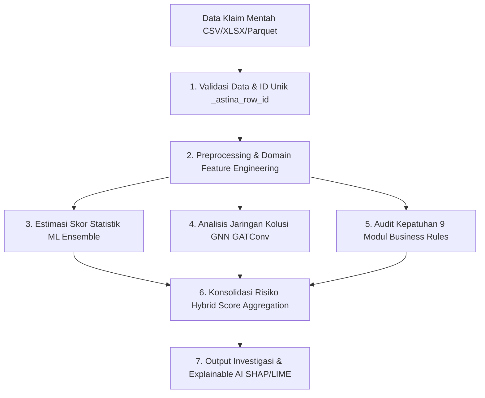

# ASTINA — AI-Powered Insurance Fraud & Anomaly Detection

**ASTINA** adalah platform analitik dan investigasi fraud klaim asuransi kesehatan berbasis **Hybrid AI** yang menggabungkan kekuatan **Machine Learning Ensemble** (Isolation Forest, Autoencoder, XGBoost, GNN) dengan **Rule-Based Business Engine** (9 modul aturan audit klaim). 

Aplikasi ini dilengkapi antarmuka interaktif berbasis **Streamlit**, mendukung pemrosesan dataset besar secara efisien, serta menyediakan Explainable AI (XAI) untuk transparansi keputusan investigasi.

---

## 🚀 Fitur Utama

- **Hybrid Detection Engine**: Menggabungkan probabilitas statistik/anomali ML dengan validasi kepatuhan aturan bisnis asuransi.
- **Batch-Only Optimized Pipeline**: Deteksi anomali dioptimalkan secara eksklusif untuk dataset batch (CSV/XLSX/XLS/Parquet) guna menjamin validitas statistik agregat (IQR, Quantile, Z-Score) dan pembentukan graf relasi GNN.
- **In-App Dataset Template & Schema Readiness**: Menyediakan unduhan template standar klaim (`astina_claim_template.csv`) dan evaluasi kesiapan skema otomatis (0–100%) sebelum analisis dijalankan.
- **9 Modul Aturan Bisnis Fraud**:
  1. *Repeat Billing*: Deteksi klaim berulang dalam rentang waktu singkat.
  2. *Phantom Service*: Deteksi tindakan medis yang tidak wajar/fiktif.
  3. *Provider Capacity*: Validasi kapasitas harian dan over-utilization faskes/dokter.
  4. *Claim Status & Duplicate Payment*: Validasi duplikasi pembayaran dan inkonsistensi administratif.
  5. *Upcoding & Unbundling*: Deteksi penaikan tarif tindakan atau pemecahan paket tagihan.
  6. *Inflated Bill & Cloning*: Deteksi lonjakan tarif ekstrem dan duplikasi tagihan mirip.
  7. *Length of Stay & Readmission*: Evaluasi lama rawat inap dan pola readmisi tidak wajar.
  8. *Medication & Device Fraud*: Validasi kuantitas dan harga satuan obat/alkes.
  9. *Fuzzy Claim Matching*: Pencocokan kemiripan klaim non-identik berbasis kemiripan teks & atribut.
- **Explainable AI (SHAP & LIME)**: Penjelasan kontribusi fitur untuk model Tree-based (XGBoost) dan Isolation Forest.
- **Large Dataset Optimization**: Chunked processing, streaming ingestion, dan optimasi tipe data berbasis Polars/PyArrow.
- **Multi-Environment Ready**: Siap dijalankan di Local (Windows/Linux/macOS), Docker Desktop, dan Serverless Google Cloud Run.

---

## 📁 Struktur Repositori

```text
project-Graphnet-main/
├── main.py                     # Entry point aplikasi Streamlit
├── run.py                      # Production/Local runtime launcher
├── config.py                   # Konfigurasi global, limit memori, & rules parameter
├── fraud_risk_pipeline.py      # Pipeline integrasi scoring & agregasi risiko
├── preprocessing_optimized.py  # Pipeline preprocessing & feature engineering
├── large_file_processor.py     # Pemrosesan dataset besar berbasis chunk
├── file_handler.py             # IO file handler (CSV/Excel/Parquet streaming)
├── model.py                    # Implementasi ensemble model ML & GNN
├── model_registry.py           # Metadata & registry model tersimpan
├── model_explainer.py          # Modul Explainability (SHAP/LIME)
├── ui/                         # Komponen & modul halaman Streamlit
│   ├── pages/                  # Halaman aplikasi (home, detection, training, dll.)
│   ├── sidebar.py              # Navigasi & status perangkat (GPU/CPU)
│   └── utils.py                # Visual helper & komponen UI
├── tests/                      # Suite pengujian otomatis (Pytest)
│   └── test_detection_modules.py
├── .cloudrun/                  # Skrip & konfigurasi deployment Cloud Run
├── Dockerfile                  # Multi-stage Dockerfile teroptimasi
├── docker-compose.yml          # Konfigurasi orkestrasi Docker Desktop
├── requirements.txt            # Dependensi Python terverifikasi (Python 3.11 - 3.13)
└── README.md                   # Dokumentasi teknis & operasional
```

---

## ⚙️ Persyaratan Sistem & Dependensi

- **Python**: Versi `3.11` s/d `3.13` (Direkomendasikan Python 3.11 atau 3.13).
- **Hardware Minimum**: 4 Core CPU, 8 GB RAM (16 GB RAM disarankan untuk dataset besar).
- **Akselerasi Opsional**: GPU NVIDIA (CUDA 11.8 / 12.x) atau AMD GPU (ROCm) untuk akselerasi PyTorch/GNN.
- **Docker**: Docker Desktop versi terbaru dengan Docker Compose v2.

Semua dependensi inti telah disesuaikan dan dikunci pada `requirements.txt`:
`streamlit`, `pandas`, `numpy`, `scikit-learn`, `scipy`, `joblib`, `torch`, `torch-geometric`, `imbalanced-learn`, `plotly`, `xgboost`, `lightgbm`, `catboost`, `polars`, `pyarrow`, `optuna`, `hdbscan`, `faiss-cpu`, `psutil`, `shap`, `lime`, dan `google-cloud-storage`.

---

## 🛠️ Panduan Menjalankan Aplikasi

### Opsi 1: Local Environment (PowerShell / Bash)

1. **Clone repositori dan masuk ke direktori proyek**:
   ```bash
  cd c:\project-Graphnet
   ```

2. **Buat dan aktifkan Virtual Environment**:
   - **Windows (PowerShell)**:
     ```powershell
      py -3.13 -m venv .venv
     .\.venv\Scripts\Activate.ps1
     ```
   - **Linux / macOS**:
     ```bash
      python3.13 -m venv .venv
     source .venv/bin/activate
     ```

3. **Install semua dependensi**:
   ```bash
   pip install --upgrade pip
   pip install -r requirements.txt
   ```

4. **Jalankan aplikasi**:
   - Menggunakan Streamlit langsung:
     ```bash
     streamlit run main.py
     ```
   - Atau menggunakan launcher runtime:
     ```bash
     python run.py
     ```

5. **Akses Dashboard**:
   Buka browser pada [http://localhost:8501](http://localhost:8501).

---

### Opsi 2: Docker Desktop (Rekomendasi untuk Kontainerisasi)

Aplikasi telah dilengkapi **Multi-stage Dockerfile** dan **Docker Compose** yang mengisolasi dependensi, mengoptimalkan ukuran image, serta menjalankan proses sebagai user non-root aman (`appuser`).

#### Menggunakan Docker Compose (Paling Cepat & Lengkap)

1. **Pastikan Docker Desktop sudah berjalan**.
2. **Jalankan build dan container**:
   ```bash
   docker-compose up --build -d
   ```
3. **Periksa status container & log**:
   ```bash
   docker-compose ps
   docker-compose logs -f
   ```
4. **Buka aplikasi di browser**:
   Akses [http://localhost:8501](http://localhost:8501).
5. **Menghentikan container**:
   ```bash
   docker-compose down
   ```

*Catatan: Folder `./cache` dan `./models` otomatis di-mount ke host agar model terlatih dan cache analisis tidak hilang saat container di-restart.*

#### Menggunakan Docker CLI Standar

```bash
# 1. Build Image
docker build -t astina-app .

# 2. Jalankan Container dengan Volume Persistensi
docker run -d \
  --name astina-app \
  -p 8501:8501 \
  -v ${PWD}/cache:/app/cache \
  -v ${PWD}/models:/app/models \
  astina-app
```

---

### Opsi 3: Deployment ke Google Cloud Run

ASTINA mendukung continuous deployment ke Cloud Run:

- **Windows (PowerShell)**:
  ```powershell
  .\.cloudrun\deploy.ps1
  ```
- **Linux / macOS**:
  ```bash
  chmod +x .cloudrun/deploy.sh
  ./.cloudrun/deploy.sh
  ```

*Untuk persistensi model di Cloud Run, set `GOOGLE_CLOUD_BUCKET=nama-bucket-gcs-anda` dan gunakan service account khusus yang memiliki akses Storage Object Admin/Creator sesuai kebijakan keamanan. Deployment default bersifat privat (`--no-allow-unauthenticated`).*

---

## ✅ Status Readiness dan Batas Operasional

Pembaruan yang sudah diterapkan:

- Batas upload aplikasi, Docker, Compose, dan Cloud Run diselaraskan ke `3072 MiB`.
- `.streamlit/config.toml` menetapkan `maxUploadSize` dan `maxMessageSize` secara global, termasuk saat menjalankan `streamlit run main.py` langsung.
- Konfigurasi CORS/XSRF dibuat kompatibel agar tidak menimbulkan override keamanan saat startup.
- CSV besar ditulis ke Parquet secara batch sebelum dimaterialisasi, sehingga tidak lagi menahan seluruh list chunk untuk `pd.concat`.
- Graph star, heterogeneous, dan k-NN memiliki batas node/edge deterministik.
- Visualisasi GNN memakai `node_id` untuk pemetaan probabilitas dan jumlah node tampilan dapat dipilih.
- Training GNN menyediakan mode `NeighborLoader` mini-batch dengan loss pada seed nodes serta fallback kompatibel jika backend sampler PyG tidak tersedia.
- Pipeline rule menggunakan stable `_astina_row_id` sehingga hasil tetap benar setelah sorting, reset index, dan perubahan chunk.
- Evaluasi business rules dijalankan pada dataset global, sehingga pasangan atau group yang melintasi batas chunk tidak hilang.
- Fuzzy matching dipetakan berdasarkan stable row ID, provider capacity berdasarkan tanggal kalender, dan duplicate payment mengecualikan klaim saat ini.
- Evaluation dan detection meneruskan graph ke GNN saat model GNN aktif; medication/device juga menangani kasus quantity delivered nol.
- Visualisasi GNN membersihkan state graph lama, menyimpan metode graph, menghitung score pada node graph yang sama, memilih node paling relevan, mempertahankan isolated node, dan memakai color scale tetap 0-1.
- Visualisasi heterogeneous graph mempertahankan `edge_type` dan membedakan relasi Provider, Patient, dan Diagnosis dengan warna serta legend.
- Training GNN heterogeneous meneruskan one-hot `edge_type` sebagai `edge_attr` ke `GATConv`; checkpoint menyimpan `edge_dim` agar arsitektur relation-aware dapat dipulihkan.
- Startup tidak lagi menjalankan `st.set_page_config()` dua kali.
- Restore artefak model Cloud Storage menggunakan nama file yang sesuai dengan prefix model.
- Restore GNN memulihkan parameter arsitektur, termasuk jumlah layer, dropout, head, dan hidden channel.
- Impor model ZIP memvalidasi path dan mengekstrak file secara streaming untuk mencegah path traversal.
- Test suite tervalidasi: `33 passed`; `pip check` tidak menemukan dependency rusak.

### Penilaian Bottleneck

Status saat ini: **layak untuk localhost dan Docker pada dataset kecil/menengah; layak untuk Cloud Run setelah konfigurasi IAM/GCS dilengkapi; belum bebas bottleneck untuk dataset 3 GiB end-to-end.**

Batas yang masih perlu diperhatikan:

1. Halaman upload masih mengembalikan DataFrame penuh agar kompatibel dengan preprocessing dan EDA lama. File 3 GiB dapat membutuhkan RAM beberapa kali ukuran file.
2. Preprocessing dan train/test split masih membuat representasi DataFrame tambahan.
3. GNN mini-batch membutuhkan backend sampler PyG pada environment deployment. Tanpa backend tersebut, aplikasi fallback ke full-batch dan dapat mengalami tekanan memory.
4. Cloud Run filesystem bersifat ephemeral. Dataset, cache, registry, audit fallback, dan model harus disimpan ke GCS/database bila diperlukan lintas restart atau instance.
5. Upload 3 GiB production sebaiknya menggunakan resumable/direct upload ke GCS, bukan mengirim seluruh file melalui request Streamlit.
6. Satu job training besar per instance direkomendasikan (`concurrency=1`) agar beberapa job tidak berebut memory.
7. Cache DataFrame upload memakai session-level cache satu salinan, bukan serialisasi `st.cache_data` yang dapat menggandakan peak memory.

### Validasi Sebelum Production

```powershell
# Aktifkan environment yang kompatibel
.\.venv\Scripts\Activate.ps1

# Dependency, import, dan test
python -m pip check
python -m pytest -q
python -c "import main; print('startup imports ok')"

# Docker
docker compose config
docker compose up --build -d
docker compose ps
```

Acceptance test production wajib mencakup upload 3 GiB resumable, peak memory, disk temporary, restart worker, concurrent users, restore model dari GCS, training GNN sampled, dan pencocokan `node_id` dengan anomaly probability.

---

## 📋 Panduan Persiapan Data & Format Skema Batch Deteksi

Untuk menjamin akurasi estimasi statistik (*IQR, Quantile, Z-Score*), topologi graf GNN, serta 9 modul aturan bisnis, deteksi anomali ASTINA **wajib menggunakan dataset batch** (minimal 2 baris data). Input manual satu data tidak diperkenankan karena tidak memiliki konteks statistik agregat.

### 📥 Unduh Template Dataset Standar

Aplikasi menyediakan template standar berekstensi CSV (`astina_claim_template.csv`) yang dapat langsung diunduh melalui antarmuka web di halaman **Deteksi** (`⬇️ Unduh Template Dataset (CSV)`). Template memuat 5 baris contoh realistis dengan 14 kolom inti.

Format file yang didukung: **`.csv`**, **`.xlsx`**, **`.xls`**, dan **`.parquet`**.

### 🏷️ 14 Kolom Inti & Pemetaan Modul yang Bergantung

| Kolom | Tipe Data | Deskripsi / Contoh | Modul yang Bergantung |
| :--- | :--- | :--- | :--- |
| `claim_id` | String/Int | Identifikasi unik klaim (`CLM-01001`) | Audit Trail, Duplicate Payment |
| `patient_id` | String/Int | Identifikasi unik pasien (`PAT-00201`) | Repeat Billing, Fuzzy Claim Matching |
| `provider_id` | String/Int | Kode faskes/dokter (`PROV-00011`) | Provider Capacity, Topologi Graf GNN |
| `service_code` | String | Kode prosedur/tindakan medis (`99213`) | Phantom Service, Upcoding & Unbundling |
| `diagnosis_code` | String | Kode diagnosis ICD-10 (`J06.9`, `E11.9`) | Phantom Service, Topologi Graf GNN |
| `billing_date` | Date (YYYY-MM-DD) | Tanggal penagihan klaim (`2024-01-15`) | Repeat Billing (30-day window), Feature High Amount Quick Submit |
| `service_date` | Date (YYYY-MM-DD) | Tanggal tindakan medis diberikan | Provider Capacity, Length of Stay |
| `billed_amount` | Float | Nominal yang ditagihkan dalam Rupiah | ML Ensemble (Fitur amount), payment_ratio, allowance_ratio |
| `paid_amount` | Float | Nominal yang dibayarkan oleh asuransi | payment_ratio, Inflated Bill & Cloning |
| `allowed_amount` | Float | Nominal yang disetujui untuk ditanggung | allowance_ratio |
| `claim_status` | String | Status klaim (`APPROVED`, `PENDING`, `REJECTED`) | Duplicate Payment & Status Check |
| `patient_age` | Integer | Usia pasien dalam tahun (`45`) | Feature Engineering: age_group_encoded |
| `length_of_stay` | Integer | Lama rawat inap dalam hari (`0` jika rawat jalan) | Length of Stay & Readmission |
| `quantity` | Integer | Kuantitas obat/alkes/tindakan | Medication & Device Fraud |

### 🩺 Evaluasi Kesiapan Skema (Schema Readiness Card)

Setiap kali pengguna mengunggah dataset klaim baru, sistem secara otomatis mengevaluasi kesesuaian kolom:
- 🟢 **100% Lengkap**: Seluruh 14 kolom inti ada; semua 9 modul aturan bisnis dan GNN aktif penuh.
- 🟡 **70%–99% Memadai**: Sebagian modul non-kritis mungkin non-aktif; sistem memberi peringatan modul mana yang terdampak.
- 🔴 **< 70% Tidak Memadai**: Kolom esensial tidak ditemukan; inferensi ditolak atau terdegradasi parah dan pengguna diarahkan menggunakan template.

### 🔧 Penyesuaian Fitur Otomatis (*Smart Feature Alignment*)

Model machine learning yang telah dilatih memiliki daftar fitur tetap. Saat dataset baru diunggah:
1. **Fitur Eksisting**: Digunakan langsung dari kolom dataset.
2. **Fitur Diturunkan (*Engineered*)**: Dihitung secara dinamis (misal: rasio `payment_ratio`, boolean `_high` via kuartil 90%, ekstrak tanggal `_day_of_week`/`_month`).
3. **Fitur Hilang (*Imputed*)**: Diisi dengan **nilai median dari data latih** (`training_stats` yang tersimpan pada `metadata.json`), bukan dengan angka 0 statis, sehingga tidak mendistorsi distribusi normal model.

---

## 🧠 Urutan Alur Kerja Hybrid AI ASTINA (End-to-End Workflow)

ASTINA mengoperasikan arsitektur **Hybrid AI** berlapis yang memadukan komputasi statistik machine learning, representasi relasional graf, serta aturan audit kepatuhan deterministik:



---

### 1. Validasi Data & Penetapan ID Unik (`_astina_row_id`)
* **Proses:** Data klaim mentah yang diunggah divalidasi keutuhannya melalui modul `DataValidator` dan disanitasi oleh `DataSanitizer`.
* **Peran Krusial:** Sebelum data dipecah (split), diurutkan (sorting), atau diproses per chunk, sistem menetapkan penanda unik permanen bernama `_astina_row_id` untuk setiap baris klaim. ID ini memastikan hasil prediksi model ML, analisis hubungan GNN, dan bendera (*flag*) aturan bisnis selalu merujuk pada klaim fisik yang sama tanpa risiko tertukar akibat komputasi downstream.

### 2. Preprocessing & Feature Engineering
* **Proses:** Data numerik dibersihkan dari outlier menggunakan batas IQR (`detect_and_handle_outliers`), data tanggal diekstrak menjadi fitur temporal (lama proses, gap pengajuan, keterlambatan), dan data kategori dikodekan secara optimal (*Target Encoding*, *Frequency Encoding*, atau *One-Hot*).
* **Peran Krusial:** Sistem secara otomatis membentuk fitur-fitur baru (*engineered domain features*) khusus industri asuransi kesehatan:
  * `payment_ratio`: Rasio nominal dibayar terhadap nominal ditagihkan.
  * `allowance_ratio`: Rasio nominal disetujui terhadap nominal ditagihkan.
  * `high_amount_quick_submit`: Indikator klaim bernominal kuartil tinggi yang diajukan dalam durasi waktu sangat singkat.
  * `zscore`: Standarisasi deviasi statistik pada variabel moneter utama.

### 3. Estimasi Skor Statistik melalui Model ML Ensemble
* **Proses:** Fitur yang telah disejajarkan (*aligned*) dimasukkan ke dalam `CombinedAnomalyDetector`. Beberapa model Machine Learning bekerja secara paralel untuk menilai keanehan klaim berdasarkan pola historis:
  * **Isolation Forest**: Mendeteksi klaim dengan atribut yang sangat terisolasi atau berada di luar sebaran data mayoritas.
  * **Autoencoder (Neural Network PyTorch)**: Mempelajari representasi data klaim normal, lalu menghitung tingkat kejanggalan melalui *reconstruction error*.
  * **XGBoost (Supervised / Semi-Supervised)**: Memprediksi probabilitas fraud berdasarkan hubungan fitur non-linear yang dipelajari dari label historis.
* **Hasil:** Model menghasilkan probabilitas individual yang kemudian digabungkan secara rata-rata berbobot (dioptimasi secara dinamis via Optuna) menjadi satu nilai statistik: `anomaly_probability` $\in [0.00, 1.00]$.

### 4. Analisis Kolusi Jaringan menggunakan Graph Neural Network (GNN)
* **Proses:** ASTINA membangun topologi relasional (*Graph Construction*) antarklaim menggunakan metode **Star Graph** (menghubungkan klaim yang berbagi dokter/provider, pasien, atau diagnosis yang sama) maupun graf heterogen/k-NN.
* **Peran Krusial:** Model GNN (`InsuranceAnomalyGNNModel` berbasis `GATConv` / *Graph Attention Network*) menganalisis pola koneksi ini. GNN mampu mendeteksi anomali kelompok (*fraud ring* / sindikat faskes)—misalnya sekelompok pasien berbeda yang diklaim secara massal oleh provider yang sama dengan kode diagnosis identik dalam rentang waktu berdekatan. Skor relasional topologi ini digabungkan langsung ke dalam total probabilitas deteksi.

### 5. Audit Kepatuhan menggunakan Rule-Based Business Engine
* **Proses:** Secara paralel dengan jalannya model ML, sistem mengeksekusi `run_integrated_claim_risk_pipeline()` yang memuat **9 kelompok aturan kepatuhan asuransi kesehatan**:
  1. **Repeat Billing**: Deteksi tagihan berulang untuk pasien/tindakan yang sama dalam jendela waktu 30 hari.
  2. **Phantom Service**: Validasi klaim fiktif melalui `PhantomServiceRuleEngine` (misal: layanan di luar tanggal rawat atau ketidakwajaran prosedur).
  3. **Provider Capacity**: Evaluasi beban layanan harian dokter/faskes yang melampaui batas wajar kapasitas fisik.
  4. **Fuzzy Claim Matching**: Deteksi kemiripan deskripsi klaim non-identik berbasis string similarity.
  5. **Upcoding & Unbundling**: Deteksi penggelembungan kode tarif dan pemecahan paket tindakan tunggal.
  6. **Inflated Bill & Cloning**: Deteksi lonjakan tagihan ekstrem di atas benchmark medis dan duplikasi rekam medis (*cloned charts*).
  7. **Length of Stay & Readmission**: Deteksi anomali lama rawat inap (*outlier LOS*) dan pola readmisi cepat.
  8. **Medication & Device Fraud**: Audit kuantitas obat berlebih, dosis tidak rasional, dan margin alkes.
  9. **Duplicate Payment & Status Check**: Validasi pembayaran ganda pada klaim yang telah lunas/disetujui.
* **Hasil:** Setiap aturan yang terpicu menghasilkan *flag* biner, skor risiko bisnis (`business_risk_score`), dan catatan bukti penjelasan (*evidence*).

### 6. Konsolidasi Risiko (Hybrid Score Aggregation)
* **Proses:** Skor anomali statistik ML/GNN (`anomaly_probability`) dan skor risiko aturan bisnis (`business_risk_score`) disatukan menggunakan formula bobot terintegrasi:

$$\text{Business Risk Score} = 0.40(R_{\text{repeat}}) + 0.20(R_{\text{phantom}}) + 0.15(R_{\text{capacity}}) + 0.15(R_{\text{fuzzy}}) + 0.10(R_{\text{additional}})$$

$$\text{Final Risk Score} = 0.50(\text{Business Risk Score}) + 0.30(\text{ML Anomaly Score}) + 0.20(\text{Duplicate Payment Flag})$$

* **Hasil:** Sistem menghasilkan `final_risk_score` (skala 0.00 hingga 1.00) dan mengklasifikasikannya ke dalam tingkat keparahan risiko: **Low Risk**, **Medium Risk**, atau **High Risk** (Threshold default $\ge 0.65$).

### 7. Output Investigasi & Explainable AI (XAI)
* **Proses:** Seluruh kasus berisiko dikirimkan ke dasbor investigator interaktif yang menyediakan:
  * **Fraud Review Table**: Tabel interaktif dengan filter faskes, severity, dan pewarnaan visual merah/kuning.
  * **Explicit Evidence & Reasoning**: Rincian naratif aturan bisnis mana saja yang dilanggar beserta bukti fisik per klaim.
  * **Explainable AI (SHAP & LIME)**: Visualisasi *SHAP summary plot* dan kontribusi bobot fitur (*feature importance*) untuk menjelaskan alasan di balik keputusan model ML.
  * **Visualisasi Graf Jaringan**: Pemetaan interaktif node & edge untuk menelusuri rantai kolusi antar-faskes dan pasien.
  * **Export Laporan**: Fasilitas unduh hasil audit dalam format CSV terstruktur untuk pelaporan resmi investigasi fraud.

---

## 🔧 Konfigurasi Lingkungan (`.env`)

Konfigurasi opsional dapat disetel melalui file `.env` di direktori utama:

| Variabel | Default | Keterangan |
| :--- | :--- | :--- |
| `PORT` | `8501` | Port listen aplikasi Streamlit |
| `STREAMLIT_SERVER_MAX_UPLOAD_SIZE` | `3072` | Batas maksimum upload dataset (MiB) |
| `ASTINA_LOG_FORMAT` | `json` | Format logging (`json` / `text`) |
| `GOOGLE_CLOUD_BUCKET` | *(Opsional)* | Nama GCS Bucket untuk sinkronisasi model |
| `OPTUNA_N_JOBS` | `4` | Jumlah thread paralel optimasi hyperparameter |
| `CV_N_JOBS` | `4` | Jumlah thread paralel Cross Validation |

---

## 🧪 Pengujian & Validasi Kualitas

Aplikasi dilengkapi suite pengujian otomatis untuk memverifikasi fungsionalitas seluruh modul deteksi dan explainability:

```powershell
# Jalankan seluruh test suite dengan Pytest
python -m pytest -q
```

Hasil verifikasi memastikan:
- ✅ Seluruh 9 modul deteksi fraud berfungsi normal pada berbagai tipe data.
- ✅ Penanganan data kosong, missing values, dan format tidak standar berjalan tanpa crash.
- ✅ SHAP Feature Importance terlindungi UI Guard saat model non-kompatibel dipilih.
- ✅ Graph GNN menghormati batas node/edge dan mempertahankan ID node yang valid.

Training GNN pada graph besar mendukung `NeighborLoader` melalui parameter
`gnn_params`: `use_neighbor_sampling`, `sampling_threshold_nodes`,
`batch_size`, dan `num_neighbors`. Jika backend sampler PyG tidak tersedia,
aplikasi menggunakan fallback full-batch dan mencatat peringatan di log.

---

## 🩺 Troubleshooting

- **Port 8501 bentrok / sudah dipakai**:
  ```powershell
  streamlit run main.py --server.port 8502
  ```
- **Error PyTorch / CUDA di Local**:
  Pastikan versi PyTorch sesuai dengan versi CUDA driver Anda. Untuk mode CPU murni, instalasi standar `requirements.txt` langsung siap digunakan.
- **Docker Desktop permission / volume mount**:
  Pastikan folder `cache/` dan `models/` ada di root project sebelum menjalankan `docker-compose up`.
- **Dataset Besar Out of Memory**:
  Gunakan format Parquet. Ingestion CSV besar berjalan per chunk, tetapi training GNN tetap membutuhkan strategi sampling graph dan resource produksi yang memadai.

---

## 📄 Lisensi

Proyek ini dirancang untuk audit dan pengawasan klaim asuransi kesehatan dengan lisensi MIT / Enterprise Internal Policy.
# project-Graphnet

