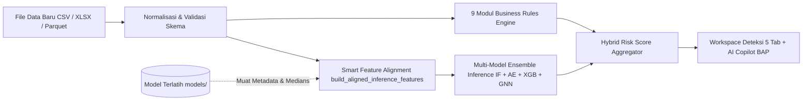
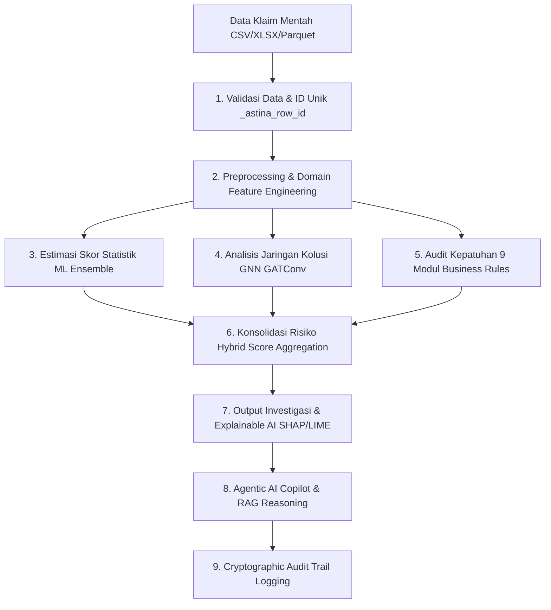

# ASTINA — AI-Powered Insurance Fraud & Anomaly Detection

**ASTINA** adalah platform analitik dan investigasi fraud klaim asuransi kesehatan berbasis **Hybrid AI Enterprise** yang menggabungkan kekuatan **Machine Learning Ensemble** (Isolation Forest, Autoencoder, XGBoost, GNN) dengan **Rule-Based Business Engine** (9 modul aturan audit klaim), **Agentic AI Copilot bertenaga RAG**, serta **Audit Trail Kriptografis**.

Aplikasi ini dilengkapi antarmuka interaktif berbasis **Streamlit**, mendukung pemrosesan dataset besar secara efisien (streaming chunk & Parquet caching), serta menyediakan Explainable AI (XAI) untuk transparansi keputusan investigasi klinis dan finansial.

---

## 🚀 Fitur Utama

- **🧠 Hybrid Detection Engine**: Menggabungkan probabilitas anomali statistik ML/GNN dengan validasi deterministik kepatuhan 9 aturan bisnis asuransi.
- **⚡ Resilient Multi-Format Data Ingestion**: Dukungan menyeluruh untuk file CSV, Excel (`.xlsx`, `.xls`), dan Parquet dengan normalisasi format otomatis, streaming disk buffering 8MB untuk efisiensi RAM, engine Polars untuk Parquet cepat, dan integrasi parser Excel tahan error.
- **🎯 Intelligent Feature Selection & Redundancy Filtering**: Modul seleksi fitur multivariat adaptif di UI Praproses yang mencakup SelectKBest (ANOVA F-Score & Mutual Information), Tree-based Feature Importance (ExtraTrees/RandomForest/LightGBM), Filter Multikolinearitas Terbobot Skor, Filter Low-Variance Skala Invarian, serta Reduksi Dimensi PCA interaktif dengan *live explained variance preview*.
- **⚡ Smart Training Profiles & Complexity Estimator**: Antarmuka pelatihan interaktif dengan preset adaptif (⚡ *Mode Cepat* ~10-30 dtk, ⚖️ *Mode Seimbang* ~1-2 mnt, 🧠 *Mode Lengkap* Deep Graph, 🛠️ *Kustom*) serta monitor estimasi beban komputasi & rekomendasi hardware (CPU vs GPU) *real-time*.
- **🕸️ Graph Neural Network (GNN)**: Analisis relasional berbasis `GATConv` (Star Graph, Heterogeneous Graph, & k-NN Graph) untuk membongkar sindikat kolusi faskes, dokter, dan pasien (*fraud rings*) dengan evaluasi metrik periodik teroptimasi.
- **📑 5-Tab Detection & Investigation Workspace**:
  1. 📊 *Ringkasan & Visualisasi*: Distribusi prediksi anomali seimbang, histogram probabilitas multi-model ensemble, panel metrik eksekutif 11 kartu risiko, dan proporsi risiko per kategori.
  2. 🚨 *Business Risk & Rules*: Audit temuan Repeat Billing & Phantom Service beserta rincian 9 modul aturan fraud medis.
  3. 📋 *Fraud Review Table & Export*: Tabel audit interaktif klaim terfilter, pengurutan tingkat keparahan (*High/Medium/Low Risk*), dan ekspor multiformat.
  4. 🤖 *AI Investigator Copilot & BAP*: Pembuatan Berita Acara Pemeriksaan (BAP) formal & resume medis dalam format Markdown dengan sitasi regulasi medis RAG FAISS.
  5. 📈 *Concept Drift & Retraining*: Pemantauan pergeseran distribusi data (uji Kolmogorov-Smirnov) dan orkestrasi retrain model Champion-Challenger.
- **🤖 Agentic AI Copilot & RAG**: Asisten investigasi cerdas multi-provider (Google Gemini, OpenAI, Local Ollama, Offline Heuristic Engine) bertenaga FAISS Knowledge Base (ICD-10, CPT, regulasi medis) yang dilengkapi sanitasi PII (HIPAA/UU PDP).
- **🧭 Interactive Top Navbar & Pipeline Tracker**: Status bar modern *glassmorphic* di setiap halaman yang memuat *live telemetry pills* (status baris & fitur data, model aktif, akselerasi GPU/CPU, status Copilot) dan *5-stage visual breadcrumb tracker* (`Unggah Data` ➔ `Praproses & Fitur` ➔ `Pelatihan` ➔ `Evaluasi` ➔ `Deteksi`).
- **📊 Real-Time Sidebar Status Dashboard**: Panel metrik samping dengan *progress bar* kesiapan pipeline (0%–100%), kartu spesifikasi dataset streaming, metrik model AI/ML, dan monitor kesehatan hardware.
- **🛡️ Cryptographic Audit Trail**: Pencatatan riwayat audit forensik berantai hash SHA-256 anti-tamper untuk setiap aksi ingestion, preprocessing, training, deteksi, dan ekspor data.
- **🔒 PII Masking & Data Privacy**: Perlindungan data sensitif pasien (NIK, Nama, Rekam Medis) secara dinamis sesuai regulasi perlindungan data pribadi (UU PDP / HIPAA).
- **⚡ Batch-Only Optimized Streaming Pipeline**: Ingestion data berkecepatan tinggi dengan Polars/PyArrow LazyFrame, penulisan Parquet per chunk terkompresi Zstandard, dan evaluasi kesiapan skema otomatis (0–100%).
- **🔄 Concept Drift & Automated Retraining**: Deteksi pergeseran distribusi data (*covariate & concept drift*) otomatis menggunakan uji Kolmogorov-Smirnov dengan *Champion-Challenger Quality Gate*.
- **⚖️ 9 Modul Aturan Bisnis Fraud Medis**:
  1. *Repeat Billing*: Deteksi klaim berulang untuk pasien/tindakan identik dalam jendela waktu 30 hari.
  2. *Phantom Service*: Deteksi layanan fiktif, inkonsistensi tanggal tindakan, dan tindakan di luar masa rawat.
  3. *Provider Capacity*: Validasi kapasitas harian dokter/faskes yang melampaui batas wajar operasional.
  4. *Claim Status & Duplicate Payment*: Validasi duplikasi pembayaran klaim yang telah lunas/disetujui.
  5. *Upcoding & Unbundling*: Deteksi penggelembungan tarif medis dan pemecahan paket tindakan terpadu.
  6. *Inflated Bill & Cloning*: Deteksi lonjakan tagihan ekstrem di atas benchmark serta duplikasi rekam medis (*cloned charts*).
  7. *Length of Stay & Readmission*: Evaluasi lama rawat inap tidak wajar (*LOS outlier*) dan readmisi kilat.
  8. *Medication & Device Fraud*: Audit kuantitas obat berlebih, rasionalitas dosis, dan markup alkes tak wajar.
  9. *Fuzzy Claim Matching*: Pencocokan kemiripan klaim non-identik berbasis kemiripan teks leksikal & atribut.
- **🔍 Explainable AI (SHAP & LIME)**: Visualisasi atribusi fitur (*feature importance*) dan kontribusi lokal untuk transparansi akuntabilitas model.
- **📊 Real-Time System Telemetry**: Monitoring utilisasi hardware (CPU, RAM, GPU/VRAM), throughput ingestion, dan latensi inferensi.
- **💻 Headless CLI Training Engine**: Dukungan pelatihan model otomatis melalui baris perintah (`training_cli.py`) untuk integrasi MLOps / CI/CD pipeline.
- **☁️ Multi-Environment Ready**: Kompatibilitas penuh untuk Localhost (Windows/Linux/macOS), Docker Desktop, dan Google Cloud Run dengan persistensi volume dan sinkronisasi Google Cloud Storage (GCS).

---

## 📁 Struktur Repositori

```text
project-Graphnet/
├── main.py                          # Entry point aplikasi web Streamlit & routing navigasi
├── run.py                           # Production & local runtime launcher
├── config.py                        # Konfigurasi global, limit memori, & parameter aturan
├── fraud_risk_pipeline.py           # Pipeline orkestrasi skoring risiko hybrid
├── preprocessing_optimized.py       # Pipeline data preprocessing, feature engineering & feature selection
├── large_file_processor.py          # Streaming chunk processor untuk dataset skala besar
├── file_handler.py                  # IO file handler (CSV/Excel/Parquet streaming)
├── model.py                         # Arsitektur ML Ensemble (Autoencoder, XGBoost, GNN, Optuna)
├── model_registry.py                # Manajemen versi model & metadata training
├── model_explainer.py               # Modul interpretasi model (SHAP & LIME)
├── agentic_copilot.py               # AI Copilot investigasi berbasis LLM & Agentic reasoning (Zero-Wipeout Fallback)
├── rag_engine.py                    # Knowledge base RAG berbasis FAISS, regulasi JKN & kaidah outlier ML
├── audit_trail.py                   # Engine pencatatan audit log berantai SHA-256
├── verify_audit_trail.py            # Skrip verifikasi integritas rantai log audit
├── pii_masker.py                    # Modul anonimisasi & masking data sensitif (PII)
├── cache_manager.py                 # Multi-tier Parquet & session cache manager
├── training_cli.py                  # Command-Line Interface untuk batch training model
├── system_status.py                 # Telemetri & monitoring resource hardware
├── enhanced_metrics.py              # Metrik operasional & performa sistem
├── encoding_recommendations.py      # Rekomendasi otomatis teknik encoding fitur kategorik
├── rate_limit.py                    # Rate limiter & proteksi konkurensi request
├── error_handler.py                 # Error boundary & resilience handler
├── retry_utils.py                   # Utilitas exponential backoff retry
├── cloud_storage.py                 # Sinkronisasi artefak model ke Google Cloud Storage
│
├── ui/                              # Antarmuka Pengguna Streamlit
│   ├── sidebar.py                   # Navigasi, telemetry status, & switch dataset
│   ├── utils.py                     # Visual helper, grafik Plotly, & smart alignment
│   ├── ui_components.py             # Custom glassmorphic CSS, navbar, pills & breadcrumbs
│   └── pages/                       # Modul Halaman Aplikasi
│       ├── home.py                  # Dashboard ikhtisar & status sistem
│       ├── data_collection.py       # Upload dataset, validasi skema, preprocessing & feature selection
│       ├── training.py              # Pelatihan model ML Ensemble & GNN
│       ├── evaluation.py            # Evaluasi performa, metrik confusion matrix, & XAI
│       ├── detection.py             # Deteksi fraud batch, rule audit, review table & AI Copilot
│       └── status.py                # Telemetri performa sistem & audit logging
│
├── tests/                           # Unit test & integrasi otomatis (Pytest) - 63 Test Cases
│   ├── conftest.py                  # Pytest fixtures & setup lingkungan uji
│   ├── test_agentic_copilot.py      # Uji Copilot, FAISS RAG, zero-wipeout fallback, & XAI/GNN context
│   ├── test_app_startup.py          # Uji startup & integritas import modul utama
│   ├── test_detection_modules.py    # Test suite komprehensif 9 modul aturan & ML
│   ├── test_feature_selection.py    # Uji metode seleksi fitur, multikolinearitas & varians
│   ├── test_gnn_minibatch.py        # Uji mini-batch sampling & forward pass GNN
│   ├── test_graph_scaling.py        # Uji penskalaan graf & edge budget limit
│   ├── test_large_file_ingestion.py # Uji streaming CSV-to-Parquet chunk ingestion
│   ├── test_optuna_ensemble_and_drift.py # Uji optimasi Optuna & deteksi pergeseran data
│   ├── test_pipeline_edge_cases.py  # Uji edge cases & robustness data tak standar
│   └── test_streaming_preprocessing_memory.py # Uji batasan memori streaming preprocessing
│
├── .cloudrun/                       # Konfigurasi & skrip deploy Google Cloud Run
│   ├── deploy.ps1                   # Skrip deploy otomatis PowerShell
│   └── deploy.sh                    # Skrip deploy otomatis Bash
├── Dockerfile                       # Multi-stage Dockerfile aman (non-root appuser)
├── docker-compose.yml               # Orkestrasi Docker Compose dengan persistensi volume
├── requirements.txt                 # Daftar dependensi Python terverifikasi
└── README.md                        # Dokumentasi teknis & operasional
```

---

## ⚙️ Persyaratan Sistem & Dependensi

- **Python**: Versi `3.11` s/d `3.13` (Direkomendasikan Python 3.11 atau 3.13).
- **Hardware Minimum**: 4 Core CPU, 8 GB RAM (16 GB RAM disarankan untuk dataset besar > 1 GB).
- **Akselerasi Opsional**: GPU NVIDIA (CUDA 11.8 / 12.x) atau AMD GPU (ROCm) untuk akselerasi PyTorch/GNN.
- **Docker**: Docker Desktop versi terbaru dengan Docker Compose v2.

Semua dependensi inti dikunci pada [requirements.txt](file:///c:/project-Graphnet/requirements.txt):
`streamlit`, `pandas`, `numpy`, `scikit-learn`, `scipy`, `joblib`, `torch`, `torch-geometric`, `imbalanced-learn`, `plotly`, `xgboost`, `lightgbm`, `catboost`, `polars`, `pyarrow`, `optuna`, `hdbscan`, `faiss-cpu`, `psutil`, `shap`, `lime`, `google-cloud-storage`, `cryptography`.

---

## 🛠️ Panduan Menjalankan Aplikasi

### Opsi 1: Local Environment (PowerShell / Bash)

1. **Masuk ke direktori proyek**:
   ```bash
   cd c:\project-Graphnet
   ```

2. **Buat dan aktifkan Virtual Environment**:
   - **Windows (PowerShell)**:
     ```powershell
     py -3.13 -m venv .venv
     .\.venv\Scripts\Activate.ps1
     ```
   - **Linux / macOS**:
     ```bash
     python3.13 -m venv .venv
     source .venv/bin/activate
     ```

3. **Install semua dependensi**:
   ```bash
   pip install --upgrade pip
   pip install -r requirements.txt
   ```

4. **Jalankan aplikasi**:
   - Menggunakan Streamlit langsung:
     ```bash
     streamlit run main.py
     ```
   - Atau menggunakan launcher otomatis:
     ```bash
     python run.py
     ```

5. **Akses Dashboard**:
   Buka browser pada [http://localhost:8501](http://localhost:8501).

---

### Opsi 2: Docker Desktop (Kontainerisasi Terisolasi)

Aplikasi dilengkapi **Multi-stage Dockerfile** dan **Docker Compose** yang mengisolasi dependensi, mengoptimalkan ukuran image, serta menjalankan proses sebagai user non-root aman (`appuser`).

#### Menggunakan Docker Compose (Direkomendasikan)

1. **Jalankan build dan container**:
   ```bash
   docker-compose up --build -d
   ```
2. **Periksa status container & log real-time**:
   ```bash
   docker-compose ps
   docker-compose logs -f
   ```
3. **Buka aplikasi**:
   Akses [http://localhost:8501](http://localhost:8501).
4. **Menghentikan container**:
   ```bash
   docker-compose down
   ```

*Catatan: Direktori `./cache` dan `./models` otomatis di-mount ke host agar model terlatih dan cache analisis tetap persisten saat container di-restart.*

---

### Opsi 3: Deployment ke Google Cloud Run

ASTINA mendukung continuous serverless deployment ke Cloud Run:

- **Windows (PowerShell)**:
  ```powershell
  .\.cloudrun\deploy.ps1
  ```
- **Linux / macOS**:
  ```bash
  chmod +x .cloudrun/deploy.sh
  ./.cloudrun/deploy.sh
  ```

*Untuk persistensi model di Cloud Run, tetapkan `GOOGLE_CLOUD_BUCKET=nama-bucket-gcs-anda` dan gunakan Service Account yang memiliki role Storage Object Admin/Creator. Deployment default bersifat privat (`--no-allow-unauthenticated`).*

---

### Opsi 4: Headless Training via CLI

Untuk melatih model ML & GNN secara otomatis melalui terminal tanpa membuka UI:

```powershell
# Melatih seluruh model (Ensemble ML + GNN) dengan optimasi hyperparameter Optuna
python training_cli.py --data cache/processed_data.parquet --output models/ --optimize-hyperparams

# Melatih khusus model GNN dengan Graph Attention Network (GAT)
python training_cli.py --data cache/processed_data.parquet --model-type gnn --epochs 50 --batch-size 1024
```

---

## 📋 Panduan Persiapan Data & Format Skema Batch Deteksi

Untuk menjamin akurasi estimasi statistik (*IQR, Quantile, Z-Score*), topologi graf GNN, serta 9 modul aturan bisnis, deteksi anomali ASTINA **wajib menggunakan dataset batch** (minimal 2 baris data).

### 📥 Unduh Template Dataset Standar

Aplikasi menyediakan template standar CSV (`astina_claim_template.csv`) yang dapat diunduh langsung melalui antarmuka web di halaman **Deteksi** (`⬇️ Unduh Template Dataset (CSV)`).

Format file yang didukung: **`.csv`**, **`.xlsx`**, **`.xls`**, dan **`.parquet`**.

### 🏷️ 14 Kolom Inti & Pemetaan Modul

| Kolom | Tipe Data | Deskripsi / Contoh | Modul yang Bergantung |
| :--- | :--- | :--- | :--- |
| `claim_id` | String/Int | Identifikasi unik klaim (`CLM-01001`) | Audit Trail, Duplicate Payment |
| `patient_id` | String/Int | Identifikasi unik pasien (`PAT-00201`) | Repeat Billing, Fuzzy Claim Matching |
| `provider_id` | String/Int | Kode faskes/dokter (`PROV-00011`) | Provider Capacity, Topologi Graf GNN |
| `service_code` | String | Kode prosedur/tindakan medis (`99213`) | Phantom Service, Upcoding & Unbundling |
| `diagnosis_code` | String | Kode diagnosis ICD-10 (`J06.9`, `E11.9`) | Phantom Service, Topologi Graf GNN |
| `billing_date` | Date (YYYY-MM-DD) | Tanggal penagihan klaim (`2024-01-15`) | Repeat Billing, High Amount Quick Submit |
| `service_date` | Date (YYYY-MM-DD) | Tanggal tindakan medis diberikan | Provider Capacity, Length of Stay |
| `billed_amount` | Float | Nominal yang ditagihkan dalam Rupiah | ML Ensemble, payment_ratio, allowance_ratio |
| `paid_amount` | Float | Nominal yang dibayarkan oleh asuransi | payment_ratio, Inflated Bill & Cloning |
| `allowed_amount` | Float | Nominal yang disetujui untuk ditanggung | allowance_ratio |
| `claim_status` | String | Status klaim (`APPROVED`, `PENDING`, `REJECTED`) | Duplicate Payment & Status Check |
| `patient_age` | Integer | Usia pasien dalam tahun (`45`) | Feature Engineering: age_group_encoded |
| `length_of_stay` | Integer | Lama rawat inap dalam hari (`0` jika rawat jalan) | Length of Stay & Readmission |
| `quantity` | Integer | Kuantitas obat/alkes/tindakan | Medication & Device Fraud |

### 🩺 Evaluasi Kesiapan Skema (Schema Readiness Card)

Sistem otomatis mengevaluasi kesesuaian kolom saat dataset diunggah:
- 🟢 **100% Lengkap**: Seluruh 14 kolom inti tersedia; semua 9 modul aturan bisnis dan GNN aktif penuh.
- 🟡 **70%–99% Memadai**: Sebagian modul non-kritis disesuaikan; sistem memberikan peringatan modul terdampak.
- 🔴 **< 70% Tidak Memadai**: Kolom esensial kurang; inferensi ditolak atau terdegradasi dan pengguna diarahkan memakai template.

### 🔧 Penyesuaian Fitur Otomatis (*Smart Feature Alignment*) & Imputasi Median Training

Saat data baru diuji menggunakan model yang telah dilatih sebelumnya, skema kolom pada data baru sering kali tidak 100% identik dengan dataset saat pelatihan (misalnya ketiadaan fitur turunan tertentu). ASTINA menerapkan mekanisme **Smart Feature Alignment** (`build_aligned_inference_features()`):

1. **Fitur Eksisting (*Direct Match*)**: Kolom yang ada langsung pada dataset baru dipetakan ke skema fitur training.
2. **Fitur Diturunkan (*Auto-Engineered*)**: Fitur turunan seperti flag missing (`*_missing`), rasio moneter domain asuransi (`payment_ratio`, `allowance_ratio`), dan fitur temporal (`day_of_week`, `month`) direkonstruksi secara otomatis jika kolom induk tersedia.
3. **Fitur Hilang Terimputasi Median (*Training Median Imputation*)**: Fitur yang sama sekali tidak dapat diturunkan dari data baru diisi dengan **nilai median per-fitur dari data training** (`feature_medians` yang tersimpan di `_params.json`). Ini menjamin distribusi input model tidak terdistorsi oleh angka sembarangan atau nilai `0.0`.

---

## 🔍 Deteksi Anomali dari Data Baru Berdasarkan Model Terlatih

ASTINA mendukung deteksi fraud secara langsung terhadap **data transaksi klaim baru** (*unseen inference dataset*) tanpa harus melatih ulang model.

### 🏛️ Arsitektur Model Persistence & Loading

Setiap kali model selesai dilatih pada modul **Pelatihan**, artefak model disimpan secara permanen di direktori `./models/`:
- `fraud_detector_isolation_forest.pkl`: Estimator Isolation Forest scikit-learn.
- `fraud_detector_xgboost.pkl`: Estimator Gradient Boosted Trees XGBoost.
- `fraud_detector_imputer.pkl` & `fraud_detector_scaler.pkl`: Pipeline praproses imputasi & normalisasi.
- `fraud_detector_autoencoder.pt`: Bobot neural network PyTorch Deep Autoencoder.
- `fraud_detector_gnn.pt`: Bobot PyTorch Geometric GATConv (Graph Attention Network).
- `fraud_detector_params.json`: Hyperparameter model, bobot ensemble, skema kolom `feature_columns`, tipe data `feature_dtypes`, dan kamus nilai median training `feature_medians`.

Saat pengguna membuka halaman **Deteksi** (`ui/pages/detection.py`), fungsi `load_persisted_detector()` secara otomatis memuat seluruh artefak ini ke dalam memori sesi kerja.

### 📊 Alur Eksekusi Inferensi Data Baru



### 📋 Tri-Tier Feature Alignment Table

| Kategori Fitur | Sumber / Penanganan | Dampak terhadap Model |
| :--- | :--- | :--- |
| **Existing** | Kolom ada langsung pada file data baru | Presisi 100% mengikuti distribusi data baru |
| **Derived** | Ditransformasikan otomatis dari kolom induk | Menjaga konsistensi representasi fitur rekayasa |
| **Filled** | Diimputasi menggunakan `feature_medians` dari model training | Netral secara statistik, mencegah false alarm akibat `0.0` |

### 🛠️ Panduan Operasional: Langkah Deteksi Data Baru

1. **Pastikan Model Tersedia**: Latih model minimal satu kali di halaman **Pelatihan**, atau pastikan artefak model telah tersedia di folder `models/`.
2. **Navigasi ke Halaman Deteksi**: Klik menu **Deteksi** pada sidebar. Indikator di atas halaman akan menampilkan status model champion yang aktif (jumlah fitur, mode komputasi GPU/CPU, bobot ensemble).
3. **Pilih Sumber Data**:
   - Pilih opsi **📤 Unggah File Baru (CSV / XLSX / XLS / Parquet)**.
   - Unggah berkas klaim baru yang ingin diperiksa (gunakan format standar sesuai template).
4. **Atur Parameter Deteksi**:
   - Tentukan **Ambang Batas Anomali ML** (default: `0.50`).
   - Tentukan **Metode Agregasi Risiko** (*Weighted Hybrid*, *Conservative Max*, atau *Ensemble ML Only*).
5. **Eksekusi Analisis**: Klik tombol **⚡ Eksekusi Deteksi Anomali**.
6. **Evaluasi Diagnostik Penyelarasan**:
   - Sistem menampilkan banner status alignment:
     - 🟢 *Hijau*: Semua fitur ditemukan langsung atau berhasil diturunkan otomatis.
     - 🟡 *Kuning*: Terdapat fitur yang diimputasi dengan median training (disertai expander rincian kolom).
   - Buka expander **Detail Penyelarasan Fitur Inferensi** untuk mengaudit kolom mana saja yang tergolong *Existing*, *Derived*, atau *Filled*.
7. **Analisis Hasil pada 5 Tab Spesifik**:
   - **Tab 1**: Pantau proporsi klaim normal vs anomali dan panel 11 kartu ringkasan risiko.
   - **Tab 2**: Periksa rincian temuan 9 aturan bisnis (Repeat Billing, Phantom Service, dll).
   - **Tab 3**: Filter klaim berisiko tinggi (*High Risk*) dan ekspor laporan ke format Excel/CSV.
   - **Tab 4**: Gunakan AI Copilot untuk menyusun Berita Acara Pemeriksaan (BAP) formal secara otomatis.
   - **Tab 5**: Pantau *Concept Drift* data baru terhadap data pelatihan menggunakan uji Kolmogorov-Smirnov.

## 🧠 Alur Kerja Hybrid AI ASTINA (End-to-End Architecture)

ASTINA mengoperasikan arsitektur **Hybrid AI** berlapis yang memadukan komputasi statistik machine learning, representasi relasional graf, audit aturan bisnis, serta penalaran cerdas AI Copilot:



### 1. Validasi Data & Penetapan ID Unik (`_astina_row_id`)
* **Proses:** Data klaim divalidasi keutuhannya melalui `DataValidator` dan disanitasi oleh `DataSanitizer`.
* **Peran Krusial:** Sistem menetapkan identifier stabil `_astina_row_id` pada setiap baris klaim sebelum partisi chunk/sorting agar hasil prediksi ML, GNN, dan bendera aturan bisnis selalu merujuk pada entitas klaim yang sama.

### 2. Preprocessing, Feature Engineering & Selection
* **Proses Preprocessing & Feature Engineering:** Deteksi outlier IQR (`detect_and_handle_outliers`), ekstraksi fitur temporal, encoding variabel kategori optimal (*Target Encoding* / *Frequency Encoding*), dan pembentukan fitur domain asuransi:
  * `payment_ratio`: Rasio nominal dibayar terhadap nominal ditagihkan.
  * `allowance_ratio`: Rasio nominal disetujui terhadap nominal ditagihkan.
  * `high_amount_quick_submit`: Indikator klaim bernominal kuartil atas yang diajukan dalam durasi waktu kilat.
  * `zscore`: Standarisasi deviasi statistik pada variabel moneter utama.
* **Seleksi Fitur Cerdas (*Intelligent Feature Selection*):**
  * **SelectKBest**: Pemeringkatan fitur berbasis korelasi statistik ANOVA F-Score (`f_classif`) atau *Mutual Information Gain* (`mutual_info_classif`).
  * **Tree-based Feature Importance**: Penilaian signifikansi fitur non-linear menggunakan *Random Forest*, *ExtraTrees*, atau *LightGBM* dengan *pseudo-labeling* otomatis.
  * **Filter Multikolinearitas Terbobot Skor**: Eliminasi fitur redundan berkorelasi tinggi ($r > 0.90$) dengan memprioritaskan fitur yang memiliki skor kepentingan (*importance score*) lebih tinggi.
  * **Filter Low-Variance Skala Invarian**: Pembersihan fitur konstan atau minim varians melalui normalisasi varians $[0, 1]$ yang aman untuk rasio berskala kecil.
  * **Reduksi Dimensi PCA**: Proyeksi komponen utama (*Principal Component Analysis*) interaktif dengan visualisasi persentase *cumulative explained variance*.

### 3. Estimasi Skor Statistik ML Ensemble & Smart Training Profiles
* **Fitur Presets Pelatihan Cerdas:**
  * ⚡ **Mode Cepat (*Tabular Fast*)**: Menggunakan Isolation Forest (50 estimator) + XGBoost, tanpa Autoencoder / GNN / Optuna (~10–30 detik). Sangat direkomendasikan untuk uji coba lokal di CPU dan serverless Cloud Run.
  * ⚖️ **Mode Seimbang (*Balanced*)**: Isolation Forest + PyTorch Autoencoder (20 epoch) + XGBoost (~1–2 menit).
  * 🧠 **Mode Lengkap (*Deep Graph Ensemble*)**: Mengaktifkan seluruh model ensemble, topologi graf GNN, serta optimasi bobot dinamis Optuna FPR Minimizer.
  * 🛠️ **Mode Kustom**: Kebebasan penuh konfigurasi hyperparameter, batch size, threshold, dan bobot algoritma.
* **Indikator Beban Komputasi & Rekomendasi Hardware:**
  * Telemetri mendeteksi hardware (GPU CUDA vs CPU Standar) secara otomatis.
  * Menghitung kompleksitas beban *real-time* dan memberikan *alert badge*: 🟢 **Beban: Ringan** (< 30 dtk), 🟡 **Beban: Sedang** (1–3 mnt), 🔴 **Beban: Tinggi** (5–15+ mnt pada CPU).
* **Proses:** Fitur dimasukkan ke dalam `CombinedAnomalyDetector` yang menjalankan ensemble terpadu:
  * **Isolation Forest**: Menilai isolasi titik data klaim dari sebaran mayoritas normal.
  * **Autoencoder (PyTorch)**: Mengukur *reconstruction error* dari representasi kompresi non-linear.
  * **XGBoost / LightGBM**: Memprediksi probabilitas fraud berdasarkan pola fitur non-linear historis.
* **Hasil:** Menggabungkan probabilitas menjadi `anomaly_probability` $\in [0.00, 1.00]$.

### 4. Analisis Jaringan Kolusi menggunakan GNN (Graph Attention Network)
* **Proses:** Membangun topologi graf (Star Graph, Heterogeneous Graph, k-NN) menghubungkan klaim yang berbagi faskes, dokter, diagnosis, atau pasien yang sama.
* **Peran Krusial:** `InsuranceAnomalyGNNModel` berbasis `GATConv` (Graph Attention Network) mendeteksi pola sindikat kolusi massal (*fraud rings*) dengan evaluasi metrik validasi periodik yang hemat memori dan ramah komputasi multi-device.

### 5. Audit Kepatuhan 9 Modul Business Rules
* **Proses:** Mengeksekusi `run_integrated_claim_risk_pipeline()` secara paralel untuk mengaudit 9 kategori fraud klaim medis, menghasilkan bendera biner, bukti penjelasan (*evidence*), dan `business_risk_score`.

### 6. Konsolidasi Risiko (Hybrid Score Aggregation)
* **Formula Bobot Terintegrasi:**

$$\text{Business Risk Score} = 0.40(R_{\text{repeat}}) + 0.20(R_{\text{phantom}}) + 0.15(R_{\text{capacity}}) + 0.15(R_{\text{fuzzy}}) + 0.10(R_{\text{additional}})$$

$$\text{Final Risk Score} = 0.50(\text{Business Risk Score}) + 0.30(\text{ML Anomaly Score}) + 0.20(\text{Duplicate Payment Flag})$$

* **Klasifikasi Severity:** **Low Risk** ($< 0.40$), **Medium Risk** ($0.40 - 0.64$), dan **High Risk** ($\ge 0.65$).

### 7. Multi-Tab Investigation Workspace (`detection.py`)
* **Tab 1: 📊 Ringkasan & Visualisasi**: Distribusi klaim Normal vs Anomali yang seimbang, histogram probabilitas multi-model dengan garis ambang batas dinamis, panel ringkasan 11 kartu risiko eksekutif (*Total Klaim, Anomali, High Risk, Repeat Billing, Phantom, Provider Capacity, Duplicate, Upcoding, Cloning, Stay Risk, Med/Device*), dan visualisasi proporsi risiko kategori bar & donut chart.
* **Tab 2: 🚨 Business Risk & Rules**: Analisis mendalam pelanggaran aturan bisnis (Repeat Billing & Phantom Service Insights).
* **Tab 3: 📋 Fraud Review Table & Export**: Tabel audit interaktif terfilter dengan badge *severity* (🔴 High, 🟡 Medium, 🟢 Low), filter pencarian klaim, dan ekspor CSV/Excel/JSON.
* **Tab 4: 🤖 AI Investigator Copilot & BAP**: Pembuatan Berita Acara Pemeriksaan (BAP) formal dan resume medis secara otomatis dalam format Markdown (.md) yang dapat langsung diunduh, didukung sitasi regulasi medis RAG FAISS (REG-001 s.d. REG-008 termasuk anomali outlier statistik ML), integrasi multi-provider LLM (Gemini, OpenAI, Ollama, Heuristic) dengan *zero-wipeout graceful fallback*, persistensi konfigurasi sesi, injeksi deviasi fitur XAI & klaster kolusi GNN, serta riwayat obrolan interaktif (*multi-turn Q&A*).
* **Tab 5: 📈 Concept Drift & Retraining**: Uji statistik Kolmogorov-Smirnov untuk mendeteksi pergeseran pola klaim dan memicu retrain model Champion-Challenger.

### 8. Explainable AI & Transparansi Model
* Menampilkan *SHAP Summary Plot*, *LIME local explanations*, *Force plots*, serta grafik keterkaitan relasi graf interaktif untuk akuntabilitas temuan fraud.

### 9. Cryptographic Audit Trail
* Setiap langkah investigasi, verifikasi, dan ekspor dicatat dalam berkas log audit berantai SHA-256 anti-manipulasi untuk keperluan pembuktian hukum dan kepatuhan compliance.

---

## 🔧 Konfigurasi Lingkungan (`.env`)

Konfigurasi opsional dapat disetel melalui file `.env` di direktori utama:

| Variabel | Default | Keterangan |
| :--- | :--- | :--- |
| `PORT` | `8501` | Port listen aplikasi Streamlit |
| `STREAMLIT_SERVER_MAX_UPLOAD_SIZE` | `3072` | Batas maksimum upload dataset (MiB) |
| `ASTINA_LOG_FORMAT` | `json` | Format logging (`json` / `text`) |
| `GOOGLE_CLOUD_BUCKET` | *(Opsional)* | Nama GCS Bucket untuk sinkronisasi model & artefak |
| `OPTUNA_N_JOBS` | `4` | Jumlah thread paralel optimasi hyperparameter |
| `CV_N_JOBS` | `4` | Jumlah thread paralel Cross Validation |
| `AUDIT_TRAIL_LOG_PATH` | `logs/audit_trail.jsonl` | Lokasi berkas penyimpanan chained audit trail |
| `GEMINI_API_KEY` | *(Opsional)* | API Key Google Gemini untuk fitur Agentic Copilot |
| `OPENAI_API_KEY` | *(Opsional)* | API Key OpenAI untuk fallback LLM Copilot |

---

## 🧪 Pengujian & Validasi Kualitas

Aplikasi dilengkapi suite pengujian otomatis komprehensif (**63 Test Cases**) untuk memverifikasi keandalan seluruh komponen sistem secara end-to-end:

```powershell
# Jalankan seluruh test suite dengan Pytest
python -m pytest tests/ -v

# Verifikasi integritas rantai Cryptographic Audit Trail
python verify_audit_trail.py

# Periksa status telemetri hardware & environment readiness
python system_status.py
```

Hasil verifikasi memastikan:
- ✅ **63 Test Cases (62 Passed, 1 Skipped, 100% Green)** mencakup seluruh modul aplikasi.
- ✅ Seluruh 9 modul deteksi fraud berfungsi normal pada berbagai tipe data dan edge cases.
- ✅ Seleksi fitur (SelectKBest, Tree Importance, Filter Multikolinearitas, Low-Variance Filter, PCA) terverifikasi matematis.
- ✅ Agentic Copilot, Zero-Wipeout Fallback, dan FAISS Knowledge RAG merespons analisis investigasi secara akurat.
- ✅ Penanganan data kosong, missing values, dan format numerik tak standar berjalan aman tanpa crash.
- ✅ Polars out-of-core streaming memory bounded (<100MB RAM peak) pada dataset besar.
- ✅ Proteksi UI Guard aktif mencegah error kalkulasi SHAP/LIME pada model non-kompatibel.
- ✅ Topologi graf GNN menghormati batas node/edge dan mempertahankan integritas ID node.
- ✅ Concept Drift detector & automated retrain trigger terisolasi dan stabil.
- ✅ Rantai hash SHA-256 pada audit trail terverifikasi valid dan anti-manipulasi.

---

## 🩺 Troubleshooting

- **Port 8501 bentrok / sudah digunakan**:
  ```powershell
  streamlit run main.py --server.port 8502
  ```
- **Error PyTorch / CUDA di Local**:
  Pastikan versi PyTorch sesuai dengan versi driver CUDA Anda. Untuk mode CPU murni, instalasi standar dari `requirements.txt` langsung siap digunakan.
- **Docker Desktop permission / volume mount**:
  Pastikan folder `cache/` dan `models/` ada di root project sebelum menjalankan `docker-compose up`.
- **Dataset Besar Out of Memory**:
  Gunakan format Parquet. Ingestion CSV besar berjalan secara streaming per chunk, namun disarankan menyediakan RAM minimal 16 GB untuk graph sampling GNN berskala jutaan node.

---

## 📄 Lisensi & Kepatuhan

Proyek ini dirancang untuk audit, pengawasan, dan investigasi fraud klaim asuransi kesehatan dengan lisensi MIT / Enterprise Internal Security Policy. Seluruh pemrosesan data klaim mendukung standar privasi data medis (PII masking).

---

<p align="center">
  <b>copyright@2026 TIM ASTINA INDONESIA</b><br>
  <i>Analisis Sistem Transaksi Identifikasi Nilai Anomali</i>
</p>